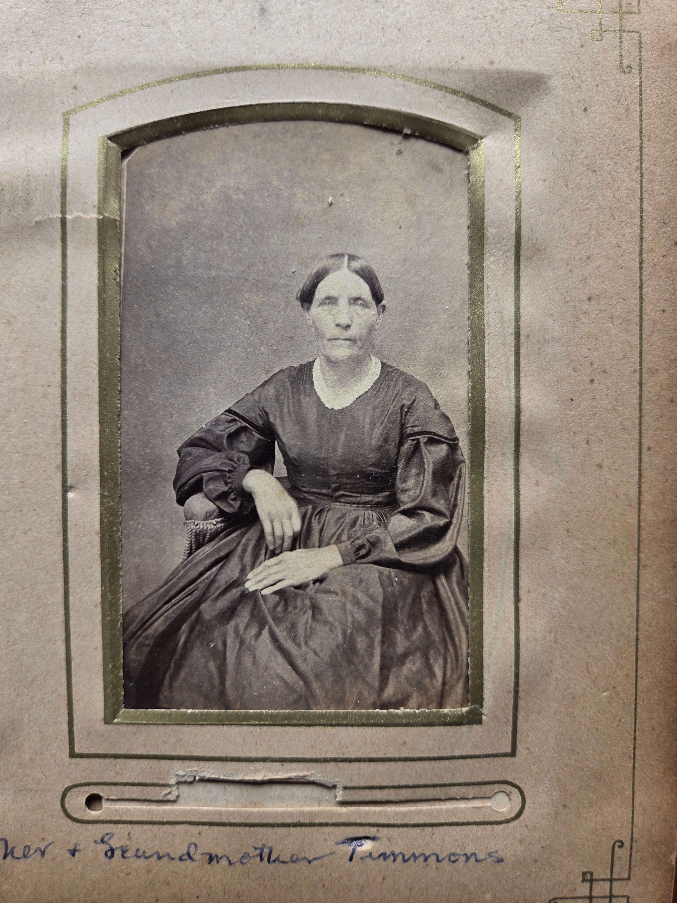

Elizabeth "Betsey" Timmons was the wife of **[John K. Timmons](/family/john-k-timmons/)** and the mother of **[Mary O. Timmons Chenoweth](/family/mary-ohio-timmons-chenoweth/)** (1845-1919). Through her daughter Mary, she is the **grandmother of [Lillie Dale Chenoweth Eesley](/family/lillie-dale-chenoweth/)** and **Chuck's great-great-great-grandmother** on the paternal Chenoweth-Timmons branch.

## "Betsey" — the family nickname

Per [Roberta Burnes Walker](/family/roberta-burnes/) (June 2026), **"Betsey" was her family nickname** &mdash; almost certainly a 19th-century shortening of **Elizabeth**, the standard naming-pattern of the period. The maiden surname Mary Eesley Bean's [*Eesley Family History*](/docs/eesley-family-history-1985/) and the Egge / Dale GEDCOM records both carry as *"Elizabeth Betsey ?"* with the surname blank &mdash; meaning her birth-family name has not yet been recovered into the digital record. A pass against the **1850 or 1860 Ohio census for John K. Timmons's household** would likely surface her full name; she would have been alive in both census years (Mary was 5 in 1850).

## The companion portrait — Grandmother Timmons

A high-resolution scan of her portrait arrived in June 2026 from Roberta Burnes Walker's Chenoweth family album, where the photograph sits on a gold-bordered album page labeled in cursive at the bottom: ***"...er + Grandmother Timmons"*** &mdash; the trailing *"-er"* almost certainly the end of *"Grandfather + Grandmother Timmons"*. The companion frame on the same or adjacent album page is her husband [John K. Timmons](/family/john-k-timmons/), labeled ***"Grandfather + ..."*** The two-portrait pairing reads as **husband-and-wife companion frames**, the kind a mid-century Ohio couple would have sat for once and kept side-by-side ever after.

The portrait shows Betsey seated in a chair with one hand resting on the armrest, the other folded across her lap. She wears a dark wide-skirted dress with leg-of-mutton-style fuller sleeves at the upper arm tightening at the forearm, a small round neckline, and a center-parted hairstyle pulled back in the period-conventional way. Her face is composed and direct, similar in temperament to the portrait of her husband on the facing page. The dress pattern (leg-of-mutton sleeves, fitted bodice) places the sitting in the **1860s** &mdash; consistent with a mid-life portrait around the same time as John K.'s companion sitting.

## What's open

- **Her maiden surname** &mdash; the single most important open question on this page. The 1850 or 1860 Ohio census for John K. Timmons's household, combined with any Pickaway or Franklin County marriage records, should settle it.
- **Her life dates** &mdash; birth and death are not yet in the GEDCOM trace this archive currently carries. The 1860s portrait suggests she was alive into the 1860s at least; whether she lived to see Lillie Dale's 1877 birth is open.
- **Her own family of origin** &mdash; once the maiden name is recovered, the deepest Chenoweth-Timmons-line research thread on this side of the archive can extend one full generation deeper.

> *Sources: Roberta Burnes Walker, June 2026 email batch with the "Grandfather/Grandmother Timmons" album-page photographs and the "Betsey may have been her nickname" note. Egge's Chenoweth-site structured record names her as Elizabeth "Betsey" but with maiden surname blank. The Chenoweth family album holds the portrait scanned here.*
