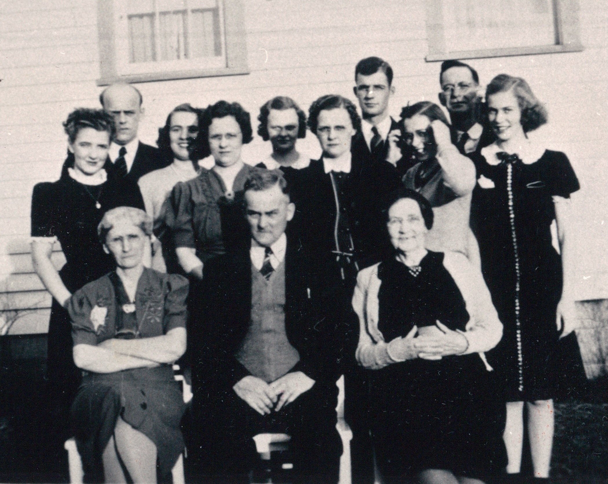

Harvey Hendershot Hill was the father of [Bessie Marie Hill Davis](/family/bessie-hill-davis/) (b. 28 March 1905) &mdash; Chuck's maternal great-grandmother through the Davis line: Harvey &rarr; Bessie &rarr; [Dorothy Marie Davis Wildermuth](/family/dorothy-davis-wildermuth/) &rarr; Terrie Lee &rarr; Chuck.

He was born **10 November 1882** in **Washington Township, Monroe County, Ohio**, the eldest known son of [Josiah W. Hill (Sr.)](/family/josiah-w-hill/) (1854-1918) and [Janetta (Smith) Hill](/family/janetta-smith/) (b. Feb 1864). On **15 June 1904** he married **[Clara Victoria Ullmann](/family/clara-victoria-ullmann/)** (1885-1941) in Monroe County. The marriage produced four children &mdash; Bessie Marie (1905-1950), and three siblings in the GEDCOM record &mdash; raised across Monroe and Washington counties in southeastern Ohio.

His younger brother [Josiah Way Hill](/family/josiah-way-hill/) was killed in action at the Meuse-Argonne Offensive on 11 October 1918, three weeks before the WWI Armistice. Harvey outlived him by thirty-three years.

## Harvey at the fair &mdash; a snapshot with a burro

A studio-quality outdoor photograph survives in the family papers. Harvey is at left, perched on the back of a small white **burro** &mdash; not a horse &mdash; in a three-piece suit and a straw boater hat. A companion in a darker suit and fedora stands at right, his arm around Harvey's shoulder. The setting looks like a fairgrounds or downtown sidewalk in front of a row of awnings; the burro's saddle suggests this was a paid "your picture with the donkey" novelty popular at county fairs and street festivals in the 1910s-1920s. Both men are smiling, mid-laughter; the photo reads as a friend-pair snapshot rather than a formal portrait.

The clothing &mdash; the boater hat and the cut of the suits &mdash; reads as late 1910s through 1920s. Harvey would have been in his thirties to early forties.

## A Hill family gathering, c. 1939-1941 — best-guess identification

A formal extended-family group portrait of about thirteen figures arranged on a porch in front of a white clapboard house with a window in the upper-right. Three figures sit in front: an older woman with her arms crossed at left, an older man in a dark suit at center, and a third older woman at right. The standing rows behind them carry roughly ten figures &mdash; a mix of women in dark or print dresses (one with a fancy pearl necklace at far right), and men in suits and ties.

The best-guess identification is that the **seated elder man at center is Harvey Hendershot Hill himself** &mdash; in his late fifties, having grown into the family-patriarch role after his father Josiah Sr.'s 1918 death. The seated women would most plausibly be his wife [Clara Victoria Ullmann](/family/clara-victoria-ullmann/) (one of the two), with the third elder figure another Hill-side senior. The standing rows would then carry **Harvey and Clara's four children &mdash; including Bessie Marie Hill Davis &mdash; and their spouses**, making the photograph a portrait of the **Hill side of Chuck's maternal Davis line, plus one generation up and one down**.

Dating: Clara Victoria Ullmann died **15 October 1941**. If she is in the frame, the photograph must predate that. Combined with the women's hemline and shoulder details (long-sleeved, knee-to-mid-calf dresses with pads), the dating reads **c. 1939-1941** &mdash; possibly an Easter, Thanksgiving, or 50th-wedding-anniversary gathering for Harvey and Clara on the eve of Clara's death.

The identification is **not certain** &mdash; the seated elder man could also be a more senior figure (Josiah Sr. died 1918, but other Hill or Smith senior relatives may be the centerpiece). The photograph is the best-known group portrait of the Hill side from this era and is queued for face-by-face identification by family who knew this generation.

## Death and burial

He died **10 February 1951 at Bremen, Fairfield County, Ohio**, age 68, and was buried at **Waterford, Washington County, Ohio** &mdash; the same ground where his daughter Bessie had been buried the previous May (29 May 1950) and where his son-in-law Homer Edward Davis would be buried in 1982.

## See also

- [Bessie Marie Hill Davis](/family/bessie-hill-davis/) &mdash; his daughter, Chuck's maternal great-grandmother
- [Clara Victoria Ullmann](/family/clara-victoria-ullmann/) &mdash; his wife
- [Josiah Way Hill](/family/josiah-way-hill/) &mdash; his younger brother, killed at the Meuse-Argonne 1918
- [Homer Edward Davis](/family/homer-davis/) &mdash; his son-in-law

> *Sources: [Eesley/Wildermuth GEDCOM tree](/docs/dale-eesley-familysearch-tree/) (June 2026 trace) &mdash; FamilySearch tree ID MYCR-KPD for Harvey Hendershot Hill confirms birth 10 Nov 1882 Monroe County Ohio, marriage 15 Jun 1904 to Clara Victoria Ullmann, death 10 Feb 1951 Bremen Ohio, burial Waterford. Photograph from Chuck's keeping, shared June 2026.*
