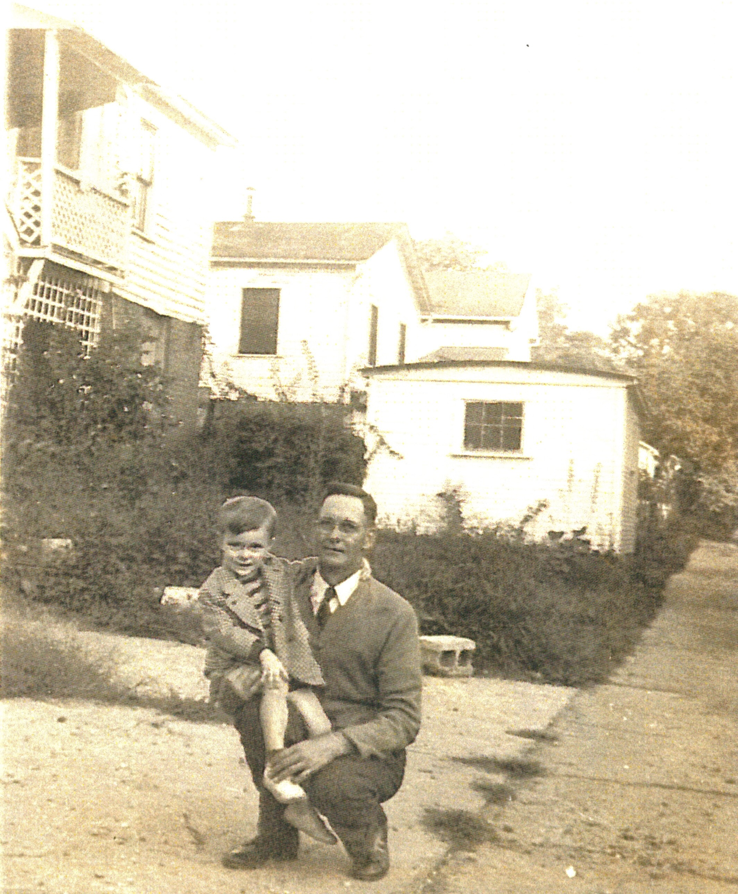
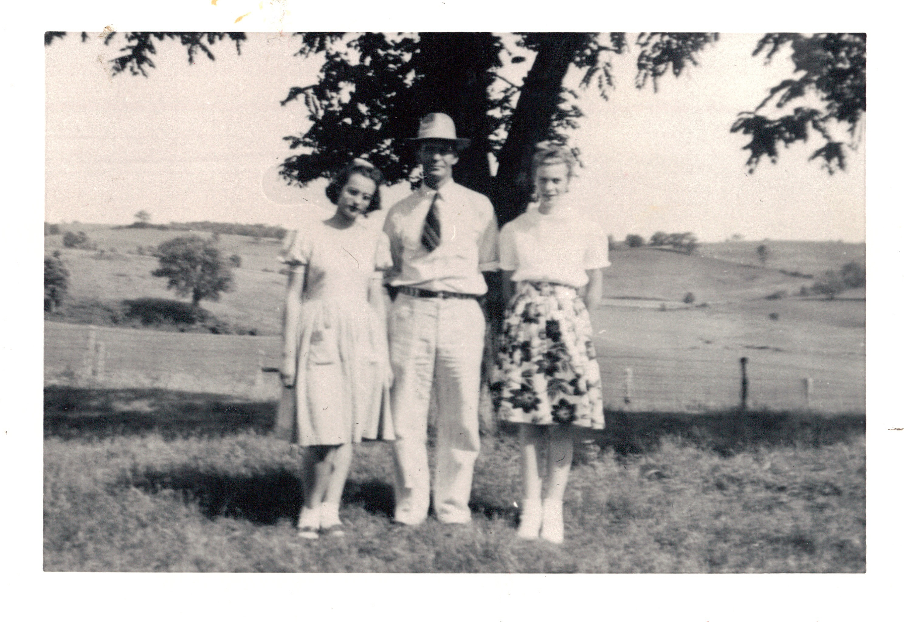
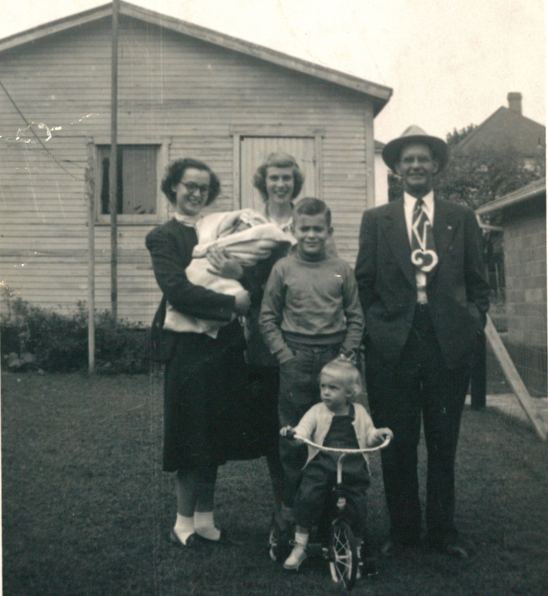
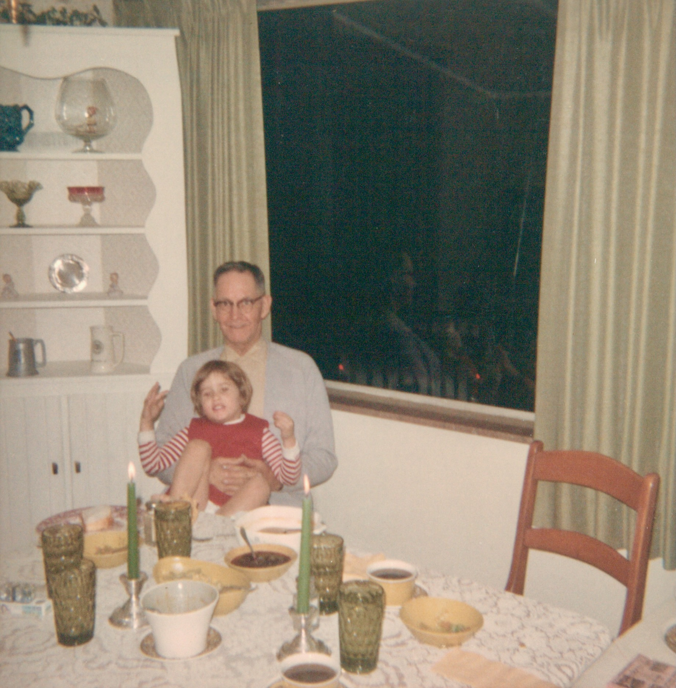

Homer Edward Davis was the father of [Dorothy Marie Davis](/family/dorothy-davis-wildermuth/) (Chuck's maternal grandmother, who would marry [Robert Earl Wildermuth](/family/robert-earl-wildermuth/) in 1946). His full middle name surfaces from Dorothy's funeral program: her mother is given as *"Bessie Marie Davis and Homer Edward Davis."*

## Homer at three, with his parents — c. 1902

Homer was born **8 February 1900** at **Crooked Tree, Noble County, Ohio** to **[William Armstrong Davis](/family/william-armstrong-davis/)** (1859-1931) and **[Victoria Anna Way Davis](/family/victoria-anna-way-davis/)** (1874-1903). His mother &mdash; daughter of [Edward E. Way](/family/edward-e-way/) (1851-1924) and [Tacy Elizabeth Matthews](/family/tacy-elizabeth-matthews/) (1848-1902), and granddaughter of the English-immigrant [Edward Taylor Way](/family/edward-taylor-way/) of the Isle of Wight &mdash; **died on 26 June 1903 at age 29**, leaving three-year-old Homer to be raised by his father (who later remarried) in Washington County. **The Way family connection enters the Davis line through his mother.** Homer himself appears in the [25 September 1901 Belle Way wedding portrait](/family/belsora-way-wickens/) as a toddler &mdash; figure #11 in the family identification legend, labeled *"Homer E. Davis (father)"* from his future daughter Dorothy Davis Wildermuth's perspective.

The studio portrait that survives in the family papers, shared by Chuck in June 2026, is the only known photograph of Homer with both parents together. He is at center in the frame, about two years old, in an Edwardian-era child's salmon-colored dress (the period convention for very young children before breeching), wide eyes looking directly at the camera. Victoria is at left; William at right.

The frame is, by date, the **earliest photograph of any of Chuck's maternal-line direct ancestors** in the archive.

## The Waterford working life — and Standard Oil of Ohio

At the time of Dorothy's birth on **24 February 1925**, Homer was twenty-five, working as a **truck driver** out of Waterford, Washington County, Ohio. His [1982 obituary](/docs/homer-davis-obituary-1982/) records that he later went on to a long career at the **Standard Oil Company of Ohio** &mdash; the transition from independent truck driver to Standard Oil employee likely tracks the 1920s-1930s consolidation of the Ohio petroleum-distribution industry into the regional Standard Oil subsidiary.

He married **[Bessie M. Hill](/family/bessie-hill-davis/)** at some date before the 1923 birth of their first daughter Mary. The three daughters together:

- **Mary Davis** (b. ~1923)
- **[Dorothy Marie Davis](/family/dorothy-davis-wildermuth/)** (b. 24 February 1925)
- **Betty Davis** (b. ~1926)

## Homer with a small boy, c. 1944-1945 — best-guess identification

Homer kneels in this snapshot &mdash; in a knit sweater and tie, on a driveway in front of a two-story clapboard house with a smaller white outbuilding behind. A small boy of about three or four sits on his knee in a winter coat. The composition reads as **mid-1940s** by clothing and photographic style.

The best-guess identification is **Homer with his son [William Harvey Davis Sr.](/family/william-harvey-davis-sr/)** (b. 20 August 1941). The boy's age (~3-4) puts the photograph at **c. 1944-1945**, when Homer would have been **44-45**. The house behind reads as the Waterford-area Davis family home where Homer was raising his children. This identification is **not certain** &mdash; the man could also plausibly be a son-in-law (Robert Earl Wildermuth with one of his children, or Jack Murdock with one of Mary's), but the closer-cropped facial structure most resembles the later Homer photographs in this archive.

## Homer with two of his daughters in a hilly pasture, c. 1944-1948 — best-guess identification

A summer-day pasture snapshot &mdash; rolling hills behind, a fence on the left, a single tree casting shadow on the ground. Homer stands at center in a light suit and fedora, his hands clasped at his front. A young woman in a pleated knee-length light dress stands on his right (the viewer's left); a second young woman in a white blouse and bouquet-print skirt stands on his left.

The best-guess identification is **Homer flanked by his daughters [Dorothy Marie Davis](/family/dorothy-davis-wildermuth/) (left, b. 24 Feb 1925) and [Betty Jean Davis](/family/betty-davis/) (right, b. 16 March 1926)**, c. 1944-1948. The women's clothing &mdash; the pleated knee-length light dress and the bouquet-print full skirt &mdash; reads as **mid-1940s**, putting Dorothy and Betty at 19-23 and Homer at 44-48. The hilly southeastern Ohio landscape fits the Waterford-Unionville area. The identification is **not certain** &mdash; one of the women could be Mary Davis Murdock (b. ~1923) rather than Dorothy or Betty &mdash; but the height-and-build pairing reads as the two sisters who are within one year of each other (Dorothy + Betty), rather than the elder Mary.

## Homer in his fifties — a backyard family group, c. 1953-1955

Homer stands at right in this backyard portrait, in a fedora and dark suit with a tie. Beside him: a young boy of about eleven, two women (one with glasses holding an infant in a christening blanket, the other behind), and a toddler perched on a small white tricycle in front. The house behind reads as a postwar single-story bungalow with vertical clapboard siding.

The dating is fixed by Homer's apparent age (mid-50s, consistent with c. 1953-55) and the ages of the children. The cast is open &mdash; this is most likely one of his three daughters' families visiting from out of town, or could be Homer with his son [William Harvey Davis Sr.](/family/william-harvey-davis-sr/) (b. 1941) as the boy and a wife or other Davis-line relatives. The composition is the kind of casual family-album backyard snapshot the postwar small-camera era produced.

## Homer with a grandchild at the Florida dinner table, c. 1970

After Marie's death in 1950, Homer remarried on **12 November 1968** to **Ida Roberts Drake** (per the [1982 obituary](/docs/homer-davis-obituary-1982/)). The second household was Florida-based &mdash; the move to Matlacha and Pine Island had already happened by the late 1960s.

This indoor dinner-table photograph &mdash; lace tablecloth, lit green tapers, yellow Fiestaware bowls, a corner cabinet behind stocked with brandy snifters, pewter mugs, and Depression glass &mdash; reads as Christmas or Thanksgiving dinner in the Florida household. Homer sits in a gray cardigan with horn-rimmed glasses, holding a curly-haired toddler grandchild (red-and-white-striped-sleeved jumper, eyes wide at the camera) on his lap.

The dating is fixed by Homer's apparent age (late sixties to early seventies) and the small-format Kodak print quality, putting it c. **1968-1972**. The toddler's specific identity is open &mdash; possibilities include any of his eleven biological grandchildren or his thirteen step-grandchildren by his second marriage to Ida Roberts Drake. He died in January 1982, so this is from the **last decade of his life**.

## The Waterford home and the Unionville fire

The Waterford family home where Dorothy was born is one of the photographs reproduced in [Robert Earl Wildermuth's 1990 Wildermuth/Fleming Heritage](/docs/wildermuth-fleming-heritage-1990/). The same document records that the family later moved to **Unionville, Ohio**, and that there:

> *In Unionville, while the parents were away from home, they suffered a tremendous calamity. The house caught fire and burned to the ground. This was a real tragedy, but with the help of friends and neighbors, they recovered, moved into a small shed not damaged in the fire while their parents lived in a poorly insulated one-room garage throughout the cold winter that followed.*

Page is a stub. Homer's parents, his birth date, his marriage date to Bessie, and his death are pending further research.

> *Sources: [Dorothy Marie Davis's birth certificate, 24 February 1925](/docs/wildermuth-fleming-heritage-1990/); [Dorothy Marie Wildermuth funeral program, 13 August 2010](/family/dorothy-davis-wildermuth/).*
