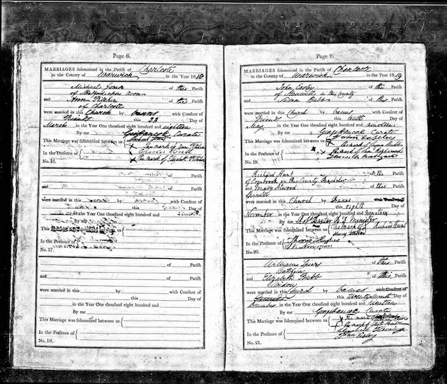

John Eesley was baptized at **Hanwell, Oxfordshire, on 6 January 1799** — the parish register records him as *"John, Son of Joseph & Frances Eesly."* He was the only child of [Joseph Eesley](/family/joseph-eesley/) and [Frances "Fanny" Ayris](/family/frances-eesley/) recorded at Hanwell, and married **[Susannah Bubb](/family/susan-babbs/)** at Charlecote, Warwickshire, on **10 May 1819** — a marriage the Charlecote register preserves with his own signature.

*The Charlecote parish marriage register, 1818–19 — the Warwickshire church where John Eesley and [Susannah Bubb](/family/susan-babbs/) were married on 10 May 1819. Photographed on the family's England research trip.* (His father Joseph had been baptized a generation earlier at [St Mary's, Banbury](/family/joseph-eesley/), the family's market town four miles east — see Joseph's page for the church.) The 1851 census placed him at Rother Street in Old Stratford, age 51, a journeyman miller, with Susannah (50, born Charlecote) and several of their eleven children.

## Across the Atlantic — 1856

John did not stay in England. Per the family's FamilySearch record, he **emigrated in 1856**, sailing from **Liverpool aboard the *Antarctic*** and arriving at **New York on 7 July 1856**, at about fifty-seven. By the **1861 census he was at North Dumfries, Waterloo County, Ontario** — the same Ayr-area township where his son [Albert Robert](/family/albert-robert-eesley/) was working in the Goldie family's mill and married Jennie Goldie that same year. He later settled at **Newark, Essex County, New Jersey**, where he **died on 4 February 1870**, age 71 — the same New Jersey city where Mary Eesley Bean's 1985 register placed an Eesley emigrant family with a bakery.

This reframes the emigration thread: it was **not only the sons who crossed**. John Sr. himself made the Atlantic passage in middle age, following the milling family to Ontario and ending his life in New Jersey. (He appears in some American hands as *"John Early,"* and he and his son John, 1832–1874, are easily conflated in the New Jersey records; the Bean register's spouse-name *"Hannah Bubb"* looks like a blend of John Sr.'s wife Susannah and their daughter Hannah.)

His occupation as a miller is not incidental: the trade ran through the line and across the Atlantic. **Albert Robert** went to **Canada** to work in the Goldie family's flour operation (the Goldies had emigrated from Ayrshire Scotland to Ontario in 1841) — what looks like an emigration to Scotland in the older brief framing is really an emigration to Canada to work in a Scottish-Canadian mill. Albert's son **John Franklin Eesley** would be born in Hamilton, Ontario in 1859 and eventually found the [Sunshine Flour Mill in Plainwell, Michigan](/places/plainwell-eesley-mill/) — so the milling thread runs Hanwell → Old Stratford → Ontario → Michigan, with John Sr. himself among those who crossed.

> Spellings vary across the records: "Eesley" in parish registers, "Easley" in some American census hands. Dale's tree standardizes to Eesley.

> *Source: [Dale Eesley / FamilySearch — John Eesley (MS7P-DQ7)](https://www.familysearch.org/tree/person/details/MS7P-DQ7).*
