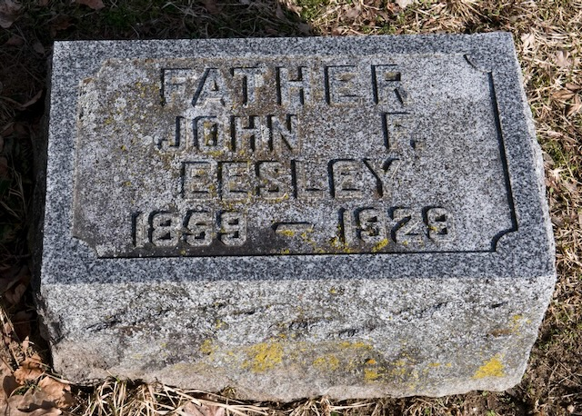
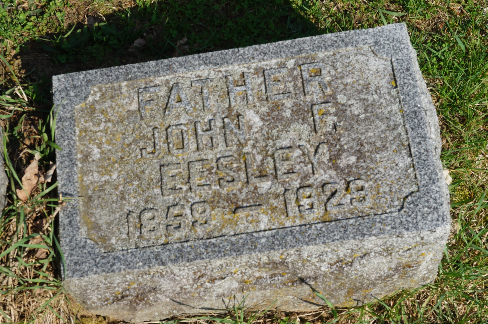
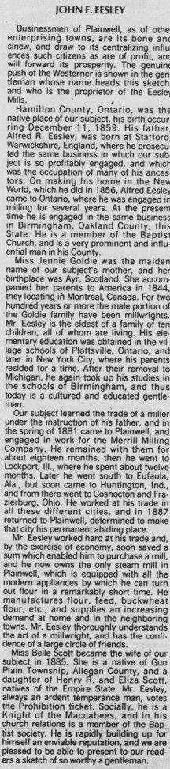

The older brief framing put John Franklin Eesley as **Albert Robert's brother**, both of them emigrants from Old Stratford going in different directions. Dale's tree settles a different relationship: **John Franklin is Albert's son and the eldest of the ten children**, born in Hamilton, Ontario in 1859, two years before his parents' Ontario marriage record. The milling thread runs not John (1799) → Albert and John F. as parallel emigrants but **John (1799) → Albert (the emigrant to Canada) → John Franklin (the next-generation emigrant from Canada to Michigan)**.

## On the "J. R." in William Eesley's c. 1916 obituary

[William Eesley's c. 1916 obituary](/docs/william-eesley-obituary-college-corner/) names the eldest brother as **"J. R., who follows milling."** A separate entry for "John R. Eesley" was briefly maintained in this archive while the obituary text and the GEDCOM appeared to disagree. The GEDCOM resolves the matter: Dale's tree has **no John R. Eesley** in this generation, only John Franklin. The "J. R." in the obituary is a transcription error or local family-memory variant for "J. F." — the same person whose Plainwell mill became the J. F. Eesley Milling Co.

## The journeyman years, 1881&ndash;1887 &mdash; from a contemporary sketch

A biographical sketch of John F. Eesley published in a Michigan county history &mdash; recovered in 2026 and reproduced below &mdash; fills in the six years the archive had skipped over between his apprenticeship and his arrival in Plainwell as an owner. He learned **the trade of a miller under the instruction of his father**, and then worked it across five states:

- **Spring 1881** &mdash; came to Plainwell and took work with the **Merrill Milling Company**, staying about eighteen months.
- Then **Lockport, Illinois**, about twelve months.
- Then south to **Eufaula, Alabama**; then **Huntington, Indiana**; then **Coshocton** and **Frazeysburg, Ohio**.
- **1887** &mdash; returned to Plainwell, *"determined to make that city his permanent abiding place,"* with a sum saved that let him buy a mill of his own.

So the 1887 purchase was not a first arrival but a **return**: he had worked in the town as a hired miller six years earlier, left to learn the trade across the country, and came back to buy in. The sketch notes he then owned **the only steam mill in Plainwell**, "equipped with all the modern appliances," making flour, feed and buckwheat flour for the town and its neighbors.

His schooling is recorded too &mdash; the village schools of **Plottsville, Ontario**, then **New York City** where the family lived for a time, then **Birmingham, Oakland County, Michigan** after the move south.

### The Goldie millwrights &mdash; where the trade came from

The sketch carries one line that reframes the family's milling thread: of his mother's people it says that **"for two hundred years or more the male portion of the Goldie family have been millwrights."**

This archive has told the milling story down the **Eesley** male line &mdash; Old Stratford to Toronto to Plainwell. The sketch suggests the deeper source was **[Jennie Goldie](/family/jeanie-goldie/)**'s family: millwrights in Scotland for two centuries before she came to Montreal in 1844. A millwright builds and maintains the mill; a miller runs it. If the sketch is right, the Eesley men married into the trade as much as they inherited it.

Born **11 December 1859** in Hamilton, Ontario, he made his way south and west across the international border to **Plainwell, Allegan County, Michigan** by 1887. There he bought the 1869 roller rink on West Bridge Street, converted it into the **Sunshine Flour Mill** under the *Sunshine Brand Flour* label, and made it the nation's second-largest producer of buckwheat flour at its peak. In 1903–04 he physically split the timber-frame mill building, moved it to East Bridge Street, and merged it with a grain elevator to create a unified mill-and-elevator landmark.

He married **[Kittie Belle Scott](/family/kittie-belle-scott/)** in Plainwell on **8 September 1885** &mdash; Kittie had been born across the township line in **Gun Plain Township**, Allegan County, a daughter of **Henry R. and Eliza Scott**, both natives of New York State.

### The three children (resolved, 2026)

Dale's tree recorded no children for John Franklin, and this page long carried the **FATHER** on his grave marker as an unexplained wrinkle. The Hillside Cemetery record settles it: there were **three children**, and only one reached adulthood.

- **[Iva Belle Eesley](/family/iva-belle-eesley/)** (1887&ndash;1888) &mdash; died in infancy, in the year after her father bought the mill; her middle name is her mother's.
- **[Harold John Eesley](/family/harold-john-eesley/)** (1893&ndash;1977) &mdash; the only child to reach adulthood; outlived his father by nearly fifty years.
- **[Franklin R. B. Eesley](/family/franklin-rb-eesley/)** (1898&ndash;1908) &mdash; died at about ten, carrying his father's middle name.

The inscription was accurate all along; the tree was incomplete. Whether the Plainwell line continues through Harold is now an open question rather than a settled ending &mdash; see [his page](/family/harold-john-eesley/).

He ran the operation until his death &mdash; **9 July 1929 in Kalamazoo, Michigan**; buried in Plainwell two days later. The mill outlasted him by a century: the [building is on the National Register of Historic Places](/places/plainwell-eesley-mill/) and now operates as The Old Mill Brewpub. He is the **wealthiest member of the documented family** — see [Notable Family Members](/docs/notable-family-members/).

*His grave marker at **Hillside Cemetery, Plainwell** (plot **P8/7**), carved* FATHER · JOHN F. EESLEY *&mdash; the "Father" designation, once a puzzle here, is explained by the three children recorded above. The final digit of the year is weathered and reads as either 1928 or 1929; the Find a Grave record and the Michigan death index give **9 July 1929**, which this archive follows. A companion "Mother" stone for [Kittie Belle Scott](/family/kittie-belle-scott/) (1864&ndash;1946) should stand in the same plot.*

*The family monument at **Hillside Cemetery, Plainwell** &mdash; the surname alone, cut into an oval cartouche, with the individual markers set low around it. John Franklin's* FATHER *stone is one of these; the plot is **P8/7**.*

*The contemporary sketch quoted above &mdash; see the [full artifact entry](/archive/john-f-eesley-biographical-sketch/) for a transcription and notes.*

## See also — family threads

John F. Eesley is an anchor for two of the ten threads in the [**Family threads**](/docs/family-threads/) synthesis essay:

- **Thread #9 — Crossing for what's next** — the [Stratford → America](/places/old-stratford-rother-street/) crossing in the 19th century.
- **Thread #10 — Building things (entrepreneurship across four generations)** — the **canonical historical instance**: bought a roller rink in Plainwell, Michigan in 1887, converted it into the **Sunshine Flour Mill**, grew it to the second-largest buckwheat-flour producer in the U.S., physically divided and moved the building in 1903–04. The [building](/places/plainwell-eesley-mill/) is now on the National Register of Historic Places — *the family surname on a building, on a federal register*.

> *Source: [Dale Eesley / FamilySearch &mdash; John Franklin Eesley (LQY3-K8S)](https://www.familysearch.org/tree/person/details/LQY3-K8S); [J. F. Eesley Milling Co., Wikipedia](https://en.wikipedia.org/wiki/J._F._Eesley_Milling_Co._Flour_Mill%E2%80%93Elevator).*
