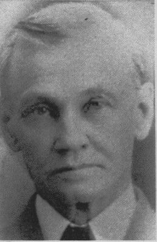

**John Franklin Eesley** was the eldest child of **[Albert Robert Eesley](/family/albert-robert-eesley/)** and **[Jennie Goldie](/family/jeanie-goldie/)**, born **11 December 1859** in **Hamilton, Ontario**. He is the generation that carried the family's milling trade across the border from Canada into Michigan, and the man whose surname still stands on a building in Plainwell.

He was schooled in the village schools of **Plottsville, Ontario**, then in **New York City** where the family lived for a time, and finally in **Birmingham, Oakland County, Michigan** after his parents moved south. His father was milling at Birmingham, and John learned **the trade of a miller under his father's instruction**.

## The journeyman years, 1881–1887

He worked the trade across five states before he owned anything:

- **Spring 1881** — came to Plainwell and took work with the **Merrill Milling Company**, staying about eighteen months.
- Then **Lockport, Illinois**, about twelve months.
- Then south to **Eufaula, Alabama**; then **Huntington, Indiana**; then **Coshocton** and **Frazeysburg, Ohio**.
- **1887** — returned to Plainwell, *"determined to make that city his permanent abiding place,"* with enough saved to buy a mill of his own.

The 1887 purchase was a **return**, not a first arrival: he had worked in the town as a hired miller six years earlier, left to learn the trade across the country, and came back to buy in.

## The Goldie millwrights

A contemporary sketch says of his mother's family that **"for two hundred years or more the male portion of the Goldie family have been millwrights."** [Jennie Goldie](/family/jeanie-goldie/) was born in **Ayr, Scotland**, and came to America in 1844. A millwright builds and maintains the mill; a miller runs it — so the trade may have come into the family through her people as much as through his father's.

## The Sunshine Flour Mill

In Plainwell he bought the 1869 **roller rink** on West Bridge Street and converted it into the **Sunshine Flour Mill**, selling under the *Sunshine Brand Flour* label. It was **the only steam mill in Plainwell**, "equipped with all the modern appliances," producing flour, feed and buckwheat flour for the town and its neighbors. At its height it turned out **600 barrels of buckwheat flour a day** and was the **second-largest producer of buckwheat flour in the United States**.

### Why he moved the mill: he bought the town a park

In 1903–04 he cut the timber-frame mill building in two, moved it to the 700 block of East Bridge Street, and merged it with a grain elevator into a single mill-and-elevator landmark. The reason was not commercial pressure:

> *"J.F. Eesley traded his property with Ingraham and Travis, whose property was located in the flat iron, so that Mr. Eesley could give the flat iron property to the village for a park."*

Ingraham and Travis held the triangular downtown parcel Plainwell called **the Flat Iron**. Eesley wanted it for the town, so he **traded them his own mill site** to get it — which is why he then had to move his mill across town — and **gave the Flat Iron to the village**. Dedicated at Plainwell's first homecoming in **1907**, it is **[Hicks Park](/places/hicks-park-plainwell/)**, the oldest park in the city, named for **Joseph Hicks**, the first village president, rather than for the miller who acquired the ground and gave it away.

The [mill still stands at 717 E. Bridge](/places/plainwell-eesley-mill/) because its owner preferred a park downtown to a convenient address.

## Marriage and children

He married **[Kittie Belle Scott](/family/kittie-belle-scott/)** in Plainwell on **8 September 1885**. Kittie had been born across the township line in **Gun Plain Township**, Allegan County, a daughter of **Henry R. and Eliza Scott**, both natives of New York State.

They had three children, of whom one reached adulthood:

- **[Iva Belle Eesley](/family/iva-belle-eesley/)** (1887–1888) — died in infancy, the year after her father bought the mill; her middle name is her mother's.
- **[Harold John Eesley](/family/harold-john-eesley/)** (1893–1977) — the only child to reach adulthood; outlived his father by nearly fifty years.
- **[Franklin R. B. Eesley](/family/franklin-rb-eesley/)** (1898–1908) — died at about ten, carrying his father's middle name.

## Later life

He voted the **Prohibition** ticket, belonged to the **Knights of the Maccabees**, and was a member of the **Baptist** society.

He ran the mill until his death — **9 July 1929 in Kalamazoo, Michigan** — and was buried in Plainwell two days later, in plot **P8/7** at **Hillside Cemetery**. The mill outlasted him by a century: the [building is on the National Register of Historic Places](/places/plainwell-eesley-mill/) and now operates as The Old Mill Brewpub. He is the **wealthiest member of the documented family** — see [Notable Family Members](/docs/notable-family-members/).

## Portrait, late in life

*John F. Eesley late in life, c. 1920s &mdash; the miller in his sixties, a generation on from the 1899 family-portrait crop at the head of this page, and a few years before his death in 1929.*

## The Plainwell grave

*His grave marker at **Hillside Cemetery, Plainwell** (plot **P8/7**), carved* FATHER · JOHN F. EESLEY. *The final digit of the year is weathered and reads as either 1928 or 1929; the Find a Grave record and the Michigan death index give **9 July 1929**. A companion "Mother" stone for [Kittie Belle Scott](/family/kittie-belle-scott/) (1864–1946) should stand in the same plot.*

*The family monument at Hillside Cemetery — the surname alone, cut into an oval cartouche, with the individual markers set low around it.*

*The c. 1890s county-history sketch that supplies the journeyman years, the schooling, and the Goldie millwright line — see the [full artifact entry](/archive/john-f-eesley-biographical-sketch/).*

## See also — family threads

John F. Eesley is an anchor for three of the ten threads in the [**Family threads**](/docs/family-threads/) synthesis essay:

- **Thread #5 — Service, stewardship, and giving** — the **earliest documented instance**: trading his mill site to buy the Flat Iron and giving it to Plainwell as a park in 1904, four generations before the [Zhou & Eesley Family Foundation](https://zhoueesleyfoundation.com).
- **Thread #9 — Crossing for what's next** — the [Stratford → America](/places/old-stratford-rother-street/) crossing in the 19th century.
- **Thread #10 — Building things (entrepreneurship across four generations)** — the **canonical historical instance**: bought a roller rink in 1887, converted it into the Sunshine Flour Mill, grew it to the second-largest buckwheat-flour producer in the U.S., and physically divided and moved the building in 1903–04. The [building](/places/plainwell-eesley-mill/) is now on the National Register of Historic Places.

> *Sources: [Dale Eesley / FamilySearch — John Franklin Eesley (LQY3-K8S)](https://www.familysearch.org/tree/person/details/LQY3-K8S); [Find a Grave — John Franklin Eesley](https://www.findagrave.com/memorial/132028385/john-franklin-eesley) (children, burial plot); c. 1890s Michigan county-history sketch ([artifact](/archive/john-f-eesley-biographical-sketch/)); [J. F. Eesley Milling Co., Wikipedia](https://en.wikipedia.org/wiki/J._F._Eesley_Milling_Co._Flour_Mill%E2%80%93Elevator); Allegan County Heritage Trail marker text for the Flat Iron trade, preserved at [hmdb.org](https://www.hmdb.org/m.asp?m=74530) (marker since removed) and corroborated by the City of Plainwell's park history.*
