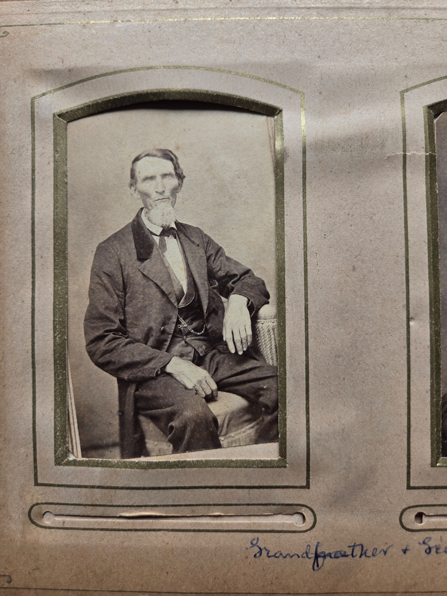

John K. Timmons was born **16 May 1806** in Ohio and died **13 May 1888**, three days short of his eighty-second birthday &mdash; living through the War of 1812 as a child and the Civil War as a man of fifty-five. He is buried in **Scioto Township, Pickaway, Ohio** &mdash; the same Scioto Township that gave his granddaughter [Scioto Mafry Chenoweth](/family/scioto-mafry-chenoweth/) her name. He was married to **[Elizabeth "Betsey" Timmons](/family/elizabeth-betsey-timmons/)** &mdash; the maternal grandmother of Lillie Dale Chenoweth and Chuck's great-great-great-grandmother.

## The two portraits — Grandfather and Grandmother Timmons

A new high-resolution scan of John K. Timmons's portrait arrived in June 2026 from [Roberta Burnes](/family/roberta-burnes/)'s Chenoweth family album, where the photograph sits on a gold-bordered album page labeled in cursive at the bottom: ***"Grandfather + ..."*** The companion frame on the same album page is [Elizabeth "Betsey" Timmons](/family/elizabeth-betsey-timmons/), labeled ***"...er + Grandmother Timmons."*** The pair are on facing or adjacent album pages &mdash; **husband-and-wife companion portraits**, of the kind a mid-century Ohio couple would have sat for once and kept side-by-side ever after.

The portrait shows John K. seated in a wicker chair, in a dark coat with a black bow-tie and a high-collared white shirt, with a thin angular face, a chin-only beard (no mustache &mdash; the classic mid-19th-century *"chin curtain"* style), and large strong hands resting on his knees. His expression is steady and direct. The wear pattern of the print and the album-page binding place this as a **1860s-1870s carte-de-visite or cabinet card** &mdash; consistent with a portrait sitting in his late fifties or sixties.

The earlier scan of him in advanced age from Maggie Eesley's [*Four Generations* deck](https://family.chuckeesley.com/) (where she noted *"It's amazing that someone in the family has kept these old photos"*) is the same person at a later date; this Roberta-album frame is the higher-resolution mid-life version.

He is **Chuck's great-great-great-grandfather** through his daughter **[Mary Ohio Timmons Chenoweth](/family/mary-ohio-timmons-chenoweth/)** (1845&ndash;1919), who married [Joseph Hill Chenoweth](/family/joseph-hill-chenoweth/) and from whom the Chenoweth-Timmons strand reaches forward to [Lillie Dale Chenoweth Eesley](/family/lillie-dale-chenoweth/) and then to [Will Eesley](/family/wilbur-eesley/) and the line everyone alive in the family today comes from.

Maggie Eesley's editorial note in her *Four Generations* archive, on the photograph of him in advanced age:

> *"It's amazing that someone in the family has kept these old photos."*

He is the deepest documented ancestor on this branch.

> *Sources: Maggie Eesley, *Four Generations of the Eesley Family* (PowerPoint archive); portrait provenance the Chenoweth family album held by Roberta Burnes. Structured record: [Dale Eesley / FamilySearch &mdash; John K. Timmons (K633-3T8)](https://www.familysearch.org/tree/person/details/K633-3T8). Note: Maggie's deck records his death year as 1899; the GEDCOM and FamilySearch record give 13 May 1888.*
