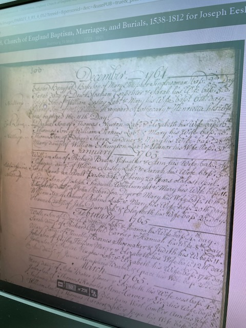
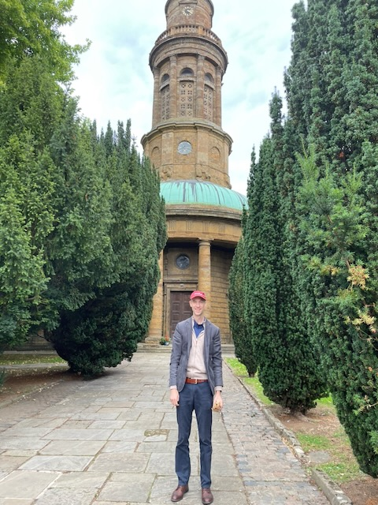

Joseph Eesley was born and christened **6 December 1764 in Banbury, Oxfordshire**, and died seventy-two years later in the same town, in 1837. He married **[Frances "Fanny" Ayris](/family/frances-eesley/)** of Horley at Bloxham on **16 April 1787** — the entry the [Oxford library volunteer in 2018](/docs/eesley-line-research-notes/) had marked with a red question mark, and which Dale's tree confirms as the right one.

Joseph and Frances had at least four children: William (bp. 19 August 1787, only months after the wedding), Hannah (bp. 23 May 1790), Mary (bp. 25 December 1794), and **John Eesley** (bp. January 1799 at Hanwell) — the journeyman miller whose marriage to Susannah Bubb is the next generation's hinge.

## His baptism and parents — St Mary's, Banbury, 1764

The **Banbury St Mary's baptism register** pushes the line back further. Joseph's entry, in December 1764, reads: *"Joseph, Son of William Eesley, Lab[ourer], & Mary his Wife, bap[tized] 6th [day]."* His parents were **[William Eesley](/family/william-eesley-1731/)** (1731–1777), a Banbury laborer, and **Mary Simkins**, who had married at this same St Mary's on 12 December 1758. William was himself baptized at St Mary's Banbury in 1731, the son of **Thomas Eesley (1700–1750)** — carrying the documented Eesley line back to the turn of the eighteenth century, all of it rooted at Banbury.

*The Banbury St Mary's parish register, open to 1761–1765 — the source record retrieved for Joseph, whose baptism falls in December 1764. (Oxfordshire Church of England Baptisms, Marriages and Burials, 1538–1812.)*

*[St Mary's, Banbury](/places/banbury/), where Joseph was baptized on 6 December 1764 — photographed on the family's England pilgrimage. (His son [John](/family/john-eesley-1800/) was baptized a generation later four miles west at Hanwell.) Note: the present rotunda-towered building was rebuilt 1790–1797, so the church Joseph was actually christened in was the medieval St Mary's that stood on this site until its demolition; this is its neoclassical successor on the same ground.*

> *Source: [Dale Eesley / FamilySearch — Joseph Eesley (M7YN-TP5)](https://www.familysearch.org/tree/person/details/M7YN-TP5); Banbury St Mary's parish baptism register, December 1764 (Oxfordshire Church of England Baptisms, 1538–1812).*
