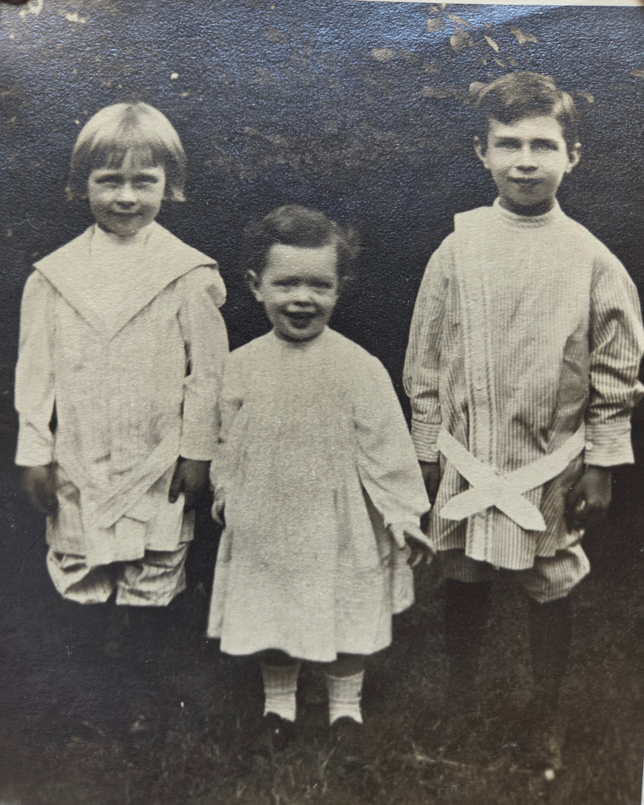

Leonard David Eesley was the **eldest** of Charles Leonard and Lillie Dale Chenoweth Eesley's ten children, born **1904 in Geneva, Ohio**. He lived to seventy-two and died **1976 in Silver Spring, Maryland**. He was the father of **[Tommy Eesley](/family/tommy-eesley/)**, the small boy in Aunt Maggie's deck slide of "Wilbur Chenoweth Eesley with his nephew Tommy at Black Lake, Michigan" around 1933 &mdash; and the same young boy who stands beside his grandfather in the [c. 1937–1939 group portrait of Charles Leonard with five sons](/archive/charles-leonard-and-sons-late-1930s/).

In that group portrait he is the **figure at the far left** &mdash; the oldest of the five brothers in the frame, in his early thirties.

This page is a stub; biographical detail to be added as family memory and Bean's register together fill it in.

> *Sources: Mary Eesley Bean, *[Eesley Family History](/docs/eesley-family-history-1985/)*, 1985; family memory.*

## With his brothers c. 1912

A sepia outdoor portrait from [Roberta Burnes](/family/roberta-burnes/)'s keeping, surfaced June 2026: the [three Eesley brothers — Don (left, ~4), Will (middle, ~2), and Len (right, ~8) — standing on a patch of grass c. 1912](/archive/eesley-three-brothers-c1912/). One of the earliest frames of any of the three in the archive.

