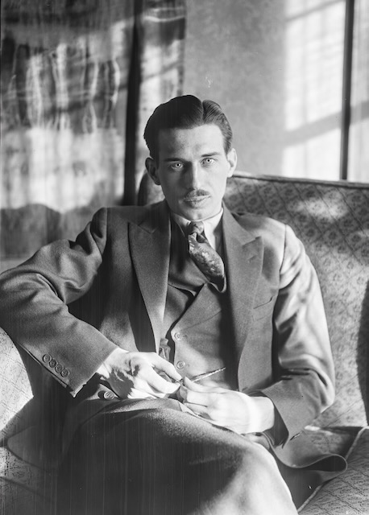

Leonard David Eesley was the **eldest** of Charles Leonard and Lillie Dale Chenoweth Eesley's eight children, born **1904 in Geneva, Ohio**. He lived to seventy-two and died **1976 in Silver Spring, Maryland**. He was the father of **[Tommy Eesley](/family/tommy-eesley/)**, the small boy in Aunt Maggie's deck slide of "Wilbur Chenoweth Eesley with his nephew Tommy at Black Lake, Michigan" around 1933 &mdash; and the same young boy who stands beside his grandfather in the [c. 1937–1939 group portrait of Charles Leonard with five sons](/archive/charles-leonard-and-sons-late-1930s/).

In that group portrait he is the **figure at the far left** &mdash; the oldest of the five brothers in the frame, in his early thirties.

## Marriage and children

Leonard David married **[Helen Bernadine Alspach](/family/helen-bernadine-alspach-eesley/)** (b. 5 October 1902). Per Bean's 1985 register they had **two sons**:

- **[Thomas Leonard "Tommy" Eesley](/family/tommy-eesley/)**, b. 1 December 1930 in Columbus, Ohio &mdash; the boy in the Black Lake and group-portrait photographs above. He married Alymer E. Crafts (d. 1974) and later Dorothy, with children Amy Helen (1958), Laurie Collene (1962), and Dale Thomas (1965).
- **[James Michael "Mike" Eesley](/family/james-michael-eesley/)**, b. 26 October 1938 &mdash; married Adrienne Woods, with sons Gregory Scott (1968) and Thomas Patrick (1969).

> *Sources: Mary Eesley Bean, *[Eesley Family History](/docs/eesley-family-history-1985/)*, 1985 (descendant register, generations IV&ndash;VI); family memory.*

## Portrait, Spring 1929

A studio-lit portrait of Leonard as a young man of about twenty-four &mdash; seated in a three-piece suit with a patterned tie, hair combed back, a slim mustache &mdash; taken in **Spring 1929**. It is the archive's first adult likeness of Charles Leonard's eldest son, and now the portrait at the top of this page.

## With his son Tommy, c. 1932

Leonard, in a beret and sweater, cradling his small son **[Thomas Leonard "Tommy" Eesley](/family/tommy-eesley/)** (b. 1 December 1930) on a sunny bank &mdash; a candid outdoor frame from about 1932, when Tommy was a toddler. See the [father-and-son artifact](/archive/leonard-and-son-tommy-c1932/).

## With his brothers c. 1912

A sepia outdoor portrait from [Roberta Burnes](/family/roberta-burnes/)'s keeping, surfaced June 2026: the [three Eesley brothers — Don (left, ~4), Will (middle, ~2), and Len (right, ~8) — standing on a patch of grass c. 1912](/archive/eesley-three-brothers-c1912/). One of the earliest frames of any of the three in the archive.

