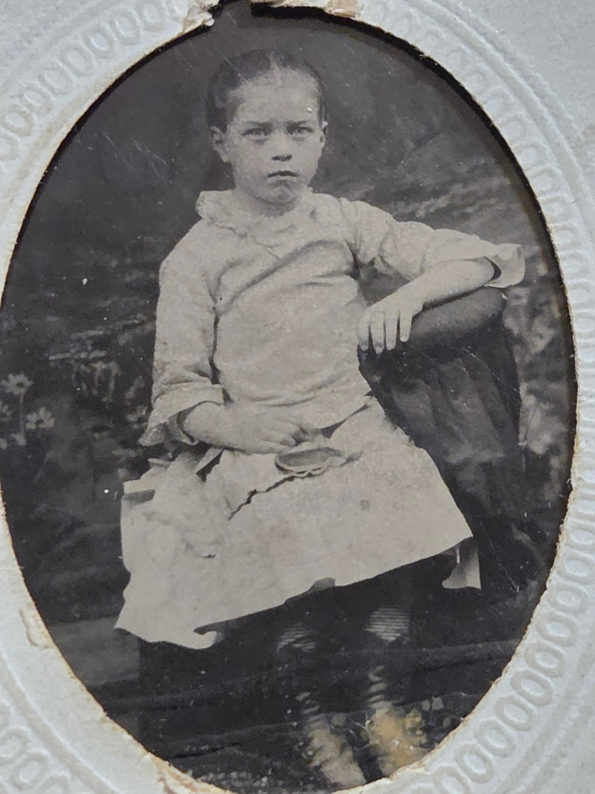

Lillie Dale Chenoweth was born **August 9, 1877**. She married Charles Leonard Eesley and raised ten children with him in Geneva, Lebanon, Shelby, Grove City, and Columbus Ohio (with one daughter, Mary, born in Shelby, Michigan during a Michigan stay). She **outlived three of her children**: Jean Goldie died at twelve in 1924, Dale at thirty-two in 1939, and Lyle at twenty-five in 1942 at a Japanese POW camp.

## Lillie Dale as a child, c. 1881–1884

A tintype of Lillie Dale as a small child &mdash; perhaps **four to seven years old** &mdash; arrived in this archive in June 2026, transmitted by her granddaughter [Roberta Burnes](/family/roberta-burnes/) from the Chenoweth family album. The photograph shows her seated against a painted-floral studio backdrop, in a pale dress with dark stockings, leaning her arm against the rolled top of a studio chair, holding what appears to be a small object (possibly a flower) in her lap. Her hair is short and dark, her expression solemn in the way late-nineteenth-century child portraits required.

The tintype process and the decorative oval mount place the photograph in the **early-to-mid 1880s** &mdash; Lillie would have been a small child in Franklin County, Ohio, decades before she would marry Charles Leonard Eesley, become the Chenoweth matriarch of the Eesley line, and outlive three of her ten children. **The Ohio State music years are still ahead of her.** So is everything else.

It is among the earliest photographs of any direct Eesley-line ancestor in this archive.

## Music at Ohio State

[Charlie Eesley's 12th-grade autobiography (c. 1964&ndash;1965)](/docs/charles-eesley-12th-grade-autobiography-1965/) carries one of the most evocative details about her early life. Charlie's grandson-view:

> *"Grandmother, Miss Lilly Chenoweth, was one of four children. Her father was a prosperous farmer who was highly respected in the community. She studied music at Ohio State University when the campus was barely more than a cornfield."*

**Lillie Dale studied music at Ohio State University** in the late 1890s, when the university (founded 1870 as the Ohio Agricultural and Mechanical College) was still small enough that *"the campus was barely more than a cornfield."* The OSU campus was about thirty years old when Lillie Dale would have attended in the mid-to-late 1890s &mdash; a young land-grant university in the middle of central-Ohio farm country. Her father [Joseph Hill Chenoweth](/family/joseph-hill-chenoweth/) sending a daughter to Ohio State for music is a marker of the family's standing in the community (the *"prosperous farmer... highly respected"* Charlie's autobiography names). Her **specific instrument or vocal training** and **whether she earned a degree** are open research; the Ohio State archives could probably settle them through enrollment records.

She died in **January 1970**, age 92, less than three years before her husband Charles Leonard. She is the matriarch at the center of the [late-1940s/'60s family group portrait](/archive/eesley-family-group-portrait-late-1940s/), photographed at the Bexley home where she had raised everyone.

The Chenoweth marriage is one of two places the paternal family's American branches widen: through Lillie Dale come **[Joseph Hill Chenoweth](/family/joseph-hill-chenoweth/) (1832&ndash;1910)** and **[Mary O. Timmons Chenoweth](/family/mary-ohio-timmons-chenoweth/) (1845&ndash;1919)**, and behind them **[John K. Timmons](/family/john-k-timmons/) (1806&ndash;1888)** &mdash; the deepest documented ancestor on this branch. Lillie Dale's older sister **[Scioto Mafry Chenoweth](/family/scioto-mafry-chenoweth/) (1871&ndash;1930)** &mdash; named after the Scioto River that runs past Columbus &mdash; is the woman Maggie Eesley's deck remembers as **one of the first women medical doctors in the United States in the late 1800s**. The structured record neither confirms nor refutes the MD claim (no occupation field), but Scioto's husband Dr. Lewis Albert Smith was an MD. A research-led follow-up at Ohio State medical archives, the AMA's physician directory, or Ohio licensure records could settle whether Scioto, Lewis, or both held the degree.

> *Sources: Mary Eesley Bean, *[Eesley Family History](/docs/eesley-family-history-1985/)*, p. 7; [Charlie Eesley's 12th-grade autobiography](/docs/charles-eesley-12th-grade-autobiography-1965/) for the Ohio State music study. The broader [**Chenoweth Family Association**](https://www.chenowethsite.org/) maintains comprehensive online genealogy of the Chenoweth surname network in America — the Chenoweth-line ancestors of this archive (Joseph Hill Chenoweth, John K. Timmons, and back) connect into its larger tree.*
