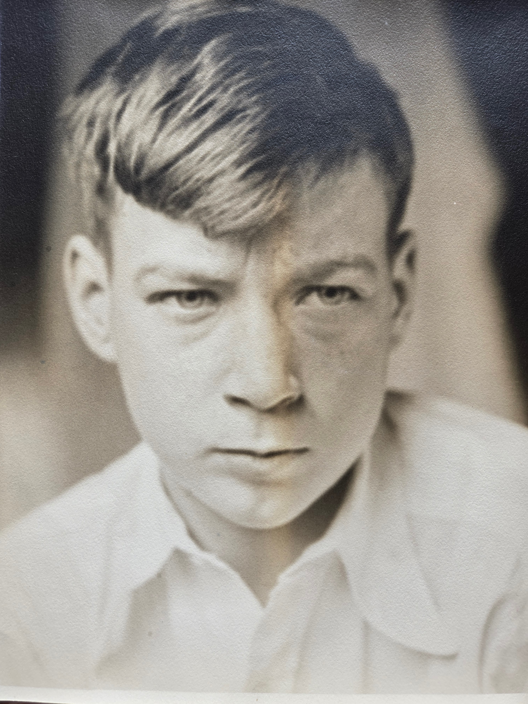
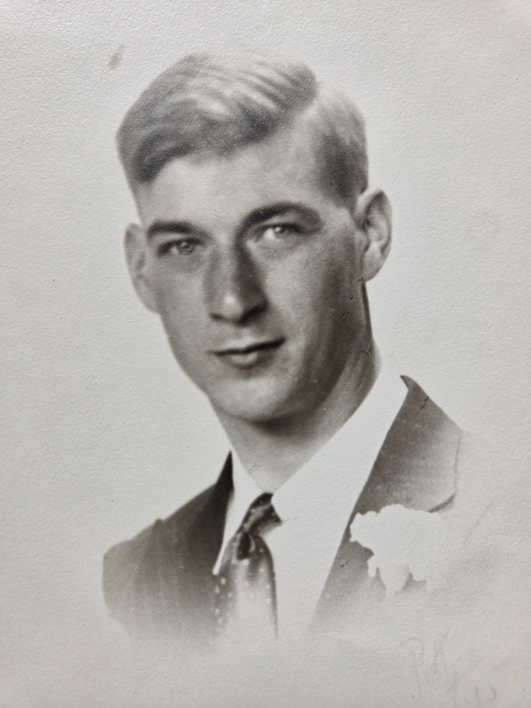

Lyle Eesley was born **August 12, 1916**, in Grove City, Ohio &mdash; one of Charles Leonard and Lillie Dale Chenoweth Eesley's eight children. He died on **July 25, 1942**, at age **twenty-five**, in the **Cabanatuan Prison Camp** on Luzon in the Philippines, where the Imperial Japanese Army had concentrated American and Filipino prisoners of war captured during the fall of the Philippines.

This is the WWII Lyle Eesley. Six years after his death, his brother Donald Stuart Eesley named his own first son [Lyle Stuart Eesley](/family/lyle-stuart-eesley/) (b. 9 January 1948) &mdash; the nephew who carries the name forward into the living family.

That his name appears in the 1985 *Eesley Family History* with the bare facts and that place name — *"died July 25, 1942, Cabanatuan Prison Camp, Luzon, Philippines"* — is itself the family's record of what happened. Cabanatuan was the largest of the Japanese camps in the Philippines; the men who arrived there in mid-1942 had survived the Bataan Death March. The death rate in the first six months was catastrophic.

## What the rest of the family's wartime then looks like in light of this

Lyle's death is the date that reshapes the Stella story. Cousin Roberta's 2019 reconstruction — *"she may have joined the scene after Lyle died"* — turns out to put Stella's arrival in the Eesley household within months of Lyle's death in the Philippines.

The shape of it: Charles Leonard's son was killed in a Japanese prisoner-of-war camp in the summer of 1942. The U.S. government in the same months was rounding up Japanese-Americans on the West Coast and putting them in camps. Charles Leonard, a few months after losing his son in one war camp, brought a Chinese-American teenager — whose appearance was the sole reason she was at risk of ending up in the other one — across the country and into his house in Bexley, Ohio.

That refusal — to let the loss of his son turn him into someone who would inflict a related loss on someone else — is the act that the next two generations remembered. Stella stayed in the house through the 1950s. The family gathered around her in the photographs that became this archive. [Charles Leonard fell into depression when she finally left.](/family/charles-leonard-eesley/)

Lyle has no surviving children in the family register; his line ends at this entry. He is the brother whose absence the next generation lived around.

## Charlie's autobiography on Lyle's death

[Charlie Eesley's 12th-grade autobiography (c. 1964&ndash;1965)](/docs/charles-eesley-12th-grade-autobiography-1965/) gives the family-memory framing of Lyle's death the next generation heard:

> *"Uncle Lyle was killed during World War II. He won the Silver Star for heroism in action but was killed in the 'Bataan Death March' on the Philippine Islands."*

Two details worth noting. **The Silver Star** &mdash; the third-highest U.S. combat decoration for valor &mdash; is named here for the first time in this archive. The 1985 Bean register and the GEDCOM both record Cabanatuan as the death place; Charlie's autobiography says *Bataan Death March*. Both can be true: men who died at Cabanatuan in mid-1942 had usually arrived there as **survivors of the Bataan Death March**. The family memory Charlie transmitted compressed the long death &mdash; capture, march, camp, July 25 &mdash; into the single phrase the family used.

## Four photographs from Roberta Burnes — June 2026

For most of this archive's life there was only one photograph of Lyle in the holdings &mdash; the c. 1937-1939 group portrait of him with his father and four brothers and his nephew. In **June 2026, Roberta Burnes sent four more**, from her late mother Helen Eesley Burnes's family album. They span Lyle's twenty-five years of life from boyhood to the late-1930s window before his enlistment, and they include &mdash; for the first time in this archive &mdash; **a photograph of him with the woman he would have married had he not died in the Philippines**.

### Boyhood portrait, c. 1928-1930

Lyle at about **twelve to fourteen years old** &mdash; the fair hair he kept all his life already present, the eyes still wary of the camera. Bexley, Ohio, c. 1928-1930. He would have just been starting at Bexley High School when this portrait was made.

### Yearbook-style portrait, c. 1934

Lyle at about **eighteen**, in suit and patterned tie &mdash; most likely his **Bexley High School senior portrait c. 1934**, or an early-Otterbein-era studio portrait of the kind young men sat for at college matriculation. He looks composed, prepared, slightly amused. **Eight years before Cabanatuan.**

### Formal portrait with boutonnière, c. mid-late 1930s

Lyle slightly older, in suit and tie with a **white boutonnière** at the lapel &mdash; the boutonnière placing him at a formal occasion, most likely a wedding. Lyle's brother **Leonard David Eesley married Helen Bernadine Alspach** in this period; this portrait is consistent with Lyle as a groomsman or member of the bridal party at one of his siblings' weddings. The dating is the late 1930s.

### With the woman he would have married, c. late 1930s

**The most charged photograph** in this group: **Lyle with the woman he would have married had he survived the war**. Lyle is in a dark overcoat and tie, smiling at the camera, his right arm around her shoulder. She wears a **leopard-print fur coat** with a brooch at the collar &mdash; the kind of fashionable winter coat young women had in the late 1930s &mdash; and her hair is set in dark waves to her shoulders. They are outdoors in front of what looks like a wood-and-brick house, possibly the Bexley family home on Cassidy Road or the woman's own family's house.

**Her name is not yet recorded in the archive.** Chuck Eesley and Roberta Burnes are the two living people most likely to remember &mdash; the name may be in Helen Burnes's notes that Roberta is working through, or it may be in the brothers' letters from before the war. A research-task is to identify her and surface her name on this page; she is part of Lyle's life and part of what his death took away.

What is recorded in family memory: **Lyle never married before he enlisted, and the woman he was committed to outlived him by years &mdash; living a life that, by all later family memory, was always shadowed by the loss of him**.

## The fifth photograph &mdash; the brothers' group portrait, c. 1937&ndash;1939

The fifth photograph of Lyle currently in the archive is the **[group portrait of Charles Leonard with five of his adult sons and his grandson Tommy, c. 1937&ndash;1939](/archive/charles-leonard-and-sons-late-1930s/)** &mdash; six men in formal suits against a hedge. **Lyle is second from the left**: fair-haired, around twenty-one or twenty-two, head turned slightly toward his older brother Leonard David. The frame catches him at home in Bexley **three to five years before he shipped to the Philippines and never came home**, alongside his brother Dale who himself would die in July 1939 before either Lyle's enlistment or the war.

> *Sources: Mary Eesley Bean, *[Eesley Family History](/docs/eesley-family-history-1985/)*, March 1985, p. 8; cousin Roberta's 2019 oral note; the historical record of the Cabanatuan POW camp. Structured record: [Dale Eesley / FamilySearch — Lyle Eesley (LB4C-DH3)](https://www.familysearch.org/tree/person/details/LB4C-DH3).*

## Further reading

On what Lyle was in the middle of when he died:

- [*Ghost Soldiers: The Epic Account of World War II's Greatest Rescue Mission*](https://www.goodreads.com/book/show/94799.Ghost_Soldiers) by Hampton Sides &mdash; the definitive account of Cabanatuan, the prisoners held there, and the eventual American raid that liberated the camp in January 1945, three years too late for Lyle.
- [*Tears in the Darkness: The Story of the Bataan Death March and Its Aftermath*](https://www.goodreads.com/book/show/6455003-tears-in-the-darkness) by Michael and Elizabeth Norman &mdash; the march that delivered most of the prisoners to Cabanatuan.
- [*Some Survived: An Eyewitness Account of the Bataan Death March and the Men Who Lived Through It*](https://www.goodreads.com/book/show/693426.Some_Survived) by Manny Lawton.
- The [Cabanatuan POW Camp](https://en.wikipedia.org/wiki/Cabanatuan) and [Bataan Death March](https://en.wikipedia.org/wiki/Bataan_Death_March) entries on Wikipedia.
- [American Battle Monuments Commission](https://www.abmc.gov/) &mdash; the federal record of US service members buried or memorialized overseas; the Manila American Cemetery records those who died in the Philippines campaign.

## See also — family threads

Lyle is an anchor for **Thread #5 (Service, stewardship, and giving)** in the [**Family threads**](/docs/family-threads/) synthesis essay — the family's deepest single cost on the military side: a young Eesley who died as a POW at Cabanatuan in the Philippines in 1942, named in the military-service roster alongside Robert Earl's B-24 missions and Charlie's Vietnam tour.
