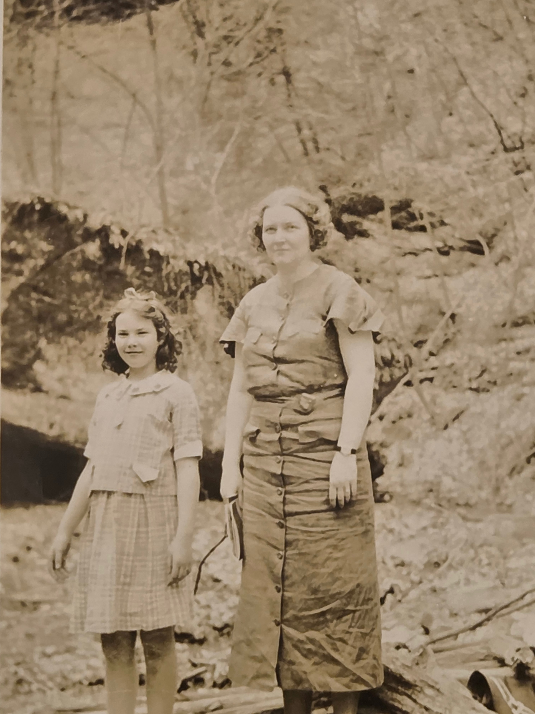

**Mafry Smith Hyatt** is the daughter of **[Dr. Sciota "Ota" Mafry Chenoweth Smith](/family/scioto-mafry-chenoweth/)** — the older sister of Lillie Dale Chenoweth Eesley and the **medical-doctor sister** the Chenoweth-Eesley family memory has long carried.

## The given name

Her **first name "Mafry"** is unusual enough to be worth noting: it is **her mother's middle name passed on as a given name**. Sciota's full name was **Scioto Mafry Chenoweth** — Scioto from the Ohio river, Mafry as a family middle name. When Sciota had a daughter, she gave her the **distinctive Chenoweth middle-name "Mafry" as her own first name**. The family's pattern of preserving Chenoweth names through the generations is visible in this naming choice.

Her **last name "Smith"** is from her father, **Dr. Lewis Albert Smith** (1874–1957); her **married name "Hyatt"** is from her husband, whose given name is not yet documented in this archive.

## A 1930s portrait — Mafry with her young daughter

The earliest photograph of Mafry in this archive arrived in June 2026 from [Roberta Burnes](/family/roberta-burnes/)'s Chenoweth family album: a sepia outdoor frame of Mafry standing next to her young daughter, perhaps seven to nine years old, against a wooded creek-bed background. Mafry is in a button-down day dress with short sleeves and a wristwatch; her daughter is in a plaid skirt-and-jacket set with a hair bow and a small purse. Their hair, dress, and the photograph's emulsion place the frame in the **mid-to-late 1930s**.

Per Roberta's June 2026 confirmation: **the photograph is labeled 1937, and the daughter is Marjorie &mdash; Mafry's only child.** Roberta met Marjorie briefly after Roberta's mother's death; Marjorie helped Roberta identify several other family photographs. The portrait preserves Mafry's young-motherhood phase &mdash; bridging from her [early-1970s ERA-activist years](/family/mafry-smith-hyatt/) and her *"at least once a week"* visits to the Burnes household. (Roberta has noted that many of the original Mafry-and-Ota photographs went to other Burnes siblings; she will check whether the original CD-ROMs the scans went to are still readable.)

If Mafry was [married in September 1922](/docs/letters/lillie-dale-to-leonard-1922-09-03/) (per Lillie Dale's letter to Len that month, *"I expect Mafry will be married this month"*) and the daughter in this frame is about eight years old, the frame would sit roughly around **1932&ndash;1936** &mdash; about a decade into her marriage. The earlier-than-previously-documented Mafry biography starts here.

## In the c. 1970s family reunion portrait

Mafry appears as one of the named figures in the **[c. 1970s Eesley extended family reunion portrait](/archive/highland-ridge-family-group-portrait-c-1980/)**. The typed caption identifies her specifically as:

> *Mafry Smith Hyatt (daughter of Lilly Chenoweth Eesley's sister, Dr. Sciota "Ota" Chenoweth Smith)*

The presence of "Dr." in front of her mother's name on the caption is the family's documentary confirmation that **Sciota was the medical doctor** — Mafry, as the surviving daughter, would have been the keeper of that memory and the visiting cousin who carried the Chenoweth-Smith branch's family record into the Eesley reunion.

## Who knew Aunt Ota in person

The previous version of this page stated that Mafry was *"the only person in this archive's record who knew Sciota in person."* That was wrong. In a June 2026 email, [Roberta Burnes](/family/roberta-burnes/) corrected the picture:

> *Mafry and my mother both knew Ota, as well as all the other siblings in that generation (Len, Will, Don, Mary). Ota delivered my mother at home on January 16, 1924. Perhaps she delivered other children of Lily's as well?*

So the family memory of Aunt Ota ran through the entire Charles-Leonard-and-Lillie-Dale sibling generation &mdash; their nieces and nephews [Leonard "Len" Eesley](/family/leonard-david-eesley/), [Will Eesley](/family/wilbur-eesley/), [Don Eesley](/family/don-eesley/), [Mary Eesley Bean](/family/mary-eesley-bean/), and [Helen Louise Eesley Burnes](/family/helen-burnes/) (Roberta's mother) all knew her personally. Helen had a particular reason: **Ota delivered her at home on 16 January 1924**, in the Eesley household. She may well have delivered her other Eesley nieces and nephews too &mdash; the practice fits her medical work and her closeness to her sister Lillie Dale.

Mafry was, however, the *last* surviving family member of Ota's own household by the time of the early-1970s Highland Ridge reunions; the chain of Aunt-Ota stories that runs through Roberta's email is the chain that flowed from Helen and from Mafry, both, to the next generation.

## Mafry in the early 1970s — the activist next door

Roberta's June 2026 email also opens Mafry's adult life, which the previous version of this page had treated as a stub. The picture is striking:

> *Mafry was such a character. Witty, sharp, and such a feminist along with my Mom in the early seventies when the first Equal Rights Amendment was being championed. She would visit at least once a week in her later years. I have many pictures of her growing up and throughout her lifetime.*

So:

- Mafry was an **early-1970s Equal Rights Amendment activist**, alongside her cousin Helen Eesley Burnes. The ERA was approved by Congress in March 1972 and ran a state-by-state ratification fight across the 1970s; Mafry and Helen were in it together on the Ohio side.
- Her register of voice was *"witty, sharp"* &mdash; the older-generation version of the same Eesley-family dry humor that would later run through Chuck's father Charlie and into Chuck himself.
- She **visited the Burnes household at least once a week** in her later years &mdash; close enough that the next generation (Roberta and her sisters) grew up knowing her, with photographs spanning her whole lifetime.
- Roberta's photographic record of Mafry is queued for digitization.

The stub-status note on this page can therefore be retired. Mafry's birth and death dates, her husband's first name, her medical-school-trained mother's death in 1930 (when Mafry would have been a young adult), the children she may have had, and the texture of her ERA activism are all still to surface &mdash; but the basic adult-life picture is here.

> *Sources: [c. 1971–1972 Eesley extended-family reunion portrait](/archive/highland-ridge-family-group-portrait-c-1980/) &mdash; typed caption identification by the family. Roberta Burnes, email June 2026 (correcting the Aunt-Ota family-memory chain and opening Mafry's adult biography). See also the broader [Chenoweth Family Association](https://www.chenowethsite.com/) genealogical resources for the Chenoweth surname network this family belongs to.*
