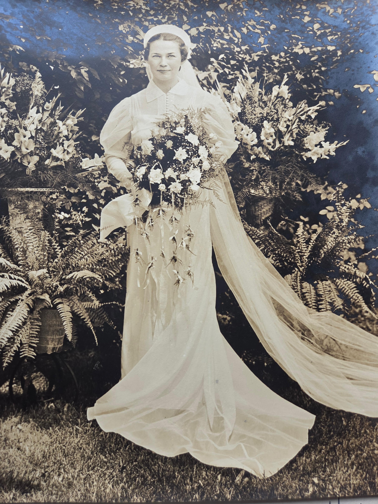

Mary Elizabeth Eesley was born **August 25, 1913 in Shelby, Michigan** — the seventh of Charles Leonard and Lillie Dale Chenoweth Eesley's ten children, and the second of their three daughters. She married **William Thomas Bean** (born November 13, 1909). They had one daughter, **Margaret Louise Bean** (b. December 11, 1941), who married Jay Albert Kirkpatrick.

## Mary's wedding portrait

A formal bridal portrait of Mary survives in [Roberta Burnes Walker](/family/roberta-burnes/)'s family album &mdash; shared June 2026. Mary stands on a lawn before lush ferns and flowering background plants, in a long white silk wedding gown with a fitted bodice, ruffled bow at the collar, and a long sheer chapel-length train fanning out across the grass. A small bow-decorated cap-and-veil sits on her head. She holds a large cascading bouquet of white flowers with trailing ribbons. The composition reads as **a c. 1939-1942 wedding** &mdash; consistent with the marriage that produced their daughter Margaret Louise in December 1941.

The portrait is the earliest formal photograph of Mary on this archive &mdash; the documentary image of the young woman who, four decades later, would assemble the [1985 Eesley Family History](/docs/eesley-family-history-1985/) that became the relationship backbone of the entire paternal side of this site.

In March 1985, working in her early seventies from her home in Narberth, Pennsylvania, she wrote the book that made this site possible: the [Eesley Family History](/docs/eesley-family-history-1985/) — a chronological listing of her father Charles Leonard Eesley's family, traced back through her grandfather Albert, and forward through every descendant she could trace. Her brother Will drew the cover.

It is the relationship backbone of this archive's paternal line and the founding document of the line's record-keeping habit. She is not just a source; she is the most important figure in the previous generation of family record-keepers.

## See also — family threads

Mary is the **paternal-side anchor for Thread #3 (Writing things down for the future)** in the [**Family threads**](/docs/family-threads/) synthesis essay. The [1985 *Eesley Family History*](/docs/eesley-family-history-1985/) she wrote is the relationship backbone of this entire site — the Eesley counterpart of Robert Earl's 1990 *Wildermuth/Fleming Heritage* on the maternal side.

> *Sources: Mary Eesley Bean, *[Eesley Family History](/docs/eesley-family-history-1985/)*, p. 8; her own preface, March 1985. Structured record: [Dale Eesley / FamilySearch — Mary Elizabeth Eesley (LB4H-N33)](https://www.familysearch.org/tree/person/details/LB4H-N33).*
