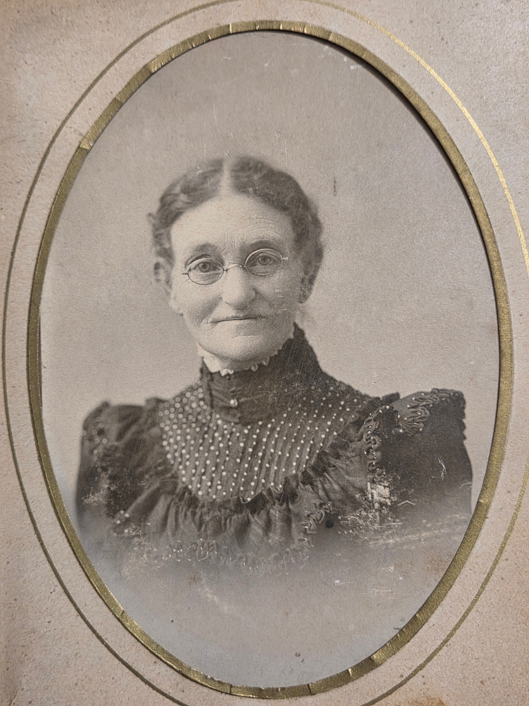

Mary O. Timmons was born in **March 1845** in Ohio, daughter of [John K. Timmons](/family/john-k-timmons/). The structured record gives her name as **Mary O.**; Aunt Maggie Eesley's *Four Generations* archive expands it to **Mary Ohio** with the etymology note that **"Ohio" means "beautiful river"** in the Iroquoian tongue from which it was borrowed &mdash; given to her, the family memory holds, "to honor the state in which she was born." Whether her middle name was actually Ohio on her birth certificate or whether the family had expanded the initial O. into a meaning over the generations is itself a small open question worth flagging.

She married **[Joseph Hill Chenoweth](/family/joseph-hill-chenoweth/) on 25 November 1864** in Franklin County, Ohio &mdash; six months after the Confederate surrender at Appomattox. Her formal portrait in the family archive dates to around 1865&ndash;1870, the early-marriage years.

She is documented in Aunt Maggie's deck as Maggie's **great-grandmother** &mdash; which makes her Chuck's **great-great-grandmother** through the line that runs Mary O. &rarr; [Lillie Dale](/family/lillie-dale-chenoweth/) &rarr; [Will Eesley](/family/wilbur-eesley/) &rarr; [Charles McMaster Eesley](/family/charles-eesley/) &rarr; Chuck.

She died in **1919** and is buried in Westerville, Franklin County, Ohio &mdash; nine years after her husband, at the same cemetery.

## Children

The GEDCOM records at least five children:

- **[Lillie Dale Chenoweth Eesley](/family/lillie-dale-chenoweth/)** (1877&ndash;1970) &mdash; the Chenoweth matriarch who married into the Eesley line.
- **[Scioto Mafry Chenoweth](/family/scioto-mafry-chenoweth/)** (1871&ndash;1930) &mdash; named after the **Scioto River** (the Ohio river-name being a family habit); the woman of Maggie's "first women medical doctors" line.
- **Howard Glen Chenoweth** &mdash; not yet a person entry.
- **Elsie Chenoweth** &mdash; not yet a person entry.
- **Dwight Kennedy Chenoweth** (1880&ndash;1957) &mdash; not yet a person entry; died in Biloxi, Mississippi.

## The two photographs

Two correctly-identified portraits of Mary Timmons Chenoweth arrived in this archive in **June 2026**, transmitted by [Roberta Burnes](/family/roberta-burnes/) from the family album she inherited through the Burnes-Eesley line — the same album that holds the 1860s handwritten Chenoweth family register and her 1862 teacher's certificate.

### Mary as a young woman, c. 1862–1865

The portrait at the head of this page is a tintype of Mary as a young woman &mdash; **probably late teens or very early twenties**, with center-parted dark hair pulled back, a small bow tie at the throat, and a checked-fabric collared dress. The tintype process and the decorative gold-and-cream paper mount place the photograph in the **early-to-mid 1860s** &mdash; the years bracketing her 1862 teacher's certificate (age seventeen) and her 1864 marriage to [Joseph Hill Chenoweth](/family/joseph-hill-chenoweth/) (age nineteen). She is, in this portrait, **a young Ohio woman teaching school during the second year of the Civil War**, two years away from the marriage that would carry the Chenoweth line forward into the Eesleys.

### Mary in old age, c. 1900–1915

The second portrait shows Mary in her later years &mdash; an oval-framed studio photograph with thin wire-rim spectacles, dark beaded Victorian bodice, hair pulled back in a tight bun. The framing style and dress place it in the **first decade-and-a-half of the twentieth century**, when she was in her mid-fifties to early seventies. She died in 1919.

Together the two portraits frame more than fifty years of her life — from the seventeen-year-old teacher in Civil War Ohio to the elderly matriarch of a household that would carry the Chenoweth name into the Eesley generation through her daughter Lillie Dale.

## A retraction, June 2026

The portrait that previously appeared on this page &mdash; carried into the archive through Maggie Eesley's *Four Generations* deck under the label *Mary Timmons Chenoweth* &mdash; was reviewed against Roberta Burnes's family album and is **not** Mary Timmons Chenoweth. It is a friend of hers, **labeled as such in Roberta's album**, and was misidentified somewhere between the album and Maggie's deck. The misattributed scan is held back from this page until the friend's actual identity is known.

## What else the family album holds

Roberta has also flagged that the album includes:

- A photograph of [Joseph Hill Chenoweth](/family/joseph-hill-chenoweth/)'s father [Elijah Chenoweth](/family/elijah-chenoweth/) &mdash; the deepest documented Chenoweth ancestor in this archive's keeping.
- A photograph of Mary's own father.
- Mary's **1862 teacher's certificate** &mdash; the document underneath the biographical line of this page.
- The **1860s handwritten Chenoweth family register** that anchors the Chenoweth Family Association's online genealogy.

These are queued for the next round of digitization.

> *Sources: Mary Bean, [Eesley Family History](/docs/eesley-family-history-1985/); structured record [Dale Eesley / FamilySearch &mdash; Mary O. Timmons (KCCC-MTP)](https://www.familysearch.org/tree/person/details/KCCC-MTP); portrait retraction and incoming-photograph notice from Roberta Burnes, June 2026.*
