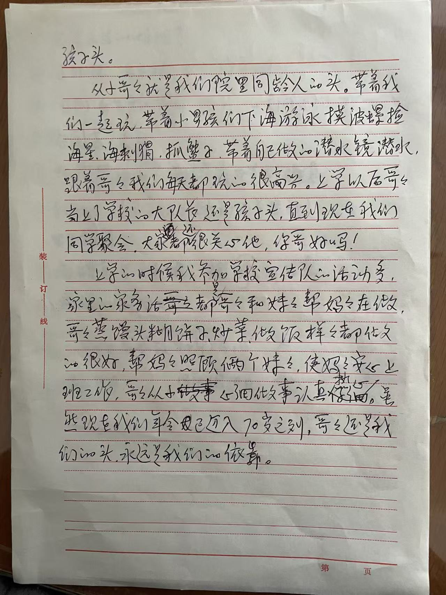

<strong>📖 English version below — <a href="#en">Jump to English ↓</a></strong> &nbsp;·&nbsp; <em>本页中文在上，英文见下方。</em>

**李孟令**（姓名汉字已由家族确认）&mdash; 周丽婕之舅父，其母[李恂](/family/xun-li/)之兄长。1980年10月1日在青岛与[An Qin Teng](/family/an-qin-teng/)成婚（据家谱）。

### 孩子头 &mdash; 妹妹手记（2026年7月）

2026年7月，妹妹[李恂](/family/xun-li/)（周丽婕之母）写下对哥哥的回忆，照录如下：

*李恂手写原稿（2026年7月）&mdash; The remembrance in Li Xun's own hand.*

> &hellip;孩子头。
>
> 从小哥哥就是我们院里同龄人的头。带着我们一起玩，带着小男孩们下海游泳、摸波螺、捡海星、海刺猬，抓蟹子。带着自己做的潜水镜潜水。跟着哥哥我们每天都玩的很高兴。上学以后哥哥当上了学校的大队长，还是孩子头。直到现在我们同学聚会，大家都还很关心他："你哥好吗！"
>
> 上学的时候我参加学校[宣传队](/archive/qingdao-no36-middle-school-troupe-1971/)的活动多，家里的家务活都是哥哥和妹妹帮妈妈在做。哥哥蒸馒头、糊饼子、炒菜、做饭样样都做的很好，帮妈妈照顾俩个妹妹，使妈妈安心上班工作。哥哥从小做事仔细、做事认真踏实。虽然现在我们年令都已迈入70岁之列，哥哥还是我们的头，永远是我们的依靠。
>
> *&mdash; 2026年7月*

*（本篇是李恂陆续写下的家族回忆之一，首行"孩子头。"承接前文。据她本人2026年7月所言，"后面想起来还要继续写" &mdash; 全篇写完后再定如何编排。）*

> *详细生平从略 &mdash; 在世。人名汉字已由家族确认。*

## English

Details withheld &mdash; living. He married [An Qin Teng](/family/an-qin-teng/) on **1 October 1980 in Qingdao** (per the family tree).

## "The leader of the kids" &mdash; his sister's note (July 2026)

In July 2026 his younger sister [Li Xun](/family/xun-li/) &mdash; Lijie's mother &mdash; wrote a remembrance of her older brother, reproduced here in her own words:

> &hellip;the leader of the kids.
>
> From the time we were small, my brother was the leader of everyone our age in our courtyard. He took us along to play; he took the little boys down to the sea to swim, to feel for whelks, to gather starfish and sea urchins, to catch crabs. He took **diving goggles he had made himself** and dove with them. Following our brother, every day we played happily. Once he started school he became the school's **brigade leader** &mdash; and he was still the leader of the kids. Even now, at our class reunions, everyone still asks after him: *"How is your brother?"*
>
> When I was in school I was often busy with the school [propaganda troupe](/archive/qingdao-no36-middle-school-troupe-1971/), so the housework at home was done by my brother and my younger sister, helping our mother. My brother steamed mantou, made griddle cakes, stir-fried dishes, cooked &mdash; he did all of it well. He helped our mother look after her two younger daughters, so that she could go to work with an easy mind. From childhood my brother did things carefully, conscientiously, steadily. Even though we have all now entered our seventies, my brother is still our leader, and will always be the one we lean on.
>
> *&mdash; July 2026*

*(This is one of a continuing series of family remembrances Li Xun is writing; the opening line carries on from an earlier passage. In her words, July 2026: "as things come back to me I'll keep writing" &mdash; how the full set is finally arranged will be decided once she has finished.)*

## A childhood frame &mdash; the Zhanqiao pier, c. 1960s

The earliest photograph of Lijie's uncle in this archive is the [Qingdao Zhanqiao pier family group photographed by Tianzhen Photography (天真照相)](/family/zhongchu-li/), c. 1960s. He stands as **the small boy on the left** &mdash; about seven years old, in a dark Mao-collar suit &mdash; separated by a small distance from his parents and sisters at the right of the frame, which makes the composition read as the older brother already starting to stand a little apart from his younger sisters. Lijie's maternal grandfather, in the heavy fur-collar coat, is at right.

The pier photograph was for many years catalogued on the Zhaoxiang Zhou (Lijie's paternal grandfather) page; Chuck's June 2026 identification of the small boy as Lijie's uncle Mengling settled the family-side question and relocated the photo to the Li side of Lijie's family. It is the only known image of him as a child in this archive.

> *Structured record: [FamilySearch — Mengling Li (GM1Y-9WR)](https://www.familysearch.org/tree/person/details/GM1Y-9WR).*
