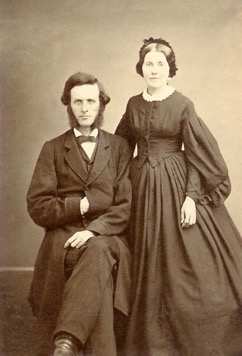

Nancy Jane Shaw was born in **1834** and died in **1910**, age 76. She married [Reverend Abraham Ramsey Anderson](/family/abraham-ramsey-anderson/) around **1860** in Washington, Pennsylvania; their wedding-year double portrait (by **J. S. Young** of Washington, Pennsylvania) preserves what Maggie Eesley's catalogue called "a couple anticipating a long marriage blessed with six children."

A higher-resolution scan of that wedding-year frame arrived in this archive in June 2026 from Chuck's keeping. She stands at her young husband's right shoulder &mdash; in a dark bell-sleeved dress with a white collar at the throat, hair pulled up; he is seated beside her in a dark suit, vest, and the long Presbyterian-clerical beard he would carry through his five-decade ministry. The studio frame is the kind of formal portrait a recently-married couple in Washington County, Pennsylvania would have sat for in the first months of the Civil War.

Together they raised six children, one of whom was [Alice Anderson McMaster](/family/alice-anderson-mcmaster/) (1871&ndash;1961), Chuck's great-grandmother.

The second photograph, dated **1888**, shows her in her sixties, taken by **Morris of Pittsburg, Pennsylvania**. Maggie's catalogue note on the chair she rests her hand on in that frame, with a wry editorial:

> *This detail appears on the chair upon which Nancy Jane Shaw Anderson's hand rests. It seems odd that the wife of a well-respected minister would rest her hand upon such a graphic display of a battle between a lion and a naked man.*

Whether the chair was an heirloom, a studio prop, or simply unremarked-on furniture from the era, it is the kind of detail Maggie's archival eye preserved without judgment, and worth keeping in the record for that reason alone.

She is **Chuck's great-great-grandmother** along the same line as her husband.

> *Sources: Maggie Eesley, *Four Generations of the Eesley Family* (PowerPoint archive); deck IDs `ARA_NJSA001 en` (with husband, 1860, by J. S. Young, Washington PA) and `NJSA en` (alone in her sixties, 1888, by Morris, Pittsburg PA).*
