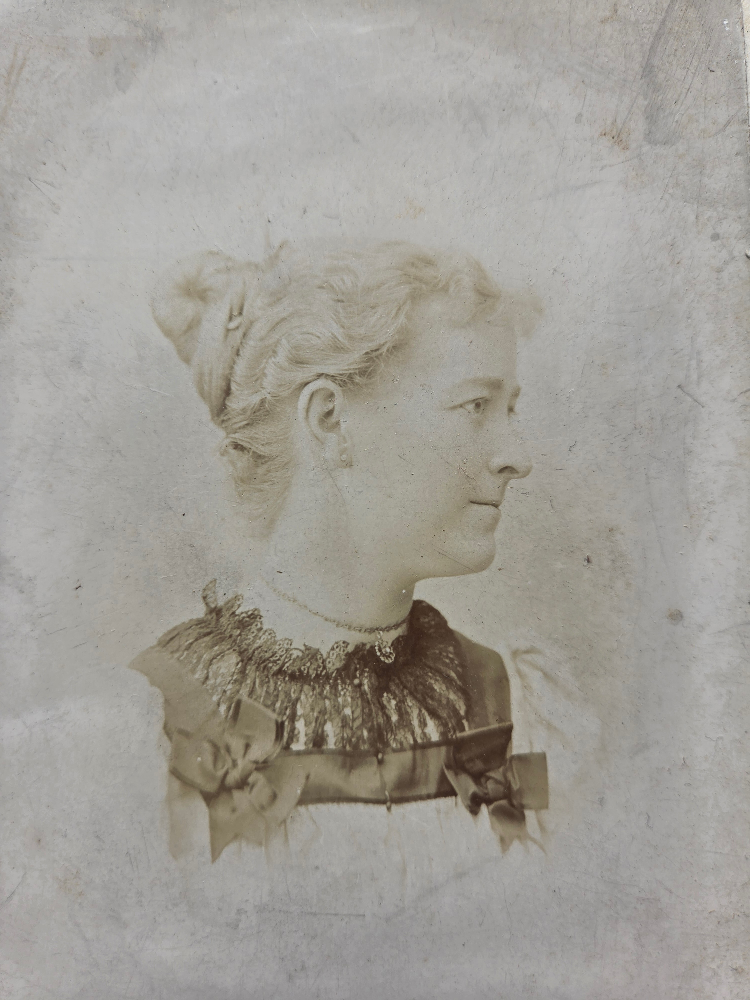

A profile portrait of **Ota Chenoweth Smith** &mdash; identified by [Roberta Burnes](/family/roberta-burnes/) from her Chenoweth family album, shared in June 2026 &mdash; is the first time this person appears in the archive. The frame is a side-on studio portrait, her hair piled up in the high bun style of the late 1880s through 1890s, a delicate lace collar at her throat, a small chain visible. The face is composed; the expression is calm.

The **Smith married name** suggests Ota married into a Smith family. Her exact place in the Chenoweth tree &mdash; which branch of the [Egge Chenoweth-site](https://www.chenowethsite.com/) tree she descends from, and whether she connects to [Lillie Dale Chenoweth Eesley](/family/lillie-dale-chenoweth/)'s [Joseph Hill](/family/joseph-hill-chenoweth/) branch or to one of the parallel Chenoweth lines &mdash; is an open question. Roberta and Egge's site should settle it.

> *Source: Identified by Roberta Burnes in her June 2026 photo-batch email; the portrait scan is part of her Chenoweth family album holdings.*
