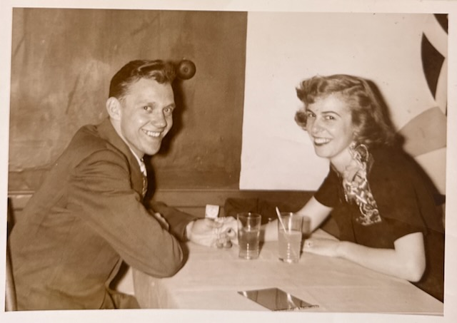
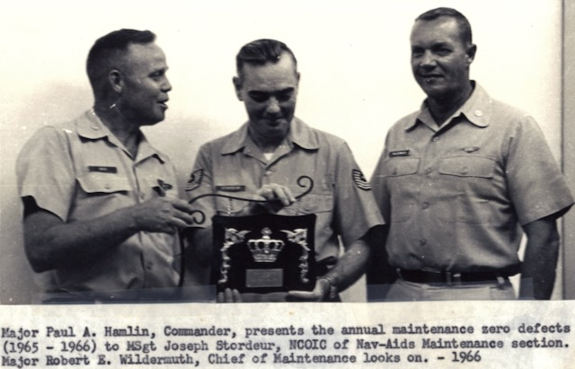
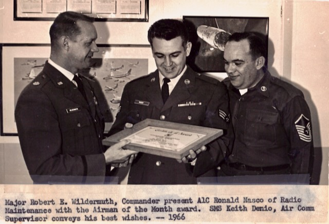
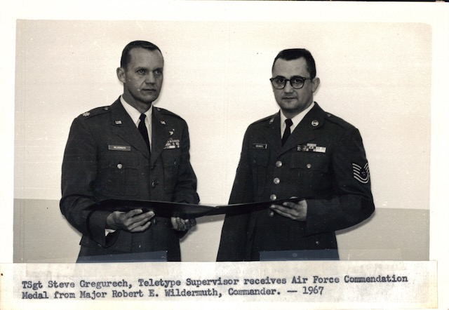
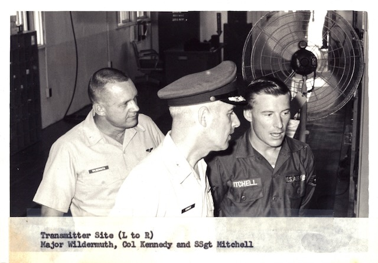
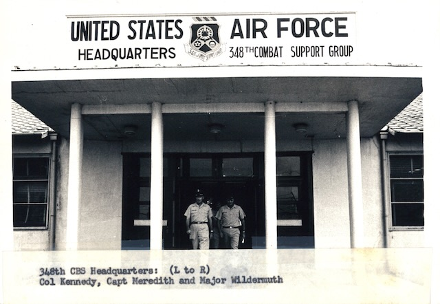
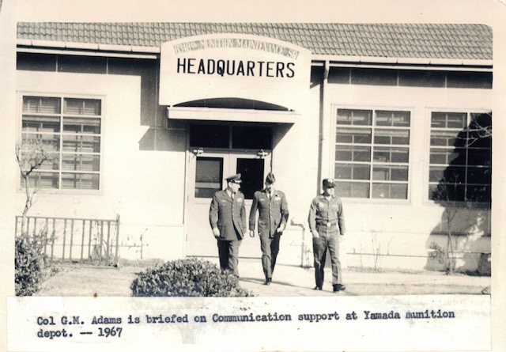
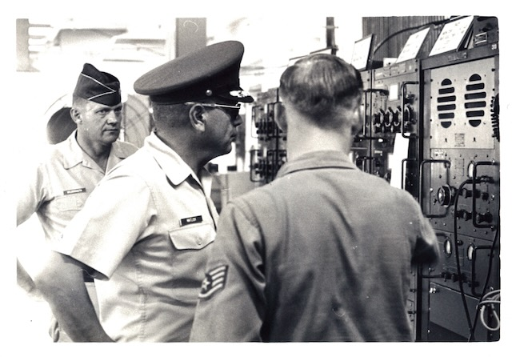
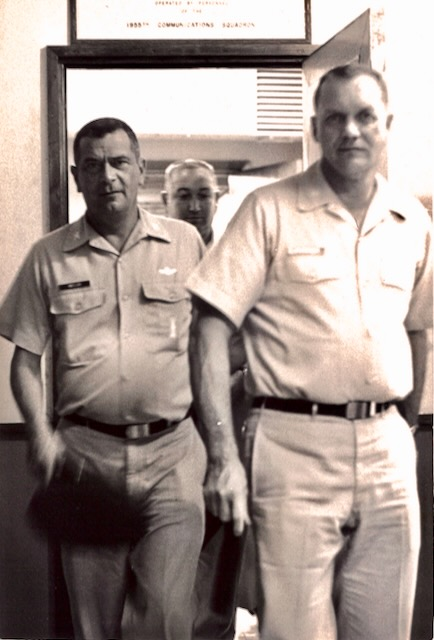

Robert Earl Wildermuth was born **8 May 1924, at home, at 123 Franklin Street in Marietta, Ohio**, to [Earl A. Wildermuth](/family/earl-a-wildermuth/) and [Sadye Irene (Fleming) Wildermuth](/family/sadye-fleming-wildermuth/) &mdash; the eldest of their five children, in the river town where the Wildermuth patriarch Johann Michael had set up shop as an immigrant shoemaker in the 1840s. He attended **Harmar Elementary School**, **graduated from Marietta High School in June 1942**, attended **Marietta College in the pre-med program**, then transferred. He flew combat missions out of Biak, Leyte, and Mindoro in 1944&ndash;45 as the navigator on a ten-man B-24 crew.

After the war he came to **Stanford** on the GI Bill and earned his **Bachelor of Arts in Biological Sciences** &mdash; conferred on **October 1, 1948**, signed by President J. Wallace Sterling. The [diploma itself](/archive/robert-earl-wildermuth-stanford-ba-1948/) survives in the family's keeping. **The young portrait at the top of this entry is from his Stanford graduation day** &mdash; 1 October 1948, suit on, leaves behind him, the unmistakable post-war California light &mdash; the moment the first Stanford degree in the Wildermuth–Eesley line was conferred. The next Christmas, 1949, he and his fianc&eacute;e Dot sent out a [photo greeting](/archive/dot-and-bob-christmas-card-1949/) signed *"Love, Dot + Bob &mdash; 1949."*

*Robert Earl and Dorothy ("Dot") Davis during their courtship in the 1940s &mdash; the couple who would marry on Easter Sunday, 20 April 1946, and stay married fifty-three years.*

## The MGM camera mission

In the summer of 1945, after the 9 August atomic bombing of Nagasaki, **Robert Earl was the navigator on the B-24 that flew an MGM newsreel cameraman over the bombed city at treetop level to film the aftermath.** It is one of the most consequential single flights of his career &mdash; the cinematic record of the second atomic strike, footage the postwar world would form its understanding of nuclear weapons from, needed someone to navigate the plane the cameras rode in. He was that navigator. The fully-built-out treatment, with cameraman context, the parallel ground crew under Lt. Daniel A. McGovern, and the postwar US suppression of the footage, is in the [combat log's marquee-moment section](/docs/the-big-one/#nagasaki-mgm).

He served again in Korea, worked at the Pentagon, retired as a lieutenant colonel, and spent the rest of his life teaching and researching the family back to the early 1700s in W&uuml;rttemberg.

## The 1999 obituary &mdash; the documentary anchor

The [obituary published in the Marietta Times c. 10 July 1999](../../assets/family/originals/robert-earl-wildermuth-obituary-1999.pdf) (newspaper-clipping scan in this archive's keeping) is the contemporaneous family-supplied document of record. From it:

> *"VENICE, Fla. &mdash; Robert Earl Wildermuth Sr., 75, of Venice, a former resident of Harmar, died Friday afternoon, June 25, 1999, in Doctor's Hospital in Sarasota, Fla."*

The obituary gives the **specific service dates** that the memoir-as-recollection had carried only approximately:

- **Service entry: 24 March 1943** &mdash; Air Corps, US Army.
- **Air Corps Navigation Training Center graduation: 4 July 1944** &mdash; the navigator's wings.
- **Commission as Second Lieutenant**: later that summer, on receipt of his Class 44-9 cadet rating.
- **Last WWII mission: the MGM movie camera/newsman flight over Nagasaki** to record atomic-bomb damage. (Both [the memoir](/docs/robert-earl-wildermuth-memoir/) and the obituary name the camera-mission destination as Nagasaki only; the memoir contextualizes it with the 6 August Hiroshima and 9 August Nagasaki bombings together as the historical pair that triggered the surrender movement, but the overflight itself was Nagasaki only.)
- **Separation from the army as 1st Lieutenant: 30 November 1945.**
- **Stanford BA: 1948.**
- **Rejoined as bombardier/navigator**, *"the new Army Air Corps"* &mdash; the post-war re-formed service.
- **Korea: 1 year**, promoted to **captain**.
- **1963: Air Force Commendation Medal.**
- **1965: promoted to major**, assigned to the **1955th Communications Squadron at Itazuke Air Base, Fukuoka, Japan**. The family's Japan years begin here, with [Itazuke](/places/itazuke-air-base/) as the actual posting.
- **Eventually promoted to lieutenant colonel.**
- **1968: transferred to the Pentagon**, Air Force Personnel Directorate, communication specialist.
- **31 May 1970: retired**, awarded the **Meritorious Service Medal**.

The post-service career the obituary records is longer than the memoir alone had surfaced: after the Fall 1970 mathematics-teaching year at [Seabreeze High School](https://en.wikipedia.org/wiki/Seabreeze_High_School) in Daytona Beach, he worked successively as **salesman, state unemployment agent, golf course supervisor, electronic computer technician, and in the insurance business**, retiring in 1986. From 1986 forward he was **the family genealogist** &mdash; the work that produced [the 1989 memoir](/docs/robert-earl-wildermuth-memoir/), [the 1990 *Wildermuth/Fleming Heritage*](/docs/wildermuth-fleming-heritage-1990/), and the documents this archive is built on.

He earned **three undergraduate degrees in three different fields** &mdash; an unusual academic record:

| Year | Degree | Institution | Field |
|---|---|---|---|
| **1948** | B.A. | Stanford University | Biological Sciences |
| **1965** | B.S. | Southern Methodist University | Industrial Engineering |
| **1972** | B.S. | University of Central Florida | Medical Record Administration |

The third &mdash; UCF at age 48 &mdash; matched the medical-records second career at Blue Cross of Florida the memoir documents.

Charter memberships the obituary records: **Air Force Academy Athletic Association** and the **American Air Museum, England** &mdash; the museum at Duxford with its 8th and 5th Air Force veteran ties.

He is survived in the obituary by his wife of 53 years **Dorothy Marie Davis Wildermuth** (whom he had married on **Easter Sunday, 20 April 1946**); their four children &mdash; [Terrie Lee Eesley](/family/terrie-lee-eesley/) of Marietta (Chuck's mother), [Sandra Sue Clement](/family/sandra-sue-wildermuth-clement/) of Atlanta, [Debra Jean Massaro](/family/debra-wildermuth/) of Pembroke, Virginia, and **Robert Earl Wildermuth Jr.** of Osprey, Florida; five grandchildren named in the document as **Charles Eric "Chuck" Eesley** (the keeper of this archive), Giancarlo Massaro, [Brianna Massaro](/family/briana-massaro-lockett/), and **Robert Earl Wildermuth III "Trey"** (the obituary lists five grandchildren but names four &mdash; the fifth either fell off the clipping or was omitted by the family who supplied the text); and **two sisters &mdash; [Norma Jean (Wildermuth) Gault](/family/norma-jean-wildermuth/) of Harbor Hills, Ohio, and [Betty Joan (Wildermuth) Haddox](/family/betty-joan-wildermuth/) of Newberry, Florida**. (The Gault and Haddox married surnames are the obituary's contribution to the record &mdash; the archive had been carrying the sisters by their birth surnames.)

He was preceded in death by his brother [Carl Edward Wildermuth](/family/carl-edward-wildermuth/) and his sister [Ruth Irene (Wildermuth) Ridenour](/family/ruth-irene-wildermuth/).

**Services were conducted 29 June 1999 at Venice Memorial Gardens, Venice, Florida.** He died about a year before [his youngest grandchild Robert Earl III's](/family/robert-earl-wildermuth-iii/) own first birthday, and sixteen years before [his grandson Chuck](/family/charles-eric-eesley/) joined the Stanford faculty that had granted him his first degree. The generational rhyme this archive was built to record &mdash; Stanford 1948 → Stanford c. 2010 &mdash; he didn't quite live to see the closing of.

## Dallas, the Kennedy assassination, and Marina Oswald in the neighborhood

The mid-1960s before Japan were spent at Southern Methodist University in Dallas, where Robert Earl had been sent by the Air Force Institute of Technology to earn an industrial-engineering degree. He and Dottie and the four children lived in Richardson, the northeastern Dallas suburb.

The morning of 22 November 1963, Robert Earl had planned to take the family to the airport to see President Kennedy arrive in Dallas; his then seven-year-old daughter Debbie was going to present the president with a bouquet of roses. An engineering final exam fell on the same day, and the airport plan had to be cancelled. The assassination followed a few hours later.

In the SMU student snack bar in the days before the visit, Robert Earl had heard Texan civilian classmates saying *"that so and so better hadn't come to Dallas or he'll get his a— shot off."* Dallas was strongly Republican; Fort Worth fifteen miles away was strongly Democratic; *"political feelings ran very high in these two cities."*

Within weeks of the assassination, Marina Oswald — Lee Harvey Oswald's young Soviet widow — moved with her two small children to Richardson, into Robert Earl and Dottie's own neighborhood. *"We saw her quite often in the local market,"* he wrote in his memoir. *"She was readily accepted in our community and to my knowledge there were no threats or harassment made towards her."* The Cold War's most famous Soviet emigrant in America, after the assassination of an American president, became for a few months Robert Earl's local grocery-store neighbor.

## The Itazuke turnaround — 1965 to 1968

The career-defining Air Force episode came at [Itazuke Air Base in Fukuoka, Japan](/places/itazuke-air-base/) from 1965 to 1968. After graduating from the Air Force Institute of Technology at SMU in Dallas with an industrial-engineering degree, Robert Earl was sent to Japan as Chief of Maintenance of the 1955th Communications Squadron &mdash; in his own words, *"the third worst Communications Squadron out of thirty one in the Far East."*

*The printed caption: "Major Paul A. Hamlin, Commander, presents the annual maintenance zero defects (1965&ndash;1966) to MSgt Joseph Stordeur, NCOIC of Nav-Aids Maintenance section. Major Robert E. Wildermuth, Chief of Maintenance looks on. &mdash; 1966." Major Hamlin &mdash; the "Major Hamelin" of the memoir &mdash; is the superior whose sudden retirement, below, made Robert Earl the squadron commander.*

His commanding general, [Brigadier General Anthony Shtogren](/family/anthony-shtogren/), was *"the highest-educated general in the Air Force (three undergrad degrees plus a Harvard and an MIT Masters), and also the meanest general in the Air Force and one of the foulest talking men on earth."* After a Shtogren inspection in which the general *"ranted and raved, cursed and threatened,"* Robert Earl's immediate superior Major Hamelin retired suddenly. Robert Earl became squadron commander.

*"Major Robert E. Wildermuth, Commander, present[s] A1C Ronald Nasco of Radio Maintenance with the Airman of the Month award. SMS Keith Denio, Air Comm Supervisor conveys his best wishes. &mdash; 1966."*

*"TSgt Steve Greguresch, Teletype Supervisor receives Air Force Commendation Medal from Major Robert E. Wildermuth, Commander. &mdash; 1967." Now the commander, Robert Earl is the one pinning on the medals.*

His leadership method, in his own words: *"I called all of my officer and non-commissioned officer staff together... I picked their brains for ideas and methods to improve. I called all the airmen in the squadron together at a Commander's Call and apprised them of our situation and asked for their complaints, ideas and ways that we could become the BEST squadron in the Far East. I even put a suggestion box in the orderly room. I always felt that to find out better ways of doing a job, one should ask the people who were doing the job."*

The squadron rose from 29th to 8th in the first quarter, to 3rd in the next, and eventually to #1 in the entire Far East, where it stayed for the rest of his tour. He won every Far East Communications Commander's Trophy there was to win, retiring some of them permanently to the squadron trophy case. He was promoted to Lieutenant Colonel below the zone of those normally eligible for promotion &mdash; the news announced at a Commanders' Conference Shtogren had flown his commanders to at Wheelus AFB in Tripoli, Libya, with Robert Earl's squadron adjutant calling from Japan to tell him through the wires.

The rest of the daily work of the Itazuke communications command, 1965&ndash;67 &mdash; the squadron and group the photographs label the **1956th Communications Squadron** and the **348th Combat Support Group**:

*"Transmitter Site (L to R): Major Wildermuth, Col Kennedy and SSgt Mitchell."*

*"348th CBS Headquarters (L to R): Col Kennedy, Capt Meredith and Major Wildermuth."*

*"Col G.M. Adams is briefed on Communication support at Yamada munition depot. &mdash; 1967."*

*Inspecting the communications gear the squadron kept running &mdash; the unglamorous core of the maintenance mission that took the unit from 29th to first in the Far East.*

*At the squadron, Itazuke Air Base, Fukuoka, Japan.*

## The Pentagon — and the proposal that took four years

At the end of his 1968 Itazuke tour the orders came: the Pentagon. *"Only one in fourteen hundred eligible ever got such an assignment. It was a great boost in a military career but it was the most frustrating assignment possible."* He worked on a single proposal blessed by a three-star general from his first month. Every day for three years he spent at least two hours on it; it had to be coordinated through thirty-three other offices of the Air Force bureaucracy.

By the time he retired three years later the proposal had finally been approved by all parties; a year after his retirement it was published in the Air Force Policy Manual. *"This kind of frustration in getting something accomplished that had the highest approval originally was what led a lot of promising officers to retire from the military rather than face another tour of duty in the Pentagon."*

In May 1970 he flew to Florida, bought a house, took a teaching job, and on 31 May 1970 retired at the rank of Lieutenant Colonel &mdash; twenty-eight years for pay against the thirty-year maximum.

## Florida &mdash; diabetes, teaching, and a medical-records second career

A month after retirement the Department of Defense notified him that his discharge physical had shown sugar in his urinalysis; tests at the Jacksonville Veterans Hospital confirmed diabetes. For fourteen years he controlled it with diet; in 1984 he had to start insulin. *"To this date in 1989, I have had no serious problems resulting from my diabetes so to anyone of my progeny that I may have passed the diabetic gene onto, have faith for diabetes can be lived with if certain care is taken."* This is the line in the memoir flagging the maternal-side diabetes-risk reference that runs through [Terrie](/family/terrie-lee-eesley/) into [Chuck](/family/charles-eric-eesley/)'s generation.

A second letter from DOD a month later: he had been awarded the Meritorious Service Medal for the Pentagon work. His full decoration list also included the Air Medal with three oak leaf clusters, the Southwest Pacific Area Medal with two battle stars, the Philippine Liberation Medal with two battle stars, the National Defense Medal with two oak leaf clusters, and the Air Force Commendation Medal.

He taught mathematics at Seabreeze High School in Daytona Beach through the 1970&ndash;71 school year &mdash; the first year of school integration in the South &mdash; teaching four levels of math, working against the bussing schedule and the lack of preparation he saw across all levels. He resigned at the end of the year, *"sadly disenchanted with the school system and education in general."*

A sequence of jobs followed &mdash; sales, state unemployment agent, golf course, electronics technician &mdash; until he remembered a Pentagon-era HEW briefing about medical-records administration as a coming field. At 48 he enrolled at the new Florida Technological University in Orlando (now University of Central Florida) and earned a degree in Medical Record Administration in two years. *"Not bad, three degrees for a person who at graduation from high school did not have the where-with-all to take advantage of a short term scholarship."*

He went to work for Blue Cross of Florida as Hospital Representative and then Charge Auditor &mdash; *"making sure that the Blue Cross patients got the health care that Blue Cross was being charged for."* In 1986, at 62, he took early retirement to pursue genealogy full time &mdash; the work that produced the 1989 memoir, the 1990 Wildermuth/Fleming Heritage, the 1993 Württemberg trip with Sandra, and the documents this archive is built on.

> *"To any future genealogists, I say good hunting for the details that I couldn't find and have a good time for knowing one's origin and family background is a valuable and rewarding insight into how and why you are what you are."*

This is the line the rest of the archive is built on.

## The 1993 Württemberg return

In November 1993, age 69, Robert Earl flew with his daughter [Sandra](/family/sandra-sue-wildermuth-clement/) from Atlanta to Stuttgart via Amsterdam &mdash; the trip to the Württemberg villages his great-grandfather [Johann Michael Wildermuth](/family/johann-michael-wildermuth/) had left for America in 1847. The trip closes the memoir. The places visited are now place pages in this archive: [Rielingshausen](/places/rielingshausen-church/) with its 1752 Evangelische church and the Wildermuth section of the cemetery, the WWI memorial naming twenty-three Wildermuths killed in the war, and Marbach (home of Schiller and of Ottilie Wildermuth, the "Germany's most famous female publisher and poetess" whose name marks a Marbach street).

> *"I have now been to the origin of my family who came to America so many years ago, saw some wonderful sights, ate some of the finest baked goods and sausages in the world and have a fuller understanding of my origin."*

## In uniform — the family photographs

Two newly placed photographs show Robert Earl in the middle of the career rather than at its bookends:

- [**The Wildermuth family portrait, mid-1960s**](/archive/wildermuth-family-portrait-1960s/) &mdash; Robert Earl and Dottie with all four children (Terrie and Sandy as teenagers, Debbie school-age, Rob a toddler). The fullest single frame of the household at the height of the Air-Force years.
- [**Terrie's high school graduation in Japan, c. 1967**](/archive/terrie-high-school-graduation-japan/) &mdash; Robert Earl in **U.S. Air Force dress blues** with command-pilot wings and ribbons, standing beside his eldest daughter at the end of her school-on-the-postings era. This is the closest the archive holds to a clear "career portrait" of him in uniform.

That his grandson Chuck would join the [Stanford](/places/stanford-university/) faculty seventy-some years later is the generational rhyme this archive was built to record. Robert Earl closed his last manuscript by addressing "future genealogists." This site is one of them answering.

## See also — family threads

Robert Earl is an anchor for seven of the ten threads in the [**Family threads**](/docs/family-threads/) synthesis essay:

- **Thread #1 — Education as inheritance** — as the first Stanford BA in the family (1948 GI Bill), the generational rhyme this archive was built to record.
- **Thread #2 — Patience and the long view** — as the eighteen-year (1971–1989) genealogical research arc that produced the [1990 Heritage](/docs/wildermuth-fleming-heritage-1990/).
- **Thread #3 — Writing things down for the future** — his closing-of-the-manuscript line addressed to *"future genealogists"* is the operating motto of the whole archive.
- **Thread #4 — Returning to the places that matter** — the November 1992 pilgrimage to Rielingshausen and Marbach is the founding instance.
- **Thread #5 — Service, stewardship, and giving** — B-24 navigator → Stanford → Korea → Pentagon → lieutenant colonel; sustained military service across decades.
- **Thread #8 — Place-and-language curiosity (Japan and China)** — the 1965–68 Itazuke posting that opened the family's three-generation Japan thread.
- **Thread #9 — Crossing for what's next** — the 1948 Marietta → Stanford crossing, founding the *moving for education and career* instance of the lineage.

> *Structured record: [Dale Eesley / FamilySearch — Robert Earl Wildermuth (GMLH-NYT)](https://www.familysearch.org/tree/person/details/GMLH-NYT).*

## Further reading

For historical context on the world Robert Earl was navigating through:

- [*Hiroshima*](https://en.wikipedia.org/wiki/Hiroshima_(book)) by John Hersey &mdash; the founding account of what happened on the ground at the cities his camera plane filmed from the air.
- [The 90th Bomb Group "Jolly Rogers" — full unit context document](/docs/90th-bomb-group-jolly-rogers-context/) &mdash; the 400th "Black Pirates" Squadron, the Fifth Air Force Southwest Pacific Area campaign, and the Australia&rarr;New Guinea&rarr;Biak&rarr;Leyte&rarr;Mindoro&rarr;Okinawa arc Robert Earl flew through in 1944-45, drawing on [90thbombgroup.org](https://www.90thbombgroup.org/) and the published unit histories.
- [The 90th Bomb Group "Jolly Rogers"](https://en.wikipedia.org/wiki/90th_Operations_Group) on Wikipedia &mdash; the unit, the B-24s, the Pacific airfields he flew out of.
- [*Wings of Morning: The Story of the Last American Bomber Shot Down over Germany in World War II*](https://www.goodreads.com/book/show/326862.Wings_Of_Morning) by Thomas Childers &mdash; on what a B-24 crew was, and was to each other.
- [The GI Bill](https://en.wikipedia.org/wiki/G.I._Bill) on Wikipedia &mdash; the program that took Robert Earl from a Pacific airfield to Stanford in two years.
