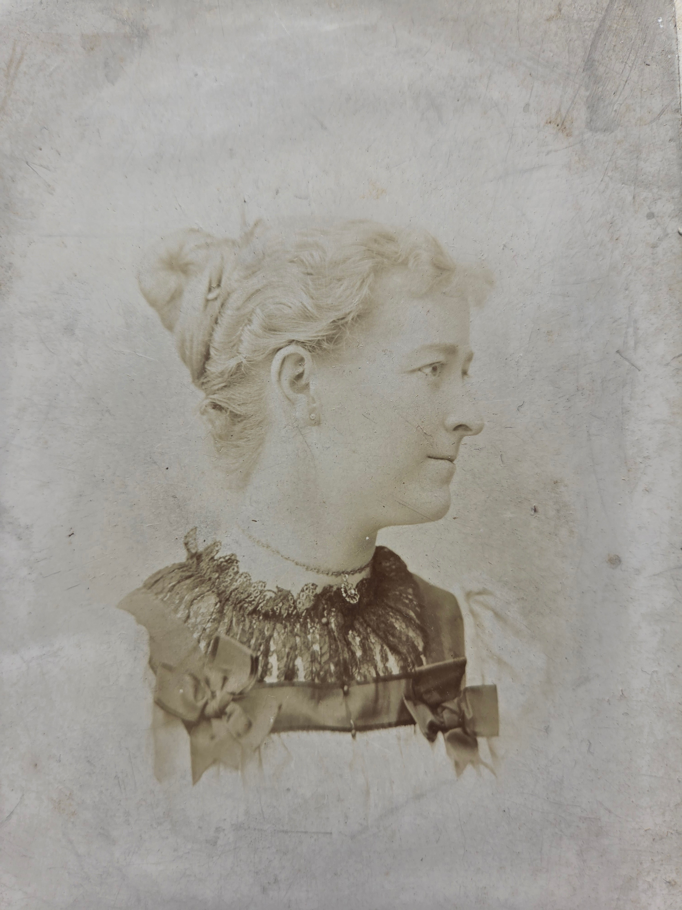

Scioto Mafry Chenoweth was born **31 August 1871 in Pleasant Township, Franklin County, Ohio**, daughter of [Joseph Hill Chenoweth](/family/joseph-hill-chenoweth/) and [Mary O. Timmons Chenoweth](/family/mary-ohio-timmons-chenoweth/), sister of [Lillie Dale Chenoweth Eesley](/family/lillie-dale-chenoweth/) (Chuck's great-grandmother). She is **Chuck's great-great-aunt** &mdash; Lillie Dale's older sister by six years.

A profile portrait of Ota &mdash; identified by [Roberta Burnes](/family/roberta-burnes/) from her Chenoweth family album, shared June 2026 &mdash; is a side-on studio portrait, her hair piled up in the high-bun style of the late 1880s&ndash;1890s, a delicate lace collar at her throat, the expression composed. The family GEDCOM records a single Scioto Mafry Chenoweth (married Dr. Lewis Albert Smith, 29 December 1898), so the *"Ota Chenoweth Smith"* portrait &mdash; briefly catalogued as its own stub in June 2026 &mdash; is her, and has been merged into this page.

## The river-name

The middle name **"Ohio"** is the name of the state Mary's mother lived in &mdash; itself an Iroquoian word meaning "beautiful river" &mdash; and **"Scioto"** is the name of the river that runs through Franklin County, Ohio, past Columbus. Naming a daughter Scioto in 1871 is to put the Ohio landscape directly into her name. (Her grandfather John K. Timmons is buried in **Scioto Township**, Pickaway County, just south of where she was born; the family's geographic anchor is the watershed of the Scioto.)

## The "first women medical doctors" claim — confirmed

Maggie Eesley's *Four Generations* archive carries this single line:

> *One of her daughters was named after the Sciota River and went on to become one of the first women medical doctors in the United States in the late 1800's.*

A **second documentary source** &mdash; the typed caption on the [c. 1971–1972 Eesley extended-family reunion portrait](/archive/highland-ridge-family-group-portrait-c-1980/), which Chuck transmitted to this archive in 2026 &mdash; identifies one of the cousins in that portrait as:

> *Mafry Smith Hyatt (daughter of Lilly Chenoweth Eesley's sister, **Dr. Sciota "Ota" Chenoweth Smith**)*

**The "Dr." prefix the caption applies to Sciota's name** &mdash; specifically not to her husband &mdash; is the family's confirmation that the *"first women medical doctors"* memory points to **Sciota herself**, not to her husband Lewis Albert Smith. This was the open question on this page until June 2026; the labeled reunion portrait closes it.

So: **Sciota Mafry Chenoweth Smith, MD**. She would have been among the first generation of American women MDs, finishing her training just as Johns Hopkins and other major medical schools were opening to women.

Her husband **Dr. Lewis Albert Smith** (b. 6 February 1874, North Brookfield, Worcester, Massachusetts; d. 20 July 1957, Columbus, Ohio) was also an MD &mdash; **a husband-and-wife MD household** in 1898 was itself unusual, particularly with the wife as well as the husband holding the degree.

## The "first women medical doctors" claim — documentary confirmation (June 2026)

For most of this page's life the MD claim rested on two soft sources: Maggie Eesley's *Four Generations* deck and the typed caption on the c. 1970s reunion portrait. The earlier version of this page closed with the note: *"A research-led follow-up at OSU's medical archives, the AMA's directory of physicians, or Ohio physician licensure records of the 1890s&ndash;1900s would surface her medical-license number, the school she graduated from, and the precise dates of her practice."*

In June 2026, Roberta Burnes ran exactly that research on Ancestry and surfaced the AMA's **Directory of Deceased American Physicians, 1804-1929** record &mdash; the gold-standard source on 19th-century American physician credentials. Her email:

> *Looks like Ota got her degree at the Medical College of Ohio in Cincinnati in 1898. I also noted in another search that she was divorced at least by 1910, according to the U.S. census. That was pretty amazing for a woman of that time, but it fits with the independent spirit that I saw in her daughter, Mafry.*

The Directory record itself:

> Name: **Ota Mafry Chenoweth**
> Birth Date: **1871**
> Death Date: **Dec 31, 1929**
> Type Practice: **Allopath**
> Licenses: **OH, 1898**
> Medical School: **Medical College of Ohio, Cincinnati: Cincinnati Medical College, 1898, (G)**
> Source: *Directory of Deceased American Physicians, 1804-1929*

So the framework now stands as documentary record, not family memory:

- **Medical School:** the [Medical College of Ohio in Cincinnati](https://en.wikipedia.org/wiki/Medical_College_of_Ohio_at_Cincinnati) (also called Cincinnati Medical College), one of the major 19th-century Ohio medical schools, later absorbed into the University of Cincinnati College of Medicine. Admitting women in the 1890s was progressive for a school of that stature.
- **Year of degree:** 1898 &mdash; the same year she married Lewis Albert Smith (29 December 1898). She finished her MD and got married in the same calendar year.
- **License:** Ohio, 1898 &mdash; she was licensed to practice in Ohio from the year of her graduation.
- **Practice type:** *Allopath* &mdash; she practiced mainstream Western medicine, as distinct from the homeopaths and osteopaths of the same era who were also licensed but worked outside the allopathic tradition.

Helen Eesley Burnes had told Roberta that Ota's degree was at Otterbein University in Westerville. The Directory record points to MCO Cincinnati instead. The most likely reconciliation is that Ota did her undergraduate work at Otterbein (the family's Methodist-affiliated school in Westerville, near where the family lived and where Ota would later be buried) before going to Cincinnati for medical school &mdash; a common 19th-century pattern of separating the bachelor's institution from the medical-degree institution. Helen, as a child, would naturally have heard "Otterbein" as her aunt's school and not separated it from the medical degree itself.

### Death-date discrepancy

The AMA Directory records Ota's death as **31 December 1929**. The FamilySearch structured record, and the family stories Helen passed down to Roberta, record **9 February 1930**. The Directory's title (*1804-1929*) suggests its date cutoff is the end of 1929; the structured FamilySearch sources (likely the death certificate and cemetery records) put her death about six weeks later. Without a death certificate scan to settle the question, both dates are recorded here and the FamilySearch date stands as primary in the page frontmatter.

### Marriage outcome — divorced by 1910

The second documentary discovery is, in some ways, more startling than the MD itself. The 1910 US census records Ota as divorced. She had married Lewis Albert Smith on 29 December 1898; by 1910 the marriage had ended. **Divorce for a woman in 1910 Ohio was extraordinarily uncommon** &mdash; the national divorce rate that year was under 0.1% of the adult female population, and divorce carried real social cost. That Ota was already divorced by 1910 reframes the *husband-and-wife MD household* picture this page previously painted: the marriage was a short chapter, not the structure of her adult life. Her practice years, the X-ray work that killed her, and her death surrounded by her sister Lillie Dale's family in Bexley all happened in the *post-marriage* portion of her life. The "Mrs. Smith" surname she carried for the rest of her life was a vestigial form; her actual household and practice were her own.

This puts the family stories Roberta passed on into different relief. The fact that she came to die at her sister Lillie Dale's Bexley house was not a passing visit &mdash; it was her family of attachment, the people she had built her later life around once her marriage ended. The fact that she spent her last year teaching her nephew Don anatomy and her nieces medicine was not just professional habit; she was without a household of her own, and the Eesley side was the household she chose.

### Two generations of independent women

Roberta's framing &mdash; *"it fits with the independent spirit that I saw in her daughter, Mafry"* &mdash; lights up a two-generation thread the structured records alone don't carry. Ota's daughter [Mafry Smith Hyatt](/family/mafry-smith-hyatt/) was an ERA activist in 1970s Ohio (recorded on her page); Ota herself was an MD in 1898 and divorced by 1910. Mafry would have grown up partially in a household structured around her mother's independence rather than a conventional 1900s marriage. The line of *independent women in this family* runs visibly from Ota → Mafry across two generations on the Chenoweth-Smith side.

## Her daughter Mafry Smith Hyatt

The reunion-portrait caption identifies Sciota's daughter as **[Mafry Smith Hyatt](/family/mafry-smith-hyatt/)** &mdash; a Chenoweth-Eesley cousin who attended the family reunion in the early 1970s. Mafry carries her mother's distinctive given name (or part of it: her mother was Scioto **Mafry** Chenoweth). The Hyatt surname is from Mafry's marriage; her father was Dr. Lewis Smith.

The earlier version of this page said Mafry was *"the only person in this archive's records who would have known Sciota in person, since Sciota died in 1930."* Roberta Burnes corrected that in June 2026: *"Mafry and my mother both knew Ota, as well as all the other siblings in that generation (Len, Will, Don, Mary). Ota delivered my mother at home on January 16, 1924."* So Aunt Ota's living-memory chain ran through all of her nieces and nephews on the Eesley side &mdash; her younger sister Lillie Dale's children &mdash; not only through her own daughter.

## What Ota actually did — Roberta's family stories (June 2026)

Until June 2026 this page carried only the bare framework: the *"first woman MD"* family memory, the husband, the dates. Roberta's email opens Ota's actual practice and the circumstances of her death &mdash; the most substantive layer of Chenoweth-side family history this archive has yet recorded.

### Otterbein and Cincinnati &mdash; the family memory and the AMA record

> *Mom used to say [Ota] received her degree at Otterbein.*

Helen Eesley Burnes (b. 16 January 1924, d. 1 June 2000) told Roberta that her aunt Ota took her medical degree at [Otterbein University](https://www.otterbein.edu) in Westerville, Ohio. The AMA's Directory of Deceased American Physicians (above) shows her MD itself was at the Medical College of Ohio in Cincinnati, not Otterbein &mdash; so Otterbein was most likely her undergraduate/pre-medical school, with the MD coming later at MCO Cincinnati. (Sciota is also buried at *Otterbein Cemetery* in Westerville &mdash; the cemetery and the university share the same Westerville-Methodist institutional root, and her undergraduate connection to Otterbein is consistent with the burial location her family chose.)

### The X-ray work and the burns that killed her

The most concrete &mdash; and unfortunate &mdash; medical detail Roberta passed on:

> *Ota was involved in some early experiments with a new technology, the X-ray machine, that left her with horrific burns and cancer, which ultimately claimed her life.*
>
> *My mother recalled that the burns ate away at the skin surrounding her belly, and that she had to keep her abdomen wrapped in layers of gauze or fabric to "hold everything in."*

X-ray technology entered American medicine in 1895&ndash;1896 with Röntgen's discovery, and women physicians of Ota's generation &mdash; many of whom worked as radiographers because the field was new and not yet professionalized &mdash; suffered repeated radiation burns and cancers from the unshielded early tube work. The Chenoweth-family description (abdominal burns severe enough that her belly had to be wrapped in gauze to *"hold everything in"*) is consistent with the late-stage radiation cancers of the period. **It is what killed her** &mdash; she died at 58, decades before her natural-mortality cohort, almost certainly from radiation-induced disease accumulated across her practice years.

### The final anatomy lesson — to Don, last year of her life

Among the chilling and powerful family stories Roberta passed on:

> *Apparently, Uncle Donald was considering going into medicine, so Ota used her own medical condition to educate him. Don would have been 22 when Ota passed, and the following story probably happened during that last year of her life. One night, as the family was finishing dinner, Ota spoke to Don — Mom says it was more of a "Let's go" or "It's time, Don" — and the two of them got up from the table and went upstairs.*
>
> *My mother, being a very curious child, followed them upstairs, where Don and Ota went into a bedroom. Mom described herself peeking through the door and watching as Ota calmly undressed herself, unwrapping the bandages around her abdomen and pointing out her internal organs to Don as if in an anatomy class. Mom never forgot this experience and would tell this story often. Ultimately, Don did not go into medicine, but imagine getting such a lesson from your own aunt!*

So: in *c. 1929,* with Ota's body partially exposed to view through the radiation damage that would kill her months later, she gave her 21-year-old nephew [Donald Stuart Eesley](/family/don-eesley/) (b. 24 September 1908) the last anatomy lesson of her career &mdash; using her own dying body as the textbook. The lesson was watched, half-secretly, by her then-five-year-old niece Helen, who would tell the story to her daughter Roberta sixty years later. *Don ultimately did not pursue medicine* &mdash; whether the lesson dissuaded him or simply made the cost of the calling vividly present is impossible to say.

### The death scene — Bexley, Cassidy Avenue, "always the teacher"

Roberta's email continues directly into Ota's death:

> *Mom said that Aunt Ota died surrounded by family, possibly at the Bexley house on Cassidy Ave. Mom was there, and said even in death, Ota used her experience as a teaching moment. She described how she lost feeling in first her extremities, then the other sensations she felt as death approached. Always the teacher, she narrated her own passing to her family. This story always gives me chills and right now, I feel a few tears as well.*

Ota died **9 February 1930 in Columbus, Ohio**, age 58. The *"Bexley house on Cassidy Ave"* is the [Charles Leonard Eesley Bexley home](/family/charles-leonard-eesley/) where Lillie Dale and her family were living &mdash; Cassidy Avenue runs through Bexley, the small affluent municipality immediately east of Columbus that the Eesley family settled in during the 1910s and 1920s. So Ota came home to her sister Lillie Dale's house to die, with her nieces and nephews present, and narrated her own death &mdash; the loss of feeling that began in her extremities, the gradual disappearance of other sensations &mdash; the way she would have narrated a clinical case in a medical-school lecture.

The phrase *"always the teacher"* is Roberta's reading; it accurately captures the figure that emerges from the stories. Aunt Ota's medical career did not stop at her death &mdash; she made her dying *itself* into instruction, both for Don the nephew she hoped would follow her into medicine and for the next generation of nieces who would carry the story forward.

### The treatment of Aunt Jean after the car crash

A separate story tied to an earlier 1925 family tragedy:

> *Mom also said that Ota treated Mom's sister, Aunt Jean, after she was thrown from their vehicle during a car crash. According to that story, Jean hit the pavement and suffered a concussion. The family noted that "everything seemed fine" with Jean at first, but later that night she passed away, likely from a blood clot in her brain.*

The GEDCOM records [Jean Eesley](/family/jean-goldie-eesley/) (b. 28 October 1921, d. 13 October 1925), Lillie Dale's sixth child, who died fifteen days short of her fourth birthday. The car-crash death narrative is consistent with toddler-age trauma and a delayed-onset subdural hematoma &mdash; Jean would have appeared stable for hours after impact before deteriorating. The 1985 *Eesley Family History* register has long carried Jean's dates as *1912&ndash;1924, age twelve;* the GEDCOM and Roberta's car-crash story together suggest the register's dates were transposed in transcription and the actual death was October 1925 at age three. Ota, as the family's MD, did the clinical work of treating her after the crash &mdash; and presumably had to deliver the news of the prognosis to Lillie Dale, her sister.

The Jean-and-Ota and Helen-and-Ota threads place Ota at two of the most charged family-medical moments of the 1920s: she delivered Helen's birth in January 1924 and treated Jean's death in October 1925 &mdash; the close-spaced new-life-and-lost-life events Lillie Dale's household lived through in those twenty-one months. Ota was *the family doctor* in the most literal sense.

## Helen's six years with Aunt Ota — 16 January 1924 to 9 February 1930

Bringing the dates together: Ota delivered Helen on 16 January 1924, and Helen was 6 years and 24 days old when Ota died on 9 February 1930. So Helen had *six full years* with her aunt &mdash; the anatomy-lesson-with-Don story (when Helen was about five) and the deathbed-narration story (when Helen was just-turned-six) both fall inside that window. Helen would carry the stories the rest of her life, and would tell them to Roberta, who told them to this archive in June 2026.

## Marriage and death

She married **Lewis Albert Smith, MD** on **29 December 1898**, age 27 &mdash; the same year she graduated from the Medical College of Ohio in Cincinnati and was licensed to practice in Ohio. The marriage ended in divorce some time before 1910 (the 1910 US census records her as divorced; see the documentary-confirmation section above). After the marriage ended she remained in Columbus, practicing medicine and increasingly anchored in her sister Lillie Dale's Eesley household in Bexley. She died **9 February 1930 in Columbus**, age 58 (the AMA Directory records 31 December 1929 &mdash; see discrepancy note); Lewis Albert Smith outlived her by twenty-seven years, dying **20 July 1957 in Columbus**, age 83. She is buried at **Otterbein Cemetery, Westerville, Blendon Township, Franklin County, Ohio** &mdash; the same cemetery as her parents Joseph Hill and Mary O. He is buried separately at Mansfield Cemetery, Mansfield, Richland County, Ohio &mdash; in death as in the second half of their lives, the two MDs were apart.

> *Sources: Maggie Eesley, *Four Generations of the Eesley Family* (PowerPoint archive); Roberta Burnes, emails June 2026 (Otterbein/Cincinnati degree, X-ray burns, the Don anatomy lesson, the Cassidy Avenue death narration, the treatment of Aunt Jean after the car crash, the AMA Directory record on Ota's MD and the 1910 census divorce finding). Structured records: AMA *Directory of Deceased American Physicians, 1804-1929* (via Ancestry, surfaced June 2026); 1910 US Federal Census, Ohio (marital status: divorced); FamilySearch &mdash; [Scioto Mafry Chenoweth (KC9W-VQG)](https://www.familysearch.org/tree/person/details/KC9W-VQG); husband: [Lewis Albert Smith, MD (L139-RVX)](https://www.familysearch.org/tree/person/details/L139-RVX).*
