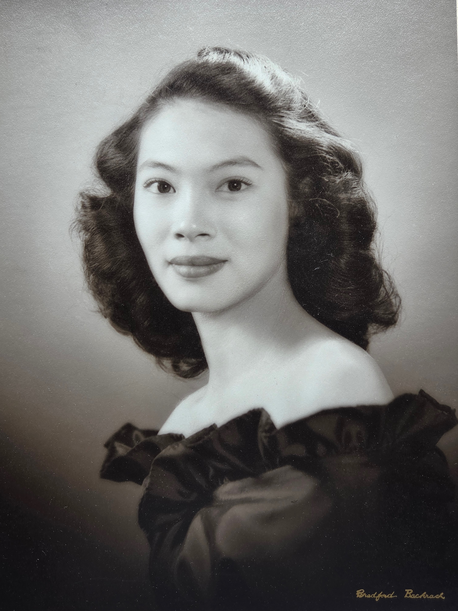
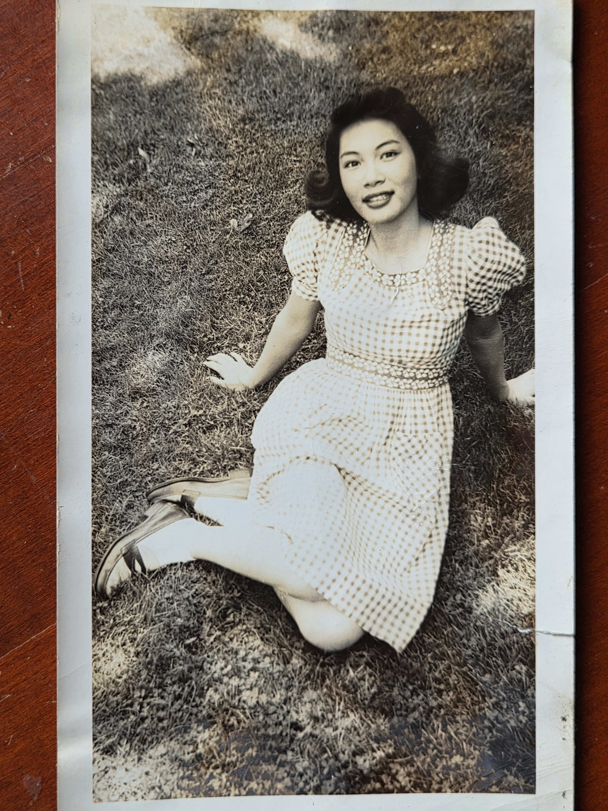
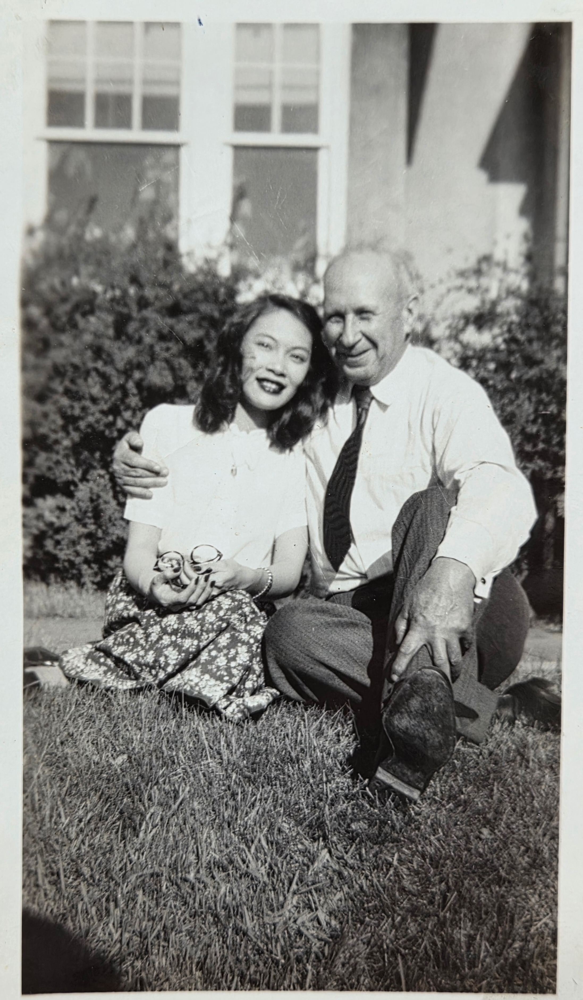
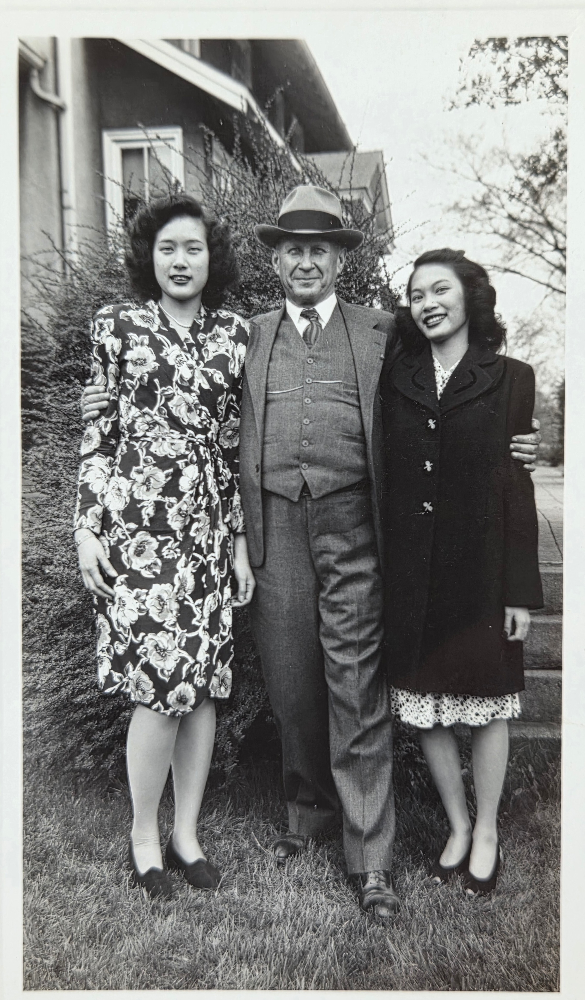
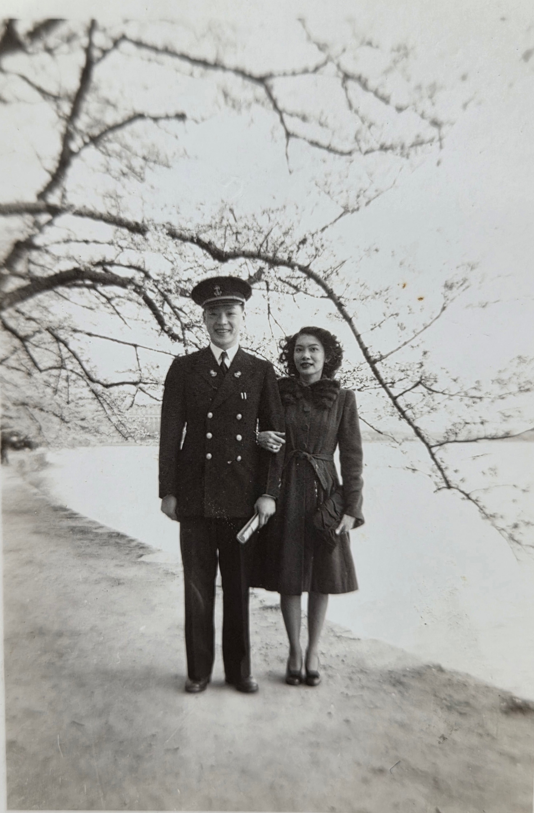
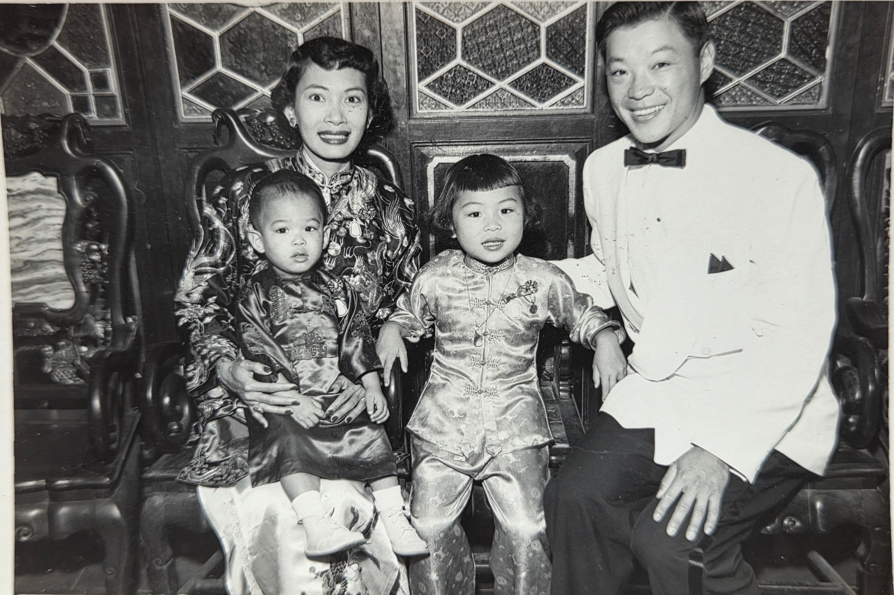
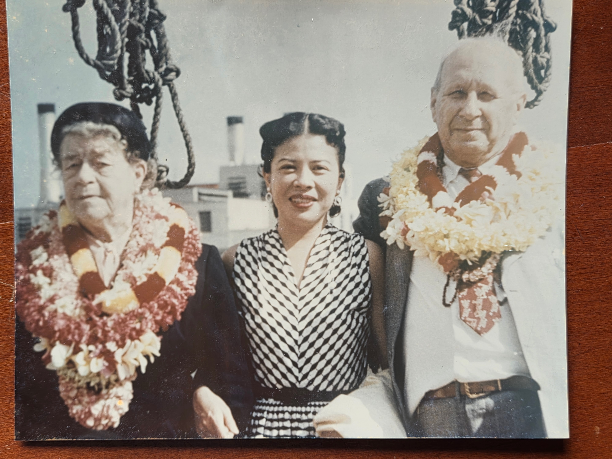

<strong>📖 本页含中文版本 — <a href="#zh">点此跳至中文 ↓</a></strong> &nbsp;·&nbsp; <em>This page has a Chinese version below.</em>

The documented record (FamilySearch ID **L614-Z2P**, seven sources): **Stella Elaine Sunn**, born October 5, 1925, Honolulu, Oahu, Territory of Hawaii. Her parents were **Koon Hung Sunn** (b. ~1898, Honolulu) and **Mabel Lee Sunn** (b. ~1900, USA) — both Hawaii-born Chinese-Americans. In 1940 the Sunns were living in Representative District 5, Oahu. Stella died **February 15, 1971**, age 45, and is buried in First Presbyterian Church Cemetery in Moorestown Township, Burlington County, New Jersey.

## What the family remembers

In a July 2019 email exchange about old family photographs &mdash; the first photographs anyone had thought to ask about in years &mdash; three voices on Stella came together. Their words are kept here.

**Aunt Maggie** ([Margaret "Maggie" Eesley](/family/margaret-maggie-eesley/), Will's youngest daughter, Chuck's paternal aunt):

> *"I remember visiting Stella and Ted when I was 10 or 11. They were Chinese, not Japanese. Grandpa felt very protective of them."*

That puts Maggie's visit around 1961–62, with Stella and Ted then in their own household.

**Aunt Jeanne** ([Jeanne Eesley Kamiab](/family/jeanne-eesley-kamiab/), Will's eldest daughter), on her own visit to Stella and Ted &mdash; **the story that fixed their names in her memory for fifty years:**

> *"For me to remember their names after fifty years means that they were important. We made a detour to visit them at their home somewhere on the East Coast. Stella served us cookies and Jeanne was fussed at for eating the last one and not saving any for Ted who hadn't come home from work. That cookie is probably why I remember the visit."*

**Cousin Roberta**, who keeps "a huge collection of mostly 1940s letters" in [Grandpa Eesley](/family/charles-leonard-eesley/)'s "almost indecipherable" handwriting:

> *"Stella is a mystery to me. No one is alive who remembers exactly how she became part of the family. She may have joined the scene after [Lyle](/family/lyle-eesley/) died ... I think that's possible. Mom said Stella lived with the Eesleys in the family home in Bexley (they often took in boarders) until sometime in the 50s. When Stella left, all the other Eesley kids had grown and gone, and Grandpa fell into a deep depression. That is pretty much all I know. Except when Grandpa died in the early 70s, we got flowers from Hawaii that must have been from Stella and her family."*

Three quietly devastating pieces in that account: that Charles Leonard fell into depression when Stella left; that the Chongs sent flowers from Hawaii when Charles died around 1972; and that Roberta's collection of 1940s letters &mdash; possibly the only direct documentary trace of how Stella came to the household &mdash; sits unread because the handwriting hasn't been deciphered.

Roberta added the specific flower in a June 2026 email:

> *"I remember so well the Hawaiian flowers they sent for Grandpa's memorial. I had never seen anything like them, **Anthurium** I think is what they are called."*

The detail is precise and tender: **anthurium**, the heart-shaped tropical bloom in vivid red or pink with a yellow center spadix, native to Central and South America but commercially grown in Hawaii throughout the twentieth century and a signature of Hawaiian floral arrangements. A 12-year-old Roberta in central Ohio in October 1972 had never seen them; the Chongs, sending memorial flowers across the Pacific to a Bexley funeral, sent the flower their adopted Hawaiian home grew best. Thirty years before Roberta would meet them, the family had already become permanent in central Ohio's flower memory.

## Roberta's photo collection of Stella — a queued resource

In the same June 2026 email, Roberta surfaced a major undocumented resource:

> *"I have so many photos of Stella, her wedding, her children and parents. I would love to know what became of that family."*

A **substantial collection of Stella photographs** &mdash; including her **wedding to [Ted Chong](/family/ted-chong/)**, photographs of **her children [SueLynn](/family/suelynn-chong/) and [Glenn](/family/glenn-chong/)**, and photographs of **her parents [Koon Hung Sunn](/family/koon-hung-sunn/) and [Mabel Lee Sunn](/family/mabel-lee-sunn/)** &mdash; sits in Roberta's keeping. None of it has been digitized into this archive yet. When it surfaces, it will be the single largest expansion of the Stella visual record in the family's holdings.

Roberta has also flagged that she will ask **[Lyle Stuart Eesley](/family/lyle-stuart-eesley/)** (Don Eesley's son, b. 1948) whether he has any memory of Stella's connection to the Eesleys &mdash; another open thread for the [reconstruction](/family/stella/) the rest of this page describes.

## What the family remembers — earlier framing

The story-as-told that this archive originally seeded with came from Aunt Jeanne in May 2026:

> *"Stella was a girl from Hawaii and I think she might have been from a mixed parentage (Chinese & Japanese). At any rate she was in danger of being incarcerated in the concentration camps in the west during World War II. So grandpa Eesley brought her over to live with them during the war and she became part of the family at that time. She later married to Dr. Ted Chong and they had two children &mdash; SueLynn and I forget what the boy's name was. But they used to send us macadamia nuts and toasted coconut cans from Hawaii before they were ever popular here and it was so fun to get those packages. They later moved to Philadelphia and were divorced."*

The 2019 thread sharpens this in two places: Maggie's first-hand correction &mdash; **"They were Chinese, not Japanese"** &mdash; aligns with the FamilySearch record of Stella's parents as Chinese-American Hawaiians. Roberta adds the **Bexley, Ohio** address and the timing window: Stella lived in the Eesley home into the 1950s, then left, then sometime later Charles Leonard's grief reset the household.

## The most likely reconstruction — Honolulu → Manila → Gripsholm → Bexley

Stella's documented arrival in the Eesley home at age 17-18 (so c. 1942-43) and the family-memory "boat from Manila" line are constrained by what was actually possible in those months of the Pacific war. The best-supported reconstruction:

**The first leg — Honolulu to Manila, pre-war.** Hawaii-born Chinese-American families like the Sunns often had family, school, or business ties to **Manila's substantial Chinese diaspora community**. The most plausible reason a 15- or 16-year-old Stella would have been in Manila in 1940-1941 is to stay with extended family, attend a Catholic or Chinese-language school, or visit relatives. A pre-war Honolulu-to-Manila passage in this period was unremarkable.

**The trap — December 1941.** Japan invaded the Philippines on **8 December 1941** (the same hours as Pearl Harbor). By April 1942 Bataan had fallen; by May, Corregidor. Manila was under Japanese occupation from January 1942 through MacArthur's October 1944 return. American civilians caught in Manila &mdash; including Chinese-Americans with US citizenship &mdash; were detained at the **Santo Tomas Internment Camp** on the University of Santo Tomas campus, the largest civilian internment site in the Philippines (~4,000 internees at peak). If Stella was in Manila when war broke out, this is most plausibly where she spent some portion of 1942.

**The exit — the MS Gripsholm exchange voyages.** Two diplomatic exchange voyages of American civilians from Japanese-occupied territories happened in 1942 and 1943, on the **Swedish-flagged neutral liner [MS Gripsholm](https://en.wikipedia.org/wiki/MS_Gripsholm_(1924))**. The first voyage exchanged American civilians at Lourenço Marques, Mozambique in June-August 1942; the second sailed September-December 1943 with a similar exchange at Goa, Portuguese India. Both returned American civilians to **New York** &mdash; including hundreds of US citizens who had been held by Japan in Manila, Shanghai, and other occupied cities. A 1942 or 1943 Gripsholm voyage matches Stella's arrival window in Bexley exactly.

**The placement to Bexley.** American Protestant and Catholic relief organizations placed returning American civilians from Asia with US host families across 1942-43. Charles Leonard Eesley &mdash; a prominent Bexley miller, recently bereaved by the [Cabanatuan death of his son Lyle](/family/lyle-eesley/) in the Philippines in July 1942, with adult children grown and gone &mdash; would have been a visible and willing host. Whether the placement came through a **church-based refugee-resettlement network**, through a **personal contact made via Lyle's POW circle** (a fellow internee's family, a Red Cross worker, a returning American who had been in Manila), or through some other channel, the placement infrastructure for repatriated American civilians from the Pacific was real and active in those exact years.

The chain &mdash; **Honolulu → Manila → Santo Tomas Internment Camp → MS Gripsholm exchange voyage → New York → Bexley** &mdash; fits the geography, the timing, the citizenship status, and the family-memory "boat from Manila" trace. It is the best-supported single reconstruction with the documentary record currently in hand.

**It is also a hypothesis, not a conclusion.** The single most consequential undeciphered source is **[Roberta Burnes Walker's collection of Charles Leonard's 1940s letters](/family/roberta-burnes/)** &mdash; the original correspondence from exactly this period, in Charles Leonard's hand. If the letters carry a reference to a placement agency, a Gripsholm passenger, a Manila-evacuated American civilian, or the specific channel by which Stella's name reached the Eesley household, they would settle the open leg of this story. Reading them is the path forward.

## After

After the war Stella married **[Dr. Ted Wah Sing Chong](/family/ted-chong/)**, also of Honolulu. They had two children, **[Sue Lin / SueLynn](/family/suelynn-chong/)** and **[Glenn](/family/glenn-chong/)**. They settled eventually in the Philadelphia area &mdash; Aunt Jeanne and Aunt Maggie both visited them at their home on the East Coast in the 1960s. The Chongs sent macadamia nuts and toasted-coconut cans back to Ohio, food from Hawaii that the Eesleys could not yet buy where they lived. The packages went to multiple Eesley households &mdash; in Roberta's June 2026 memory, **her own mother [Helen](/family/helen-burnes/) (Stella's Eesley sister-equivalent) received macadamia nuts from Stella too, and they were Helen's absolute favorite.** The shipments were Stella's small ongoing thread back into the Eesley household across decades, the perishable, mailable equivalent of staying in touch. Stella and Ted later divorced; Ted remarried Janice and would live until 2013.

### Open question &mdash; did Stella leave Ohio earlier than the 1950s?

Roberta's June 2026 framing &mdash; *"Mom said Stella lived with the Eesleys in the family home in Bexley ... until sometime in the 50s"* &mdash; is the working timeline this archive carries. In a later June 2026 email, Roberta surfaced a second-guess:

> *I'm wondering about my memories of Mom's stories regarding Stella. The dates of her wedding, living back in Hawaii, those things make me think she might have left Ohio sooner than the 1950s, but I'm just not sure. There are a fair amount of records concerning her and her husband on Ancestry, but I haven't pieced it all together yet.*

So the **1950s-end-of-Bexley** framing may turn out to be a few years off. If Stella married Ted in the late 1940s &mdash; and the [Bradford Bachrach portrait above](#) is c. late 1940s on East-Coast stationery &mdash; she could have been on the East Coast earlier than the family memory has held. The Ancestry-side records Roberta mentions are not yet in this archive. **The exact year Stella's residence shifted from Bexley to the East Coast and then to Hawaii is open.** What is documented: she was alive and in the Eesley family's life through her death in February 1971, and Charles Leonard fell into a deep depression at some point in the years before his own death in the early 1970s.

She appears in the [family group portrait taken at Charles and Lillie Dale's home in Bexley](/archive/eesley-family-group-portrait-late-1940s/) standing beside Ted, with Uncle Will in front. That photograph and her early death in 1971 bracket roughly twenty-five years of her adult life inside this family. She had been part of the family for close to thirty years when she died.

## The Stella photographs — first major batch, June 2026

Roberta Burnes Walker began sending photographs of Stella in June 2026 &mdash; the first substantial expansion of Stella's visual record in this archive. The first batch contains **six photographs spanning roughly twenty years of her adult life**:

### Formal studio portrait — Bradford Bachrach, c. late 1940s

A **Bradford Bachrach** formal studio portrait of Stella in her early-to-mid twenties &mdash; soft three-quarter lighting against a neutral backdrop, hair waved in the late-1940s/early-1950s style, an off-the-shoulder dark satin dress with a fitted bodice and ruffled neckline. The portrait is **signed *"Bradford Bachrach"*** in gold along the lower right edge &mdash; the New York and Philadelphia portrait-studio chain famous for high-end society and presidential portraits of the mid-twentieth century. The Bradford Bachrach commission marks Stella's late-1940s East-Coast life: a formal portrait of the Bexley-raised Hawaiian-American young woman taken at the kind of prestige studio that the Eesleys' adopted daughter was photographed at, like any of the Eesley-side daughters by birth.

### Stella as a young woman on the lawn, c. 1942

A relaxed outdoor portrait of Stella sitting on grass in a polka-dot or check-pattern day dress with puffed sleeves. She is **late teens to about twenty**, smiling broadly into the camera, dark hair shoulder-length and curled in the period style. The dress and hair place the frame at **c. 1941-1943** &mdash; almost certainly **the first year or two of her time in the Bexley Eesley household**.

### Stella with Charles Leonard on the lawn

A casual snapshot of **Charles Leonard Eesley** sitting on a lawn with his arm around **Stella**, both smiling broadly for the photographer. Stella holds what appears to be a small handful of objects (perhaps eggs or marbles or fruit) in her lap; she is in a white blouse and a floral-print skirt. Charles Leonard, balding and in shirtsleeves and tie, kneels with one leg up. The composition reads as a **chosen-family-grandfather and adopted-granddaughter ease** &mdash; one of the most affectionate images of Charles Leonard and Stella together that the archive will likely ever have. **Late 1940s** by clothing.

### Stella with a friend and Charles Leonard, late 1940s

A three-figure outdoor portrait at the Bexley house: a **second young Chinese-American woman** at left in a floral-print dress, **Charles Leonard** at center in his characteristic fedora and three-piece suit, and **Stella** at right in a dark coat. Both young women have their arms around Charles Leonard's shoulders, and all three are smiling. The other woman is **not identified** &mdash; possibly a Sunn-family relative, a Chong-family connection, or a wartime-evacuated Chinese-American friend Stella brought into the Eesley household.

### Ted Chong in Navy uniform with Stella, Washington DC, April 1945

A wartime portrait of **Ted Chong in U.S. Navy dress uniform** with Stella beside him in a dark coat with a bow at the collar, standing on a pier or seawall under flowering cherry trees with water behind them. The composition reads strongly as **the Tidal Basin in Washington, D.C., cherry-blossom season** &mdash; an iconic wartime backdrop for servicemembers and their wives or sweethearts. The back of the print is stamped *"KISCO Certified Photo Service, APR 10, 1945."*

The April 1945 date is significant &mdash; the war in the Pacific would not end for four more months. Ted's Navy service is a **new biographical detail** the archive had not previously carried.

### Stella, Ted, and their two children — formal studio portrait, c. mid-1950s

A formal family-of-four portrait of **Stella, Ted, and their two children** &mdash; **SueLynn** (the older girl, perhaps four or five, in a Chinese-style brocade tunic) and a toddler (perhaps two, possibly **Glenn**) on Stella's lap. Stella wears a **traditional Chinese silk cheongsam (旗袍)**, embroidered with floral motifs; Ted is in a white dinner jacket with a black bow-tie. The setting is a formally-decorated room with elaborate carved-wood paneling and hexagonal stained-glass windows behind &mdash; reading as a **Chinese-restaurant or community-association formal hall** of the mid-1950s.

### Charles Leonard + Lillie Dale + Stella in Honolulu, 1953 — 50th wedding anniversary

The headline photograph of this batch. **Charles Leonard and Lillie Dale Eesley wearing Hawaiian leis on a ship's deck in Honolulu Harbor**, with Stella standing between them &mdash; **the documentary proof of their 1953 50th-wedding-anniversary trip to Hawaii to visit Stella and Ted**. The back of the print carries a handwritten note by Lillie Dale herself: *"Lilly was wearing this in Honolulu on our 50th wedding anniversary."*

**The 50th-anniversary trip to Hawaii is a major new fact in this archive.** [Charles Leonard](/family/charles-leonard-eesley/) and [Lillie Dale](/family/lillie-dale-chenoweth/) had married on **9 September 1903 at the Methodist Episcopal Church in Harrisburg, Ohio** &mdash; per the [original engraved wedding invitation](/docs/lillie-dale-charles-leonard-wedding-invitation-1903/) Roberta also shared. Fifty years later, in 1953, they took a ship to Hawaii to celebrate the anniversary **with Stella and Ted** &mdash; the chosen daughter who had come into their household during the war, and her husband. **The Bexley-Honolulu connection that the wartime placement had set in motion was complete enough by 1953 that the anniversary itself was held there.** The flower leis around Charles Leonard's and Lillie Dale's necks would have been the welcome leis Stella and Ted brought to greet them at the pier.

The photograph is one of the most precious single artifacts in the Eesley-side archive &mdash; the visual capstone of [Thread #7 (Showing up)](/docs/family-threads/) and of the whole [Stella narrative](/family/stella/).

> *Sources: [FamilySearch L614-Z2P](https://www.familysearch.org/en/tree/person/L614-Z2P); Ted Chong's published obituary (Burlington County Times, 2013); Aunt Jeanne's oral account (May 2026); July 2019 family email exchange among Chuck, Maggie, Jeanne, and Roberta.*

## Further reading

On the larger history Stella's wartime sits inside:

- [Densho](https://densho.org) &mdash; the most thorough public archive of Japanese-American incarceration during WWII, including the experience of Hawaiian residents and people of mixed East-Asian heritage.
- [*Farewell to Manzanar*](https://www.goodreads.com/book/show/77640.Farewell_to_Manzanar) by Jeanne Wakatsuki Houston &mdash; the canonical memoir of West Coast internment.
- [*By Order of the President: FDR and the Internment of Japanese Americans*](https://www.goodreads.com/book/show/1147019.By_Order_of_the_President) by Greg Robinson &mdash; the policy history.
- [The Chinese in Hawaii](https://en.wikipedia.org/wiki/Chinese_in_Hawaii) on Wikipedia &mdash; the community Stella's family belonged to, distinct from the Japanese-American community that bore the brunt of the internment program.
- [PBS *The War*](https://www.pbs.org/kenburns/the-war/) (Ken Burns and Lynn Novick) &mdash; episodes on the Pacific theater and the home-front internment.

## See also — family threads

Stella is the **canonical anchor for Thread #7 (Showing up — in small, daily, unglamorous ways)** in the [**Family threads**](/docs/family-threads/) synthesis essay. The wartime decision by [Charles Leonard Eesley](/family/charles-leonard-eesley/) to **bring her from Hawaii into the Bexley household** to keep her clear of the West Coast internment camps — and her staying, marrying Ted, raising a family, *"sending macadamia nuts back from Hawaii for years"* — is the archive's clearest single instance of **kinship as a practice rather than an identity**. She is also referenced in **Thread #9 (Crossing for what's next)** as a wartime crossing made *for the safest version of "what's next."*

---

## 中文

**斯特拉·埃莱恩·孙·张 (Stella Elaine Sunn Chong)** &mdash; 这一家族档案中**唯一一位华裔成员**（除了Lijie的家人之外）。她不是Eesley家族的血亲，但成为了这个家族的一员 &mdash; 1942年战争年代被Chuck的曾祖父[Charles Leonard Eesley](/family/charles-leonard-eesley/)接到俄亥俄州Bexley的家中收留，从此成为家族永久的一员。她的故事是本档案"血缘之外亦为家人"这一主题最清晰的一例。

### 出生与家庭

**1925年10月5日生于夏威夷领地檀香山** &mdash; 当时夏威夷尚未成为美国的州（1959年方加入联邦）。父亲为[Koon Hung Sunn (孙姓，名拼音Koon Hung)](/family/koon-hung-sunn/)，约1898年生于檀香山；母亲为[Mabel Lee Sunn (李姓出嫁孙姓)](/family/mabel-lee-sunn/)，约1900年生于美国本土。**双亲皆为夏威夷出生的华裔**，属于自19世纪中叶起即在夏威夷扎根的华人社群。

1940年人口普查时，孙家居住于瓦胡岛第五选区。

### 家族口述记忆

2019年7月家族邮件交流中，三位家族成员回忆了Stella：

**[Maggie姑姑 (Margaret Eesley)](/family/margaret-maggie-eesley/)** &mdash; Will Eesley的小女儿，Chuck的姑姑：

> *"我10、11岁时去看过Stella和Ted。他们是华人，不是日本人。爷爷对他们非常保护。"*

**[Jeanne姑姑 (Jeanne Eesley Kamiab)](/family/jeanne-eesley-kamiab/)** &mdash; Will的长女：

> *"五十年后我还记得他们的名字，说明他们对我很重要。我们绕道去他们东海岸的家里探望。Stella招待我们吃饼干，我因为吃了最后一块没给还没下班的Ted留着，被骂了。这块饼干大概就是我至今还记得这次探访的原因。"*

**[Roberta堂姐 (Roberta Burnes Walker)](/family/roberta-burnes/)** &mdash; Chuck的堂姑：

> *"Stella对我来说是个谜。没有一个还活着的人确切记得她是怎么进入这个家的。她可能是在Lyle牺牲之后才出现的……我想这是有可能的。妈妈说Stella一直住在Eesley家在Bexley的房子里，直到五十年代某个时候。当Stella离开后，其他Eesley孩子都已长大成人各自独立。爷爷因此陷入深深的抑郁。当七十年代初爷爷去世时，我们收到了来自夏威夷的鲜花，应该是Stella一家送的。"*

### 火鹤花的记忆 — 1972年的纪念花

Roberta在2026年6月的邮件中补充了花的具体品种：

> *"我清楚记得他们为爷爷的追思会送来的夏威夷鲜花。我从未见过那样的花 &mdash; 我想是叫**火鹤花** (Anthurium)。"*

火鹤花 &mdash; 心形热带花朵，鲜红或粉红色，中央有黄色佛焰苞，原产中南美洲但二十世纪在夏威夷广泛栽培，是夏威夷花艺的标志。1972年10月，12岁的Roberta在俄亥俄州中部第一次见到这种花。张氏一家从太平洋彼岸寄来这种他们夏威夷新家最熟悉的花 &mdash; 给Bexley的丧礼。**Chuck三十年后才会见到张家人，但在那之前，他们已经成为俄亥俄州中部花艺记忆中永恒的一部分。**

### 最合理的重建 &mdash; 檀香山 → 马尼拉 → 格里普斯霍尔姆号 → Bexley

Stella约17、18岁（即1942-43年间）到达Eesley家的时间窗口，以及家族口述中"从马尼拉乘船而来"的线索，受到太平洋战争初期实际可能性的严格制约。最合理的重建：

**第一段 — 战前从檀香山到马尼拉。** 像孙家这样的夏威夷华裔家庭，往往与**马尼拉规模庞大的华人侨居社群**有家族、学校或生意上的联系。15、16岁的Stella1940-41年间在马尼拉的最合理原因，是探亲、求学（天主教学校或华语学校）或访友。战前从檀香山到马尼拉的航程在那时并不罕见。

**陷阱 — 1941年12月。** 日本于**1941年12月8日**（与珍珠港同时）入侵菲律宾。1942年4月巴丹陷落；5月科雷希多岛陷落。马尼拉自1942年1月起处于日本占领之下，直到1944年10月麦克阿瑟回归。被困于马尼拉的美国公民 &mdash; 包括持有美国国籍的华裔美国人 &mdash; 被关押在**圣多默斯拘留营** (Santo Tomas Internment Camp)，菲律宾最大的平民拘留所（高峰时约4000人）。若Stella战争爆发时在马尼拉，这里最有可能是她度过1942年部分时光的地方。

**出口 &mdash; 格里普斯霍尔姆号 (MS Gripsholm) 交换航行。** 1942年和1943年，瑞典籍中立邮轮**[MS Gripsholm](https://en.wikipedia.org/wiki/MS_Gripsholm_(1924))**进行了两次美国平民交换航行，将被日本扣押的美国公民送回美国。第一次1942年6-8月在莫桑比克洛伦索马克斯（今马普托）交换；第二次1943年9-12月在葡属印度果阿交换。两次航行都将美国平民送回**纽约** &mdash; 包括数百名曾被关押在马尼拉、上海等沦陷地的美国公民。1942或1943年的格里普斯霍尔姆号航行，与Stella到达Bexley的时间窗口完全吻合。

**安置至Bexley。** 1942-43年间，美国新教和天主教救援组织将从亚洲返回的美国平民安置到美国寄宿家庭。**Charles Leonard Eesley** &mdash; Bexley著名的面粉厂主，1942年7月刚因儿子[Lyle](/family/lyle-eesley/)在菲律宾[Cabanatuan战俘营牺牲](/family/lyle-eesley/)而失去亲人，自己的成年子女均已离家 &mdash; 是显见而乐意接纳的寄主。无论是通过**教会的难民安置网络**，还是通过**Lyle战俘圈的人脉**（同营战俘的家属、红十字会工作人员、刚从马尼拉返回的美国人），亦或其他途径，从太平洋返回的美国平民的安置机制在那几年是真实而活跃的。

整条链 &mdash; **檀香山 → 马尼拉 → 圣多默斯拘留营 → MS Gripsholm 交换航行 → 纽约 → Bexley** &mdash; 在地理、时间、国籍身份及家族口述"从马尼拉乘船而来"等所有维度上都吻合。这是目前所有证据最为支持的单一重建。

**但这仍是一个假设，而非定论。** 唯一最具决定性的未解读资料是[Roberta堂姐收藏的Charles Leonard 1940年代信件](/family/roberta-burnes/) &mdash; 那个时期Charles Leonard亲笔写下的原始通信。若这些信中提及任何安置机构、Gripsholm船员、马尼拉撤离的美国平民或Stella的名字进入Eesley家的具体渠道，就能解开这段故事的开放环节。读懂这些信件是前进之路。

### 战后

战后Stella嫁给了**[张华星医生 (Dr. Ted Wah Sing Chong)](/family/ted-chong/)**，也是檀香山出生。育有两个孩子：**[SueLynn 张](/family/suelynn-chong/)** (Sue Lin) 和 **[Glenn 张](/family/glenn-chong/)**。最终定居费城地区。Jeanne姑姑和Maggie姑姑均在1960年代到东海岸他们家拜访过。张氏夫妇常从夏威夷寄夏威夷豆 (macadamia) 和椰子干罐头回俄亥俄 &mdash; 在那个年代，Eesley家在中西部还买不到这些夏威夷的食物。Stella与Ted后离婚；Ted再娶Janice，直至2013年辞世。

**1971年2月15日逝世，享年45岁。** 葬于新泽西州Burlington郡Moorestown镇的**第一长老会教会墓地**。

她出现在[Charles和Lillie Dale在Bexley家中拍摄的家族合影](/archive/eesley-family-group-portrait-late-1940s/)里 &mdash; 站在Ted身旁，Will叔叔在前排。**从这张照片到她1971年的早逝，标记了她作为Eesley家庭一员的二十五年成年生活。她去世时，已在这个家族里生活了近三十年。**

### Roberta 2026年6月寄来的Stella照片首批 &mdash; 七张

2026年6月Roberta开始整理她收藏的Stella照片，**首批七张照片**横跨Stella成年生活的二十年：

**1. Bradford Bachrach正装影楼肖像 (1940年代末)。** 中性背景下的三分之四光肖像，Stella身着深色绸缎露肩礼服，发型为1940年代末1950年代初流行的波浪卷。底部以金色字签名 *"Bradford Bachrach"* &mdash; 美国二十世纪中叶以高端社交圈与总统肖像闻名的纽约与费城连锁影楼。**Bexley长大的夏威夷裔华人姑娘，被这家与任何Eesley嫁出去的女儿同等级别的高级影楼摄影留念** &mdash; 这本身即说明她在家族中的地位。

**2. Stella草地坐姿，约1942年。** 户外随意肖像，约二十岁，呈现她在Bexley Eesley家庭中**最初一两年**的样貌。

**3. Stella与Charles Leonard在草坪上，1940年代末。** 两人都笑容灿烂；Charles Leonard用手揽着她肩膀。**家族档案中Charles Leonard与Stella合影最亲切的一张** &mdash; 是Stella作为"被接纳的孙女"角色的视觉佐证。

**4. Stella、不知名朋友与Charles Leonard，1940年代末。** Bexley屋前三人合影：Stella、另一位华裔美国女子（身份不明，可能为Sunn家族亲戚、Chong家族联系人或Stella带回家的战时撤离友人）、Charles Leonard。两位年轻女子双臂搂着Charles Leonard肩膀，三人都笑。

**5. Ted Chong海军礼服与Stella在华盛顿特区潮汐湖樱花树下，1945年4月10日。** 战时肖像，Ted身着美国海军礼服。底面盖戳为KISCO Certified Photo Service 1945年4月10日。**Ted的海军服役是本档案此前未记录的新生平事实。**

**6. Stella、Ted与两个孩子的正式家庭合影，约1950年代中期。** Stella身着**中式锦缎旗袍**，Ted身着白色晚礼服。两个孩子 &mdash; 较大的女孩**SueLynn**身着中式锦缎短装，膝上的幼儿可能是**Glenn**。背景为雕花木隔与六角彩绘玻璃窗 &mdash; 像是1950年代中式餐馆或华人社团宴会厅的正式场所。

**7. (头条照片) Charles Leonard + Lillie Dale + Stella 在檀香山，1953年 &mdash; 五十周年金婚纪念。** 这是本批最重要的照片。**Charles Leonard 与 Lillie Dale 戴着夏威夷迎宾花环 (lei) 站在船甲板上，Stella立于两人之间。** 照片背面有Lillie Dale亲笔写的注解："Lilly 戴着这条花环在檀香山，是我们结婚50周年时拍的。" 这是**他们1953年专程乘船到夏威夷与Stella和Ted夫妇庆祝金婚纪念**的纪实。

**这趟1953年金婚纪念赴夏威夷的旅行，是本档案中关于Charles Leonard与Lillie Dale一段全新的重要事实。** 他们[1903年9月9日在俄亥俄州Harrisburg卫理公会教堂](/docs/lillie-dale-charles-leonard-wedding-invitation-1903/)结婚，五十年后，1953年，他们乘船至夏威夷与Stella和Ted夫妇共度纪念日 &mdash; 这位在战时被接进家门的"养女"，连同她的丈夫。**1942年战时安置所建立的"Bexley-檀香山"纽带，到1953年已牢固到金婚纪念本身就在那里举办。** Charles Leonard 与 Lillie Dale 颈上的花环正是Stella和Ted在码头迎接他们时戴上的。

这张照片是Eesley家族档案中最珍贵的单一影像之一 &mdash; 是[第七主线（"以小事、日常、不张扬的方式坚守"）](/docs/family-threads/)和整个[Stella叙事](/family/stella/)的视觉总结。

### 与家族主线的连结

Stella是[家族主线综合论](/docs/family-threads/)中**第七主线（"以小事、日常、不张扬的方式坚守"）**的标志性范例。Charles Leonard Eesley战时**把她从夏威夷接到Bexley家中**以保护她免于西海岸日裔美国人集中营 &mdash; 以及她此后留下、嫁给Ted、养育子女、**"几十年里一直从夏威夷寄夏威夷豆回来"** &mdash; 是本档案中**"血缘之外亦为家人"** (kinship as practice rather than identity) 最清晰的单一实例。**1953年金婚纪念在檀香山举行**，是这一主线的视觉终章。她也是**第九主线（"为了'下一步'而迁徙"）**中战时迁徙的代表 &mdash; 一次为了"下一步最安全的版本"而进行的迁徙。

> *注：除孙、张姓氏外，相关人名汉字均为推测，待家族确认。*
