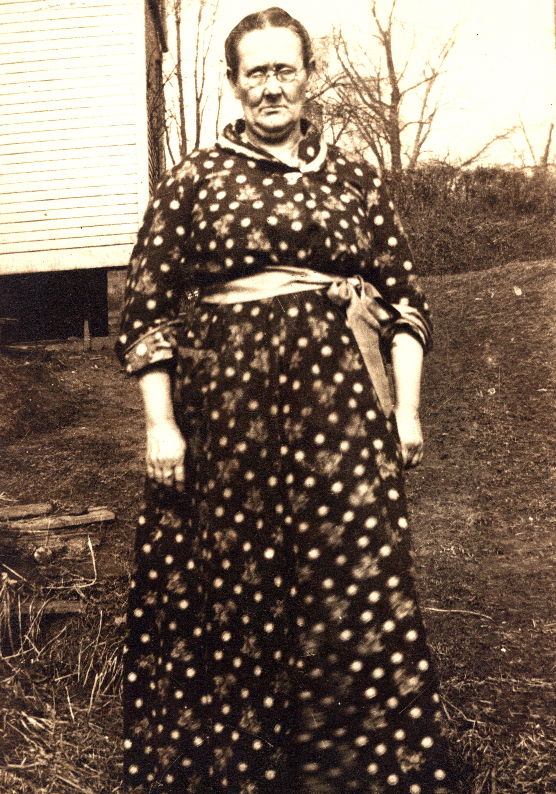

Verona's tangle of surnames &mdash; Kelley, Dunbar, Sheppard, Fleming &mdash; confused this archive's earlier readings, which treated *Sheppard* as an early married name. **[Robert Earl Wildermuth's own genealogy of the family](/docs/wildermuth-family-of-marietta-book/) settles it, in his own words:** Verona was *"born out of wedlock to Martha Kelley. The father was Seth Dunbar."* When her mother left, the infant was taken in by Martha's sister **Deborah (Kelley) Sheppard** and Deborah's husband **Levi Sheppard**, who raised her as their own. **"Sheppard" was therefore her adoptive family's name, not a marriage** &mdash; and it was under the name **"Mary V. Sheppard"** that she married Wesley Fleming at sixteen. (The two accounts of the father are one man: the family GEDCOM identifies him as **[Seth Grosvenor Dunbar](/family/seth-grosvenor-dunbar/)**, born in Kennebec County, Maine in 1836, who had migrated south to Wood County, West Virginia &mdash; where he died in 1870 and where Robert Earl knew the Dunbars as an established local family. A New England man settled among the Wood County Dunbars, in other words, which reconciles his own note with the record.)

## A late-life portrait, c. 1920-1922

The first photograph of Verona to surface in this archive arrived in June 2026 from Chuck's keeping. She stands outdoors next to a white clapboard farmhouse &mdash; in a dark long-sleeved polka-dot dress with a small white collar, a dark belt at the waist, glasses, hair pulled back, hands at her sides. The trees behind her are bare; the season reads as **late autumn or early spring**. The composition is the kind of plain hand-held family snapshot that survived from the early 1920s era of small folding cameras and home photography.

She was in her **early fifties** here and within a year or two of her death &mdash; she died **27 October 1922** in Marietta. The bare trees in the background fit late October. The portrait may, in fact, be **one of the last photographs taken of her**.

## Origin &mdash; the Maine-and-Kelley crossing

Verona was born **11 June 1869 in Wood County, West Virginia**, out of wedlock to **[Martha Kelley](/family/martha-kelley/)** and **[Seth Grosvenor Dunbar](/family/seth-grosvenor-dunbar/)**. Martha had come west from Preston County with her younger sister Rebecca to live near their sister **Deborah (Kelley) Sheppard**; after Verona's birth, Martha left the infant with Deborah and her husband **Levi Sheppard**, who raised her as their own about a hundred miles from her mother's home. By the **1870 census** Verona is a one-year-old in the Sheppard household in the Williams District; by **1880** she is listed as the eleven-year-old *daughter* of Levi (age 70) and Deborah (age 50) Sheppard. Martha and Rebecca had moved on by 1880, leaving Verona behind.

Her father, **Seth Grosvenor Dunbar**, was a **Maine man** &mdash; born 7 October 1836 in Kennebec County &mdash; who had migrated south to **Wood County, West Virginia**, where Verona was born and where he died on **26 October 1870**, when she was sixteen months old. That migration reconciles the two family accounts of him: Robert Earl remembered the Dunbars as an established Wood County family (which is where Seth had settled), while the GEDCOM preserves his New England origin. Verona grew up knowing neither parent in her own household &mdash; her father dead before she was two, her mother gone by 1880.

## The name — Kelley, Dunbar, Sheppard, Fleming

Because Robert Earl's research corrects an old confusion, it is worth stating plainly: **"Sheppard" was Verona's adoptive-family surname, not a married name.** She grew up a Sheppard because Levi and Deborah Sheppard raised her, and it was as **"Mary V. Sheppard"** that, on **7 October 1885 at Parkersburg**, age sixteen, she married **[James Wesley Fleming](/family/wesley-fleming/)** — twelve years her senior, and the surname she carried the rest of her life.

## Fourteen children, and a life of hard labor

Verona bore **fourteen children** across roughly a quarter-century (ten still living at the 1910 census), most delivered without a physician in the family's log cabin in the red-clay hills of Wood County. Robert Earl's account is unsparing about what her life cost: *"All of Verona's adult life was spent in hard labor cleaning other people's homes… to buy flour, material and shoes for her children."* Her children, in birth order, were Walter George (1886), Della Deborah (1888), Lenora "Nora" (1890), Mary (1892), Howard Morgan (1895), Frank (1897), May (1899, died in infancy), **[Sadye Irene](/family/sadye-fleming-wildermuth/)** (1901 — Robert Earl's mother), Etha May (1904), Diatha Faye (1904, Etha's twin), Belle (1905, died at 14 days), Genevieve (died in infancy), LaVerna (1907), and Grace (c. 1910, died in infancy). The three who outlived Sadye — named in Sadye's [1976 obituary](/family/sadye-fleming-wildermuth/) — were her sisters Mrs. LaVerna Raison and Mrs. Etha Becker.

## Death and burial

She died **27 October 1922 in Marietta, Ohio** at age 53 (the family had moved across the Ohio River to Marietta about eleven years earlier). Her death certificate gives the cause as **apoplexy** — after a roughly two-month illness that the record also ties to **typhoid fever** — and Robert Earl's account adds the stark image that she collapsed **as she climbed the steps of the Washington County Courthouse in Marietta**. Burial was on 30 October back across the river at **Mount Pleasant, West Virginia**, the informant her husband Wesley. The West-Virginia burial is one of the small signals that the Fleming side kept identifying with West Virginia even after relocating to Ohio for work.

Robert Earl Wildermuth was born 6 October 1924 &mdash; *two years* after Verona's death. He never met her.

## The lament &mdash; the only memoir trace of Verona

Robert Earl's [1989 memoir](/docs/robert-earl-wildermuth-memoir/) carries one substantive passage on Verona, and it is an absence-passage rather than a story about her life. In the middle of an extended sketch of his paternal great-grandmother [Catherina Boeshar](/family/catherina-boeshar/) Wildermuth (who lived to 1933 and was the only "grandmother" figure Robert Earl ever knew), he stops to record what his father Earl Adam used to lament across the rest of his life:

> *I recall throughout my young adult hood that my father used to lament the fact that neither my mother's mother nor his mother lived until my sister and I were old enough to remember them. He was saddened by the fact that we never had any grandmothers to get to know and love &mdash; yet here was this lovely old lady who was our great-grandmother, an original from Germany, and my dad never really emphasized that she belonged to us. She was or could have been our grandmother and great-grandmother all in one.*

Earl Adam's two grieved-for grandmothers were Verona (Sadye's mother, d. 27 October 1922) and Flora Schlicher Wildermuth (Earl Adam's own mother, d. 18 November 1919 &mdash; both gone before Robert Earl's October 1924 birth). Catherina Boeshar &mdash; the German-immigrant *great*-grandmother on the Wildermuth side &mdash; outlived both by a generation and stepped, partially, into the absence. Verona did not.

The lament was, for a long time, the only narrative of Verona this archive had. But Robert Earl in fact devoted several careful pages to her in [his own family genealogy](/docs/wildermuth-family-of-marietta-book/) — reconstructing her out-of-wedlock birth, the Sheppard adoption, the 1885 marriage, the fourteen children, and the courthouse-steps death. It is from that research, not the memoir, that the fuller picture above is drawn.

## What's still open

- *The Fleming-and-Dunbar oral history* &mdash; if Sadye told Robert Earl stories of her own mother beyond the genealogical record, they may sit in her own letters and any photograph captions she annotated.
- *Seth Grosvenor Dunbar's migration* &mdash; **resolved (July 2026)** from the [Wildermuth &amp; Bain book](/docs/wildermuth-family-of-marietta-book/): Seth did not migrate alone or for the Civil War. His father, [John V. Dunbar](/family/john-v-dunbar/), a steam-mill owner, moved the whole family from **Readfield, Kennebec County, Maine to Bull Run in Wood County** between the 1850 and 1860 censuses &mdash; which is exactly how the New England Dunbars came to be the "established Wood County family" of Robert Earl's memory. Seth's mother was [Ann Dunbar](/family/ann-dunbar/) (b. 1812, Maine); **her maiden name is the one remaining gap** in this corner of the parentage.

> *Sources: [Wildermuth Family of Marietta, Ohio](/docs/wildermuth-family-of-marietta-book/) (Wildermuth & Bain), the "Fleming, Verona Belle (Kelley)" section — Robert Earl's own research, quoting the 1870/1880/1900/1910 censuses, the 1922 Marietta Times obituary, and Verona's death certificate; GEDCOM &mdash; Dale Eesley / FamilySearch ([downloadable](/docs/eesley-wildermuth-tree.ged)); the earlier reading (Sheppard as maiden name) came from Sadye's c. 1976 Marietta Times obituary and has been corrected here.*
