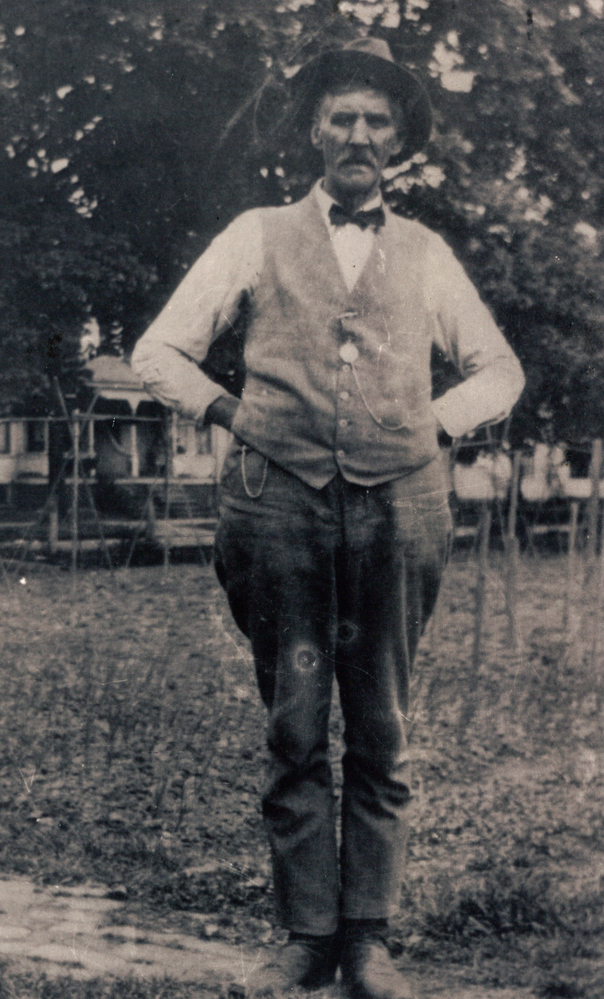

James Wesley Fleming &mdash; known in the family as Wesley &mdash; was the father of [Sadye Irene Fleming](/family/sadye-fleming-wildermuth/), who married Earl A. Wildermuth and became [Robert Earl Wildermuth](/family/robert-earl-wildermuth/)'s mother. He is **Chuck's maternal great-great-grandfather** on the Fleming-Dunbar line.

## A West Virginia farmer, born before West Virginia

He was born **20 December 1855 at Arnolds Creek, Doddridge County, in what was still Virginia** &mdash; West Virginia would not become a separate state until **20 June 1863**, eight years after his birth, in the middle of the Civil War. His birthplace is one of the documentary anchors of the family's deep West Virginia roots: the upper-Ohio-valley hill country south of Marietta, the same Appalachian-frontier region Verona Belle Dunbar would also be born into fourteen years later (in 1869, Wood County).

He married **[Verona Belle (Dunbar) Fleming](/family/verona-sheppard-fleming/)** at some date before 1901 &mdash; his second-known marriage by the family record (Verona had also been previously married, possibly to a Sheppard, before becoming a Fleming). Their daughter [Sadye Irene Fleming](/family/sadye-fleming-wildermuth/) was born **15 July 1901 at Waverly, Pleasants County, West Virginia**, and was one of at least eight children Wesley and Verona raised across the early twentieth century &mdash; per Sadye's [1976 obituary](/family/sadye-fleming-wildermuth/), surviving sisters Mrs. La Verna Raison (Newark, OH) and Mrs. Etha Becker (Columbus, OH); three brothers and two sisters had predeceased her.

## The portrait — in vest and watch-chain, c. 1910s-1920s

A single photograph of Wesley Fleming survives in the family papers, surfaced June 2026 from Chuck's keeping. He stands in a sunlit yard, slim and weathered, in a fedora hat, a button-down shirt with bow-tie, a light-colored vest with a watch chain looping down to the pocket, dark trousers, and dark boots. His hands are at his back, his pose three-quarter to the camera, mustache neatly trimmed. Behind him a porch with arched detail trim and a low picket fence are partially visible.

Dating reads **c. 1910s-1920s** by the photographic paper, his apparent age (mid-to-late 50s through mid-60s), and the bow-tie-and-vest dress that fits the working-class West Virginia rural style of that decade. The pocket watch and watch chain suggest a Sunday-best or church-bound moment, not field clothing &mdash; this is the dressed Wesley, not the working farmer.

## The 1922 widower

When Verona Belle Dunbar Fleming died on **27 October 1922 at Marietta, Washington County, Ohio**, age 53, Wesley was 66 and had been with her for at least two decades. He outlived her by **eighteen years**, dying on **2 October 1940 at Marietta, age 84**, and was buried two days later, on 4 October 1940. He lived to see his daughter Sadye marry [Earl Adam Wildermuth](/family/earl-adam-wildermuth/), and to see his grandson [Robert Earl Wildermuth](/family/robert-earl-wildermuth/) born (6 October 1924) and grow into a young man &mdash; Robert Earl was 16 when his maternal grandfather died.

Robert Earl's [1989 memoir](/docs/robert-earl-wildermuth-memoir/) records his father Earl Adam's lament that *"neither my mother's mother nor his mother lived until my sister and I were old enough to remember them"* &mdash; the absent grandmothers being Verona Dunbar Fleming and Flora Schlicher Wildermuth, both dead by 1922. **Wesley Fleming was a present grandfather**, the surviving senior on the Fleming side across Robert Earl's childhood and adolescence.

## See also

- [Verona Belle (Dunbar) Fleming](/family/verona-sheppard-fleming/) &mdash; his wife
- [Sadye Irene Fleming](/family/sadye-fleming-wildermuth/) &mdash; his daughter, Robert Earl's mother
- [Robert Earl Wildermuth](/family/robert-earl-wildermuth/) &mdash; his grandson, Chuck's maternal grandfather

> *Sources: [Eesley/Wildermuth GEDCOM tree](/docs/dale-eesley-familysearch-tree/) (June 2026 trace) &mdash; FamilySearch tree ID LVH9-QPM for James Wesley Fleming confirms birth 20 Dec 1855 Arnolds Creek Doddridge County Virginia, death 2 Oct 1940 Marietta Ohio, burial 4 Oct 1940. The portrait is from Chuck's keeping, shared June 2026.*
