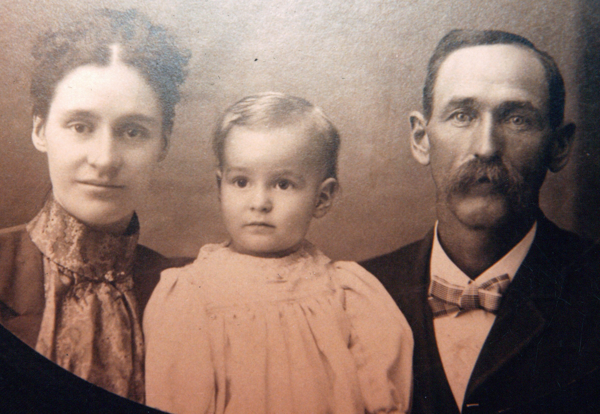

William Armstrong Davis was born **5 November 1859 in Jefferson, Ohio** and died **13 March 1931 in Washington County, Ohio**, age 71. He was buried at **Waterford Cemetery, Waterford, Washington County, Ohio** — the same Waterford ground where his great-granddaughter [Dorothy Marie Davis Wildermuth](/family/dorothy-davis-wildermuth/) would be born sixty-six years after his own birth, on 24 February 1925.

He is **Chuck's maternal great-great-grandfather** through the Davis line: William → [Homer Edward Davis](/family/homer-davis/) → Dorothy Marie Davis Wildermuth → Terrie Lee → Chuck.

## A short first marriage, a long widowerhood

William married **[Victoria Anna Way](/family/victoria-anna-way-davis/)** (b. 1874) at some date before 1900 &mdash; the Way-family marriage that brings the [Way line of Noble County](/family/victoria-anna-way-davis/) into the Davis family. Victoria was the daughter of [Edward E. Way](/family/edward-e-way/) (1851-1924) and [Tacy Elizabeth Matthews](/family/tacy-elizabeth-matthews/) (1848-1902), and the eldest granddaughter of the English-immigrant [Edward Taylor Way](/family/edward-taylor-way/) of the Isle of Wight. Their one documented son **[Homer Edward Davis](/family/homer-davis/)** was born 8 February 1900 at Crooked Tree, Noble County, Ohio. **Victoria died on 26 June 1903 at age 29**, leaving William a widower with a three-year-old son. He remarried (the GEDCOM records a second household) and raised Homer in Washington County.

## The c. 1902 family portrait

The studio close-up of William, Victoria, and toddler Homer that survives in the family papers &mdash; preserved in Chuck's keeping, shared June 2026 &mdash; is **the only known family portrait of the three together** and almost certainly **one of the last photographs taken of Victoria before her death**. William is at right in the frame &mdash; in his early forties, dark suit, thick mustache, plaid bow-tie or cravat &mdash; with Victoria at left and Homer at center between them.

He outlived Victoria by **twenty-eight years**, dying in 1931 when Homer was thirty-one and already the father of his own daughters [Mary, Dorothy, and Betty Davis](/family/homer-davis/). The Davis-Way marriage that produced Homer lasted only about three years; William's life afterward ran much longer.

> *Sources: [Eesley/Wildermuth GEDCOM tree](/docs/dale-eesley-familysearch-tree/) (June 2026 trace) &mdash; FamilySearch tree ID LRR3-RWV. The c. 1902 family portrait is from Chuck's keeping, shared June 2026.*
