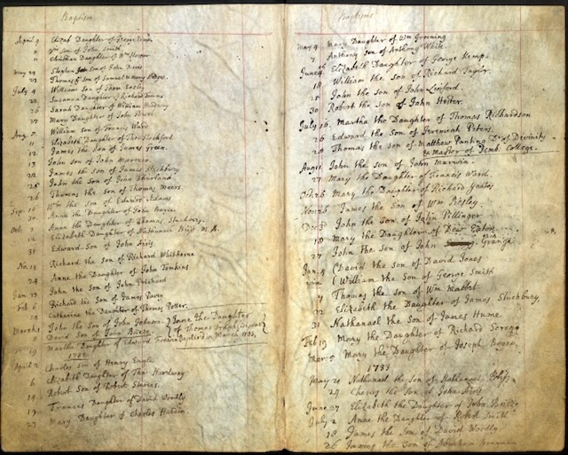

William Eesley was **baptized 4 July 1731 at St Mary's, Banbury**, Oxfordshire — the parish register enters him as *"William, Son of Thom[as] Easley."* He is the **earliest Eesley yet documented in the line that reaches Chuck**, and his baptism fixes the family at Banbury a full century before they left north Oxfordshire for America.

*A page from the 18th-century parish baptism register consulted in the Eesley-line research, spanning the years around William's 1731 baptism. (Oxfordshire / Warwickshire Church of England registers, 1538–1812.)*

He married **Mary Simkins** at Banbury on **12 December 1758**. Among their children was **[Joseph Eesley](/family/joseph-eesley/)** (baptized at the same St Mary's, Banbury, in December 1764) — the *"William Eesley, Lab[ourer], & Mary his Wife"* of Joseph's own baptism entry. William was a **laborer**; the milling trade that would define the later Eesleys, and carry them to Canada, Michigan, and Ohio, still lay two generations ahead.

He **died in 1777**, at about forty-six. His parents were **[Thomas Eesley](/family/thomas-eesley-1700/)** (1700–1750) and **Sarah**; Thomas's own father, per the family tree, was **Hugh Easley (b. 1675)** — carrying the documented Eesley name back into the seventeenth century. (The tree also carries a separate, earlier marriage under this record whose dates cannot fit a 1731 birth; it is most likely a conflation with an older William Eesley and is set aside here in favor of the well-dated 1758 marriage to Mary Simkins.)

> *Source: [Dale Eesley / FamilySearch — William Eesley (G95K-HFK)](https://www.familysearch.org/tree/person/details/G95K-HFK); St Mary's, Banbury parish baptism register (Oxfordshire Church of England Baptisms, 1538–1812).*
