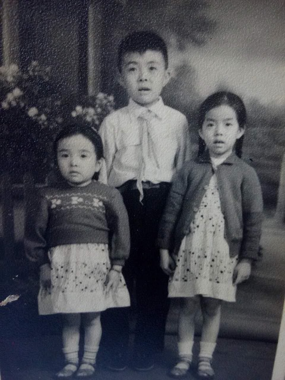

Details withheld &mdash; living. Mother of [Lijie](/family/lijie-zhou/).

## Newly placed photographs

- A **1960s studio portrait of three Chinese children** &mdash; an older boy in a white shirt and red Young Pioneer scarf between two younger girls in patterned dresses &mdash; survives in the family's keeping. Chuck believes **Xun Li is the girl on the right**. The identifications of the other two children are not yet confirmed; family to refine. *[Photograph: `IMG_1485.jpeg` &mdash; embedded below.]*

  

- The **honeymoon portrait of Xun and Ling at Hangzhou's Lingyin Temple in 1982**, just after their 18 September wedding &mdash; paired with their return visit decades later on the new [Lingyin Temple, Hangzhou](/places/lingyin-temple-hangzhou/) place page.

> *Structured record: [Dale Eesley & Chuck Eesley / FamilySearch &mdash; Xun Li (GMLK-HBZ)](https://www.familysearch.org/tree/person/details/GMLK-HBZ).*

---

## 中文

**李恂**，1956年6月20日生于山东省青岛市。Lijie之母。[李忠初](/family/zhongchu-li/)（1921&ndash;1982）与[商耀珍](/family/yaozhen-shang/)（1921&ndash;2013）之女。1982年9月18日在青岛与[周玲](/family/ling-zhou/)成婚。

兄弟姊妹：[李孟灵](/family/mengling-li/)（生于1952年8月18日）、[李波](/family/bo-li/)（生于1957年7月16日）。

> *详细生平从略 &mdash; 在世。姓名汉字已由家族确认：李恂。*
