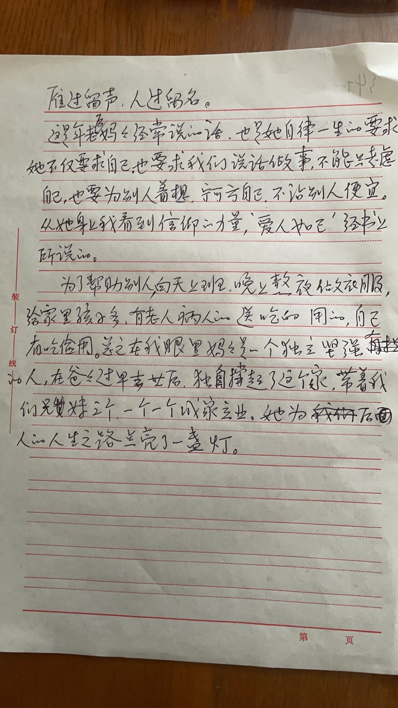
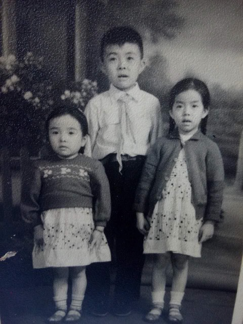

<strong>📖 English version below — <a href="#en">Jump to English ↓</a></strong> &nbsp;·&nbsp; <em>本页中文在上，英文见下方。</em>

**李恂**（姓名汉字已由家族确认）&mdash; 周丽婕之母。[李仲初](/family/zhongchu-li/)（1921&ndash;1982）与[尚耀真](/family/yaozhen-shang/)（1921&ndash;2013）之女。1982年在青岛与[周玲](/family/ling-zhou/)成婚。

本档案中收有李恂晚年与公公周兆祥及丈夫周玲的[合影](/archive/visit-with-zhaoxiang-zhou-and-family/)：李恂身穿驼色大衣，居周兆祥左侧。

本档案另收有李恂[与母亲尚耀真、襁褓中的女儿Lijie在青岛的幼年家庭照](/archive/lijie-grandparents-early-childhood-qingdao-c1980s/)（约1984年；另一帧为李恂给幼女Lijie喂食）。

兄弟姊妹：[李孟令](/family/mengling-li/)、[李勃](/family/bo-li/)。

2026年7月，李恂写下三篇手记 &mdash; 追忆父亲[李仲初](/family/zhongchu-li/)、母亲[尚耀真](/family/yaozhen-shang/)，以及兄长[李孟令](/family/mengling-li/)，均照录于下。

## 回忆我的父亲（2026年7月）

2026年7月，李恂写下对父母的回忆 &mdash; 追忆其父[李仲初](/family/zhongchu-li/)与其母[尚耀真](/family/yaozhen-shang/)。全文以其本人之言照录于下。

> 我的父亲是个性格耿直、很有才华的人，写得一手好字，聪明而有智慧。我记得小时候，不管谁家有事，都愿意来找他商量，他也总能帮别人找到解决的办法。母亲则热情好客，凡是来的客人，都以好菜好饭招待。所以家里总是亲戚朋友往来不断，我就是在这样温暖的环境中长大成人。
>
> 父亲从小教育我们：做人要正直，待人接物要有礼貌，要多学习&mdash;&mdash;人只有具备一技之长，才能在这世上立足谋生。后来他生病了，偏瘫在身，却凭着坚强的毅力坚持康复锻炼。右手不能写字，他就用左手重新学写字；每天还跟着收音机学日语。这些事，都在我的记忆中留下了深刻的印象。
>
> 后来他再次病倒，这一次很严重（贲门癌&mdash;&mdash;胃的贲门部，即胃的上端入口）。在父亲的影响下，我立志要好好学习，做一个像他那样有学识的人。只是我们这一代生不逢时，赶上文化大革命，始终没能上一所正规的四年制大学。后来，我一边工作一边完成了继续教育的学业。所以在我有了孩子以后，心里便默默立下心愿：一定要让孩子接受最好的教育，以弥补我当年的缺憾，也不辜负父辈的期望。如今，孩子能够用所学回馈社会，是我最大的欣慰&mdash;&mdash;她以自己的学识，投身[社会慈善事业](https://zhoueesleyfoundation.com)。
>
> *&mdash; 2026年7月*

## 我的妈妈（2026年7月）

2026年7月，李恂又写下对母亲[尚耀真](/family/yaozhen-shang/)的回忆，照录如下（[其母页面](/family/yaozhen-shang/)亦载此文）：

*李恂手写原稿（2026年7月）&mdash; 追忆母亲。*

> 我的妈妈漂亮慈祥，特别爱干净。她是那个年代里有文化、思想开放的女性——因为像她那个年龄的女性、家庭妇女，不识字、缠足的多，而她是在教会学校得以学习的。
>
> "雁过留声，人过留名。"这是老妈妈经常说的话，也是她自律一生的要求。她不仅要求自己，也要求我们说话做事，不能只顾自己，也要为别人着想；宁亏自己，不占别人便宜。从她身上我看到信仰的力量——"爱人如己"，经书上所说的。
>
> 为了帮助别人，她白天上班，晚上熬夜给人做衣服；家里孩子多、有老人病人的，她送吃的、送用的，自己省吃俭用。总之，在我眼里，妈妈是一个独立、坚强、有爱心的人。在爸爸过早去世后，她独自撑起了这个家，带着我们兄妹几个，一个个成家立业。她为我们后人的人生之路，点亮了一盏灯。
>
> *&mdash; 2026年7月*

## 孩子头 &mdash; 记哥哥李孟令（2026年7月）

2026年7月，李恂又写下对兄长[李孟令](/family/mengling-li/)（1952年生）的回忆，照录如下（[其兄页面](/family/mengling-li/)亦载此文）：

*李恂手写原稿（2026年7月）&mdash; 记哥哥。*

> &hellip;孩子头。
>
> 从小哥哥就是我们院里同龄人的头。带着我们一起玩，带着小男孩们下海游泳、摸波螺、捡海星、海刺猬，抓蟹子。带着自己做的潜水镜潜水。跟着哥哥我们每天都玩的很高兴。上学以后哥哥当上了学校的大队长，还是孩子头。直到现在我们同学聚会，大家都还很关心他："你哥好吗！"
>
> 上学的时候我参加学校[宣传队](/archive/qingdao-no36-middle-school-troupe-1971/)的活动多，家里的家务活都是哥哥和姐姐帮妈妈在做。哥哥蒸馒头、糊饼子、炒菜、做饭样样都做的很好，帮妈妈照顾俩个妹妹，使妈妈安心上班工作。哥哥从小做事仔细、做事认真踏实。虽然现在我们年令都已迈入70岁之列，哥哥还是我们的头，永远是我们的依靠。
>
> *&mdash; 2026年7月*

*（此篇首行"孩子头。"承接上一页，前页原稿待补。）*

> *详细生平从略 &mdash; 在世。姓名汉字已由家族确认：李恂。*

## English

Details withheld &mdash; living. Mother of [Lijie 周丽婕](/family/lijie-zhou/).

In July 2026 Li Xun wrote three remembrances — of her father [Zhongchu Li](/family/zhongchu-li/), her mother [Yaozhen Shang](/family/yaozhen-shang/), and her older brother [Mengling Li](/family/mengling-li/) — all reproduced below in her own words, with scans of the manuscripts where we have them.

## Remembering My Father (July 2026)

In July 2026, Li Xun set down her memories of her own parents &mdash; her father [Zhongchu Li](/family/zhongchu-li/) and her mother [Yaozhen Shang](/family/yaozhen-shang/). Her note is reproduced here in full, in her own words.

> My father was a man of upright character and real talent. He had beautiful handwriting, and he was clever and wise. I remember that when I was young, no matter which family in our circle had a problem, they were all willing to come to him for advice, and he could always help them find a way through. My mother was warm and hospitable; whoever came was received with good food and a good table. So our home was always full of relatives and friends coming and going, and it was in this warm environment that I grew up.
>
> From early on, Father taught us to conduct ourselves with integrity, to treat others with courtesy, to keep learning, and that only with a skill of one's own can a person make a living in this world. Later he fell ill and was left with hemiplegia, but through sheer strength of will he worked at his rehabilitation. When his right hand could no longer write, he taught himself to write with his left, and every day he followed the radio to study Japanese. These things left a deep impression on me.
>
> Later he fell ill again, and this time it was serious &mdash; a cancer of the stomach, at the cardia, the top entrance to the stomach. Under my father's influence, I resolved to study hard and become a person of learning as he was. But our generation came of age at the wrong time: with the Cultural Revolution, I never had the chance at a proper four-year college education. In later years I completed my studies through continuing education while working. So after I had a child of my own, I quietly resolved to give my child the best education possible, to make up for what I had lacked and to fulfill the hopes of the generation before me. Today, that my child gives back to society is my greatest comfort &mdash; she devotes her learning to [charity work for society](https://zhoueesleyfoundation.com).
>
> *&mdash; July 2026*

## My Mother (July 2026)

In July 2026, Li Xun also wrote a remembrance of her mother [Yaozhen Shang](/family/yaozhen-shang/), reproduced here in full (it also appears on [her mother's page](/family/yaozhen-shang/)):

*The remembrance of her mother in Li Xun's own hand, July 2026.*

> My mother was beautiful and kind, and especially fond of cleanliness. She was an educated, open-minded woman for her time &mdash; for among women of her age, homemakers who were illiterate or had bound feet were common, whereas she had been able to study at a mission school.
>
> "When a wild goose passes it leaves its cry; when a person passes they leave their name." This was a saying my mother often repeated, and the standard of self-discipline she held to all her life. She asked it not only of herself but of us, in how we spoke and acted: never to think only of oneself, but to consider others too &mdash; sooner to shortchange herself than to take advantage of anyone. In her I saw the power of faith &mdash; "love your neighbor as yourself," as the scripture says.
>
> To help others, she worked by day and sat up late into the night sewing clothes for people; wherever a family had many children, or an elder or someone sick, she would bring food and the things they needed, while living frugally herself. In short, in my eyes my mother was an independent, strong, and loving person. After my father died too early, she held up the household on her own, raising the several of us &mdash; brothers and sister &mdash; until each of us married and made a life. For the road of life of those of us who came after her, she lit a lamp.
>
> *&mdash; July 2026*

## "The leader of the kids" &mdash; on her brother Mengling (July 2026)

In July 2026 Li Xun also wrote a remembrance of her older brother [Mengling Li](/family/mengling-li/) (b. 1952), reproduced here in full (it also appears on [his page](/family/mengling-li/)):

*The remembrance of her brother in Li Xun's own hand, July 2026.*

> &hellip;the leader of the kids.
>
> From the time we were small, my brother was the leader of everyone our age in our courtyard. He took us along to play; he took the little boys down to the sea to swim, to feel for whelks, to gather starfish and sea urchins, to catch crabs. He took **diving goggles he had made himself** and dove with them. Following our brother, every day we played happily. Once he started school he became the school's **brigade leader** &mdash; and he was still the leader of the kids. Even now, at our class reunions, everyone still asks after him: *"How is your brother?"*
>
> When I was in school I was often busy with the school [propaganda troupe](/archive/qingdao-no36-middle-school-troupe-1971/), so the housework at home was done by my brother and my sister, helping our mother. My brother steamed mantou, made griddle cakes, stir-fried dishes, cooked &mdash; he did all of it well. He helped our mother look after her two younger daughters, so that she could go to work with an easy mind. From childhood my brother did things carefully, conscientiously, steadily. Even though we have all now entered our seventies, my brother is still our leader, and will always be the one we lean on.
>
> *&mdash; July 2026*

*(The note as received begins mid-sentence with "the leader of the kids" &mdash; a preceding page of the manuscript is still to be added.)*

## Newly placed photographs

- A **1960s studio portrait of three Chinese children** &mdash; an older boy in a white shirt and red Young Pioneer scarf between two younger girls in patterned dresses &mdash; survives in the family's keeping. Chuck believes **Xun Li is the girl on the right**. The identifications of the other two children are not yet confirmed; family to refine. *[Photograph: `IMG_1485.jpeg` &mdash; embedded below.]*

  

- The **honeymoon portrait of Xun and Ling at Hangzhou's Lingyin Temple in 1982**, just after their wedding &mdash; paired with their return visit decades later on the new [Lingyin Temple, Hangzhou](/places/lingyin-temple-hangzhou/) place page.

- The **c. 1984 maternal early-childhood photographs** &mdash; [Xun Li with her mother Yaozhen Shang and infant Lijie in Qingdao](/archive/lijie-grandparents-early-childhood-qingdao-c1980s/) (and, in a second frame, feeding baby Lijie).

> *Structured record: [Dale Eesley & Chuck Eesley / FamilySearch &mdash; Xun Li (GMLK-HBZ)](https://www.familysearch.org/tree/person/details/GMLK-HBZ).*

## See also — family threads

Li Xun is an anchor for **Thread #4 (Returning to the places that matter — pilgrimage as family form)** in the [**Family threads**](/docs/family-threads/) synthesis essay alongside her husband [Ling Zhou](/family/ling-zhou/). The 1982 honeymoon and 2019 return frames at the [Lingyin Temple gate](/places/lingyin-temple-hangzhou/) are her photograph too.
