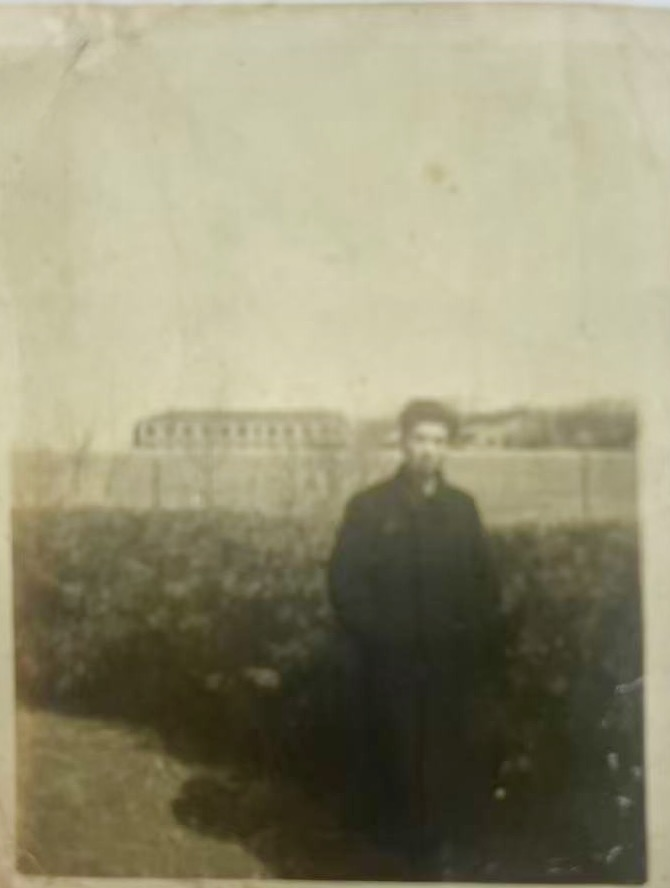

<strong>📖 English version below — <a href="#en">Jump to English ↓</a></strong> &nbsp;·&nbsp; <em>本页中文在上，英文见下方。</em>

**尚耀礼**（姓氏确定；名字汉字"耀礼"已由家族确认）&mdash; 周丽婕的姨外祖父。据[李恂](/family/xun-li/)，耀礼是她的**大舅** &mdash; 即其母[尚耀真](/family/yaozhen-shang/)诸兄弟中的长兄，长于1925年生的[尚耀福](/family/yaofu-shang/)。生卒待补。页首肖像由李恂于2026年指认为耀礼本人。

> *注：人名汉字已由家族确认。*

## English

Birth and death not yet recorded. Per [Li Xun](/family/xun-li/), Yaoli was her **大舅** — her eldest maternal uncle — meaning he was the elder of Yaozhen's two brothers, older than [Yaofu](/family/yaofu-shang/) (b. 1925). (An earlier version of this page had him as the youngest sibling; that is corrected.) The formal portrait above is identified as Yaoli by Li Xun, 2026.

