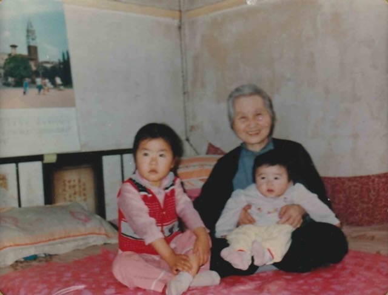

<strong>📖 English version below — <a href="#en">Jump to English ↓</a></strong> &nbsp;·&nbsp; <em>本页中文在上，英文见下方。</em>

**尚耀香**（姓氏确定；名字汉字"耀香"已由家族确认）&mdash; 周丽婕的姨外祖母，[尚耀真](/family/yaozhen-shang/)（周丽婕之外祖母）之姐姐，年长十岁。**1911年6月30日生于平度市** &mdash; 即青岛市以北的县级市。生日与[李蕴华](/family/yunhua-li/)（1911年6月30日生于青岛）相同，可能为巧合，亦可能为家谱数据缺漏所致。据家族照片题注（2026年），耀香于**2013年辞世** &mdash; 与其妹[尚耀真](/family/yaozhen-shang/)同年，且时年约102岁，此年份待家族进一步确认。

耀香青年时期的影像，见于她与妹妹[尚耀真](/family/yaozhen-shang/)的[旗袍合影](/archive/lijie-grandmothers-young-women-c1940s/)（左为耀香，右为耀真）。（本页早先曾误将一张男士正装照当作耀香；该照实为[李仲初](/family/zhongchu-li/)，已据李恂2026年的指认更正、移出本页。）

耀香的另一张影像见于[Lijie母系的幼年家庭照](/archive/lijie-grandparents-early-childhood-qingdao-c1980s/) &mdash; 约1988年，她怀抱着襁褓中的[丁丽珺](/family/ding-lijun/)（珺珺），左侧坐着幼时的[Lijie](/family/lijie-zhou/)。

*约1988年 &mdash; 右侧[尚耀香](/family/yaoxiang-shang/)怀抱婴儿[丁丽珺](/family/ding-lijun/)（珺珺），左侧为幼时的[Lijie](/family/lijie-zhou/)。据[李恂](/family/xun-li/)手记，怀抱婴孩的是尚耀香。*

> *注：人名汉字已由家族确认。*

## English

Yaoxiang was the elder of the Shang siblings &mdash; [Yaozhen](/family/yaozhen-shang/) (Lijie's grandmother) was ten years younger. Born **30 June 1911 in Pingdu Shi**, a city-region inland from Qingdao. Birth date a curious coincidence with [Yunhua Li](/family/yunhua-li/), who was also born 30 June 1911 in Qingdao &mdash; possibly a GEDCOM data quirk, possibly an actual coincidence.

Per the family's photo captions (2026), Yaoxiang **died in 2013**. That is the same year her sister [Yaozhen](/family/yaozhen-shang/) died and would make Yaoxiang 102, so the exact year is worth confirming with the family.

Yaoxiang's young-adult likeness is the [qipao photograph with her sister Yaozhen](/archive/lijie-grandmothers-young-women-c1940s/) (Yaoxiang at left). *(An earlier version of this page carried a man's studio portrait mislabeled as Yaoxiang; per Li Xun's 2026 identification that photograph is actually [Li Zhongchu](/family/zhongchu-li/) and has been moved to his page.)*

A later photograph of Yaoxiang appears in the [maternal early-childhood family photos](/archive/lijie-grandparents-early-childhood-qingdao-c1980s/): c. 1988, she holds the baby [Ding Lijun](/family/ding-lijun/) ("Junjun"), with a young [Lijie](/family/lijie-zhou/) seated beside her.

> *Structured record: [FamilySearch — Yaoxiang Shang (G9QD-LXW)](https://www.familysearch.org/tree/person/details/G9QD-LXW).*
