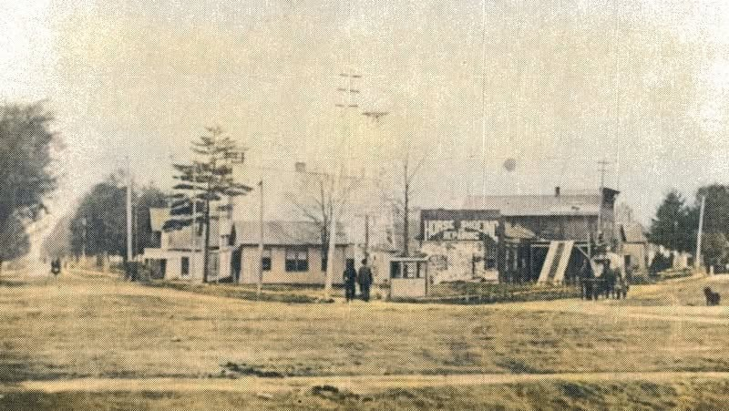
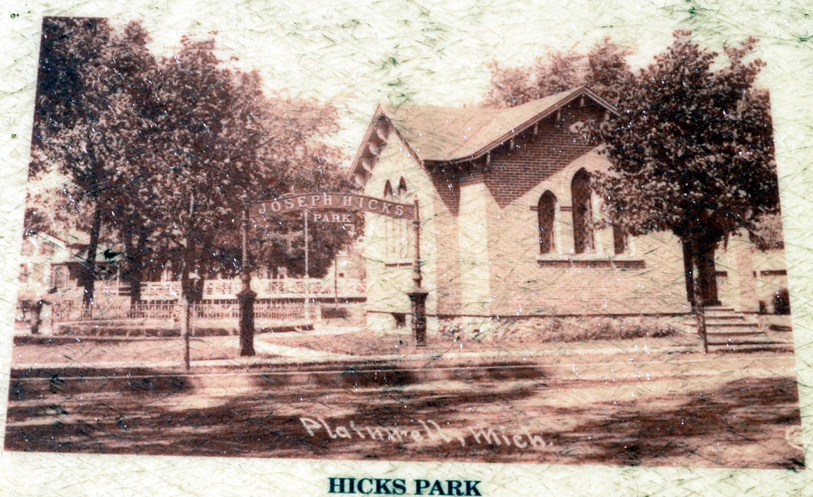
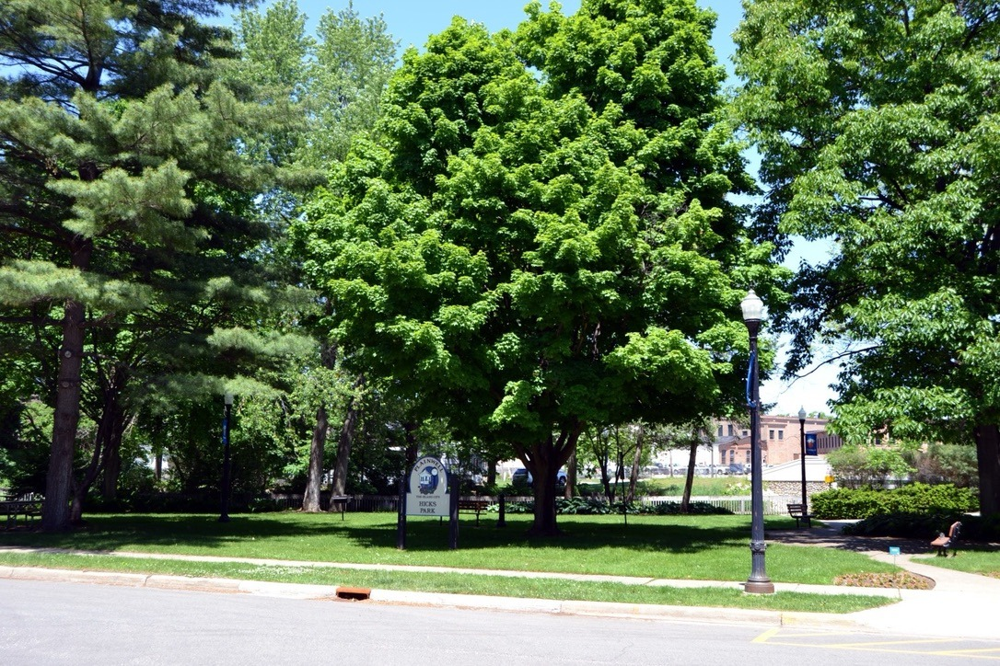

**Hicks Park** occupies the triangular block between **Allegan Street (M-89)** and **West Bridge Street** in the centre of Plainwell. The shape gave it its old name: the townspeople called it **the Flat Iron**.

## How the family comes into it

In the early 1900s the Flat Iron belonged to **Ingraham and Travis**, who ran an implement business. **[John Franklin Eesley](/family/john-f-eesley/)** — proprietor of the [Sunshine Flour Mill](/places/plainwell-eesley-mill/) on West Bridge Street — wanted the parcel for the town. The Allegan County Heritage Trail marker for Plainwell recorded the arrangement:

> *"J.F. Eesley traded his property with Ingraham and Travis, whose property was located in the flat iron, so that Mr. Eesley could give the flat iron property to the village for a park."*

He traded them **his own mill site** for it. That is why, in 1903–04, he had to divide his timber-frame mill building in two, haul it to the 700 block of East Bridge Street, and merge it there with a grain elevator. The [mill stands at 717 E. Bridge](/places/plainwell-eesley-mill/) today because its owner gave away the ground it had stood on.

The parcel was **dedicated at Plainwell's first homecoming in 1907** and is the **oldest park in the city**. It was named in memory of **Joseph Hicks**, the village's first president — not for Eesley. An early entrance arch over the walk read **JOSEPH HICKS PARK**.

## The three views

*The Flat Iron as open ground, early 1900s — the triangle still bare, the town at its edges. This is the parcel Eesley traded his mill site to obtain.*

*A postcard view of the park after dedication, with the **JOSEPH HICKS PARK** arch over the entrance walk and the brick church alongside. The arch no longer stands.*

*Hicks Park today. The trees planted after 1907 are full grown; the sign carries the city crest and the name Hicks.*

## Standing here

The park and the **original mill site** — West Bridge Street between Bridge and Chart — are within sight of one another, which makes the trade legible on foot: the ground he gave away, and the ground he took in exchange, a short walk apart. The **present mill** at 717 E. Bridge is the third point.

There is no marker in the park recording where it came from. The Heritage Trail sign that carried the sentence above was **Stop 28, "Early History of Plainwell"**; by July 2023 the post held only a sticker reading "New Heritage Trail Signs Coming Soon," and the Historical Marker Database lists it as permanently removed and not to be replaced. The [archived page](https://www.hmdb.org/m.asp?m=74530) keeps photographs of the panel.

> *Sources: Allegan County Heritage Trail marker text, preserved at [hmdb.org](https://www.hmdb.org/m.asp?m=74530); [City of Plainwell parks](https://www.plainwell.org/Services-Departments/Visiting-and-Recreation/Parks-and-Recreation.aspx) (Hicks Park "originally called the Flat Iron because of its shape," dedicated at the 1907 homecoming, named for the first village president); [J. F. Eesley Milling Co. Flour Mill–Elevator, Wikipedia](https://en.wikipedia.org/wiki/J._F._Eesley_Milling_Co._Flour_Mill%E2%80%93Elevator). Present-day photograph by Chuck Eesley, 2026; the two historic views from Plainwell local-history material.*
