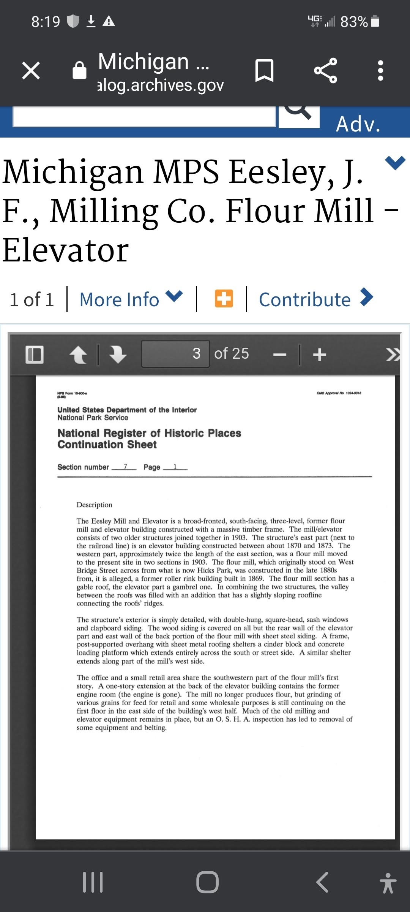
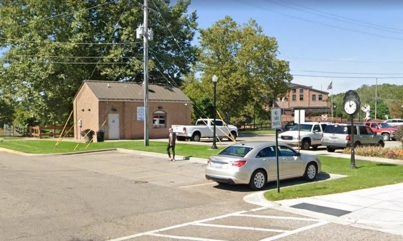
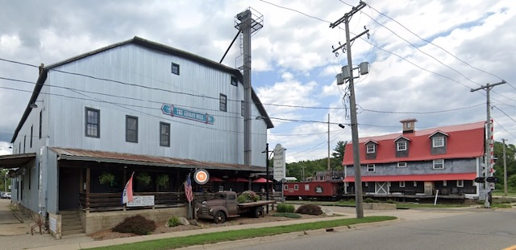
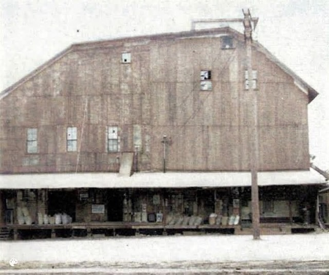

**The two original buildings.** The **east** part of the present structure, next to the railroad line, is the grain **elevator**, built on this site about **1870–1873** by an owner the Register nomination could not identify. The **west** part — about twice the length of the elevator section — is the **flour mill**, and the nomination is careful about its origins: the mill *"was constructed in the late 1880s from, it is alleged, a former roller rink building built in 1869."* So the 1869 date belongs to the rink; the mill was made out of it roughly two decades later, and even the rink story is given as allegation rather than fact — though the **1884 Sanborn map does show a roller skating rink** on that site, which supports it (see below).

Its original site is stated precisely: **West Bridge Street, across from what is now Hicks Park** — which places the mill and the Flat Iron on opposite sides of the same street.

**The Sunshine Flour Mill (1891):** [John F. Eesley](/family/john-f-eesley/) — by then the operator of the nearby **D. B. Merrill flour mill**, having returned to Plainwell in 1887 — **partnered with three other local entrepreneurs in 1891** to establish the **Sunshine Flour Mill** at the West Bridge Street building.

**National success:** Under the "Sunshine Brand Flour" label, the mill expanded to producing up to six hundred barrels of buckwheat flour a day — the second-largest such producer in the United States at its peak.

**The big move (1903):** John F. Eesley divided the timber-frame mill building and moved it to the **700 block of East Bridge Street** (717 E. Bridge today) **in two sections**, joining it to the elevator already standing there. The result was an architecturally integrated mill-and-elevator: a three-story gable-roofed mill joined by a central section to a gambrel-roofed elevator.

**Why it moved — the Flat Iron trade.** The usual telling is that the mill moved *"to make room for the Ingraham and Travis Implement Store,"* which reads as though Eesley was pushed off his own site by a hardware business. The Allegan County Heritage Trail marker for Plainwell recorded what actually happened:

> *"J.F. Eesley traded his property with Ingraham and Travis, whose property was located in the flat iron, so that Mr. Eesley could give the flat iron property to the village for a park."*

Ingraham and Travis owned the triangular downtown parcel that Plainwell called **the Flat Iron**, for its shape. Eesley wanted that parcel for the town — so he **traded them his West Bridge Street mill site for it**, which is why he then had to cut his own mill in half and haul it across town, and **gave the Flat Iron to the village**. It was dedicated at Plainwell's first homecoming in **1907** and is **[Hicks Park](/places/hicks-park-plainwell/)**, the city's oldest, at Allegan Street and West Bridge — named in memory of **Joseph Hicks**, the village's first president, not for the man who acquired the ground and gave it away.

So the mill stands at 717 E. Bridge today *because* its owner bought a park for the town. The move was the cost of the gift, not a displacement.

**End of the milling era (1929):** John F. Eesley ran the operation until his death. The Plainwell Elevator Company acquired the facility and turned it from consumer flour production to regional farming support — livestock feed, corn, hay — for the next six decades.

**Feed mill, then reuse (1929–present):** After John F. Eesley's death in 1929 the **Plainwell Elevator Company** took the facility over and ran it as a **feed mill until at least the 1990s**. It was listed on the **National Register of Historic Places on 1 November 1991** (reference no. **91001547**, nominated by Robert O. Christensen in July 1991 under the Plainwell Multiple Property Submission). The building was later renovated, and **The Old Mill Brewpub opened in the last week of February 2012** — its century-old wooden floors, posts and post-and-beam framing preserved.

### The Register description

The National Register nomination describes **one three-story structure** made from two buildings joined in 1903: a broad-fronted, massive timber frame; **gable roof over the mill section**, **gambrel roof over the elevator**, with a slightly sloping connecting addition between them. Exterior of **clapboard siding**; double-hung, square-head sash windows; a **cinder-block loading platform under an overhang running the length of one side**; a single-story extension at the back of the elevator. The listed area is **less than one acre**, at **42°26′35″N 85°37′54″W**.

The **sheet-steel siding** was already in place by 1991, covering the clapboard everywhere except the rear wall of the elevator and the east wall of the back portion of the mill. The nomination also records the interior as it then stood: the **office and a small retail area** in the southwestern part of the mill's first story, the **former engine room** (engine gone) in the one-story extension behind the elevator, and — notably — that the mill *"no longer produces flour, but grinding of various grains for feed for retail and some wholesale purposes is still continuing on the first floor."* Much of the original milling and elevator machinery **remained in place**, with some equipment and belting removed after an OSHA inspection.

*The Register nomination's description page (Section 7), the source for the account above &mdash; via the National Archives catalog.*

### How the building tells its own story now

The Old Mill Brewpub's account of the building is two sentences long:

> *"Old Mill Brewpub & Grill is listed on the National Registry of Historic Places. Built in 1869, this four story building was once the largest buckwheat flour mill in the country."*

Neither **John F. Eesley** nor the **Sunshine Flour Mill** is named in it — though *"THE EESLEY MILL"* is lettered across the gable outside. As at [Hicks Park](/places/hicks-park-plainwell/), the family name is on the thing without being in the story told about it.

Two points of difference with the record kept here, and both are worth noting because of where the numbers came from.

The brewpub now says **"the largest"** buckwheat flour mill in the country. The Wikipedia article's **"second largest"** is footnoted to *"The Old Mill History,"* the brewpub's own page as archived in **November 2016** — so the same establishment appears to have said *second* largest a decade ago and *the* largest now. This archive follows **second-largest**.

The brewpub also describes a **four-story** building, where the 1991 Register nomination is explicit that the joined structure is **three-story**. On this the Register description is the better authority.

The brewpub's taps include a beer called **Sunshine**, alongside **Island City** (for Plainwell's nickname) and **Railside Red**. Whether *Sunshine* is a deliberate nod to the *Sunshine Brand Flour* milled in the building is not stated anywhere on their site — the coincidence is suggestive but undocumented.

*717 E. Bridge Street today. The two buildings John F. Eesley joined in 1903 read as one: the **gable-roofed mill** at left, the **gambrel-roofed elevator** at right with its leg still rising above the roofline, and the connecting section between them. The loading platform and posted overhang described in the 1991 Register nomination still run the length of the street side. The green sign high on the wall reads **THE EESLEY MILL** — the family name on the building, as it has been since he moved it here.*

## The Sanborn maps, and a second mill

The most precise documentation of the W. Bridge Street building comes from **Sanborn Fire Insurance maps**, cited by Jim Higgs in the Plainwell local-history discussion of the photograph below:

- **1884** — the building on the **south side of W. Bridge Street** appears as a **roller skating rink**.
- **1892** — the same building, together with several smaller ones, appears as the **J. F. Eesley Milling Co.**
- **Before 1904** — that building is gone from the W. Bridge site, having been moved to E. Bridge Street.

This is independent confirmation of the sequence, and it sharpens the dates: the rink was still a rink in 1884, and the Eesley name was on the site by **1892** — consistent with the 1891 founding, and more exact than the Register's "late 1880s."

### The 1911 photograph — a different building

A **1911 real-photo postcard captioned "EESLEY MILLING CO. MILL · PLAINWELL, MICH."** shows a mill that is **not** the E. Bridge Street structure.

*The mill in **1911**, from a real-photo postcard (colorized). The caption along the bottom reads* EESLEY MILLING CO. MILL · PLAINWELL, MICH.

The identification was argued out in the thread that circulated the image. Scott Page reasonably read Wikipedia to mean this must be the Bridge Street site. Jim Higgs gave two physical reasons it is not: a **railroad bridge visible at the far left**, corresponding to the existing bridge over **the mill race**, and a **roof line quite different** from the E. Bridge mill — and he produced the **1911 Sanborn map** showing where the Eesley mill stood at that date. The original post placed this building on the **west side of N. Main Street**, and said it was **destroyed by fire in 1932**.

*The location given for that mill, in **2019**: a parking lot, a small brick utility building, a street clock.*

**Whether this is a second mill at all is unresolved.** The simplest reading is that it is not: the mill moved to E. Bridge Street in 1903, so by 1911 the company's mill *was* the E. Bridge building, and a photograph captioned "Eesley Milling Co. Mill" in that year would naturally show it. Against that stand Jim Higgs's two observations — the roof line, and a railroad bridge over the race — plus the claim that this building burned in 1932, which the E. Bridge structure plainly did not.

The roof-line argument is suggestive but not decisive; photographed end-on, the gambrel-roofed elevator could fall outside the frame. The railroad point cuts less cleanly than it appears, since the Register notes the E. Bridge elevator stands *next to the railroad line* — it is the **race** specifically that would distinguish the two sites.

If the 1932 fire is real, it settles the matter, because the surviving building did not burn. That date rests on the local-history post alone.

The 1932 fire date and the N. Main Street location rest on the local-history post rather than on the Register or a newspaper account, and are worth confirming. The **1911 Sanborn map** Jim Higgs posted would settle the location outright.

If the two are indeed different buildings, the contrast is worth noting: the mill John F. Eesley **moved in order to give the town a park** is on the National Register and busy most evenings, while the one in the 1911 photograph burned and left a parking lot.

## Then and now

The two frames above &mdash; placed from photographs [Chuck](/family/charles-eric-eesley/) supplied in 2026 &mdash; are the first images of the mill in this archive: the **Sunshine Flour Mill in operation in the early 1900s**, the gable painted *USE SUNSHINE &middot; J. F. EESLEY MILLING CO &middot; BUCKWHEAT MILLS &middot; DAILY CAPACITY 500 Bbls* with an L.S. &amp; M.S. boxcar drawn up on the siding in front, beside a **2019 Google Street View** of the same building as The Old Mill Brewpub, "THE EESLEY MILL" lettered across the gable. (The painted sign advertised 500 barrels a day; at its peak the mill reached about 600.) What still hasn't happened is an **Eesley descendant standing at the building in the present generation**: **Chuck plans the first family visit in November**, on the same trip as a talk at the University of Michigan, and a family frame will join these afterward.

*A wider 2019 street view: the mill at left, and across the way the red-roofed barn and a caboose by the rail crossing &mdash; the East Bridge Street setting the 1903 move brought the building to.*

A second surviving historic frame shows the mill from its loading-dock side:

*The loading-dock side of the mill in its working years — a second early-1900s view to set beside the signage-side photograph in the diptych above.*

> *The physical Allegan County Heritage Trail marker that once carried a full Eesley Mill panel (Stop 28, "Early History of Plainwell") is gone — replaced by a "New Heritage Trail Signs Coming Soon" sticker by July 2023 and listed as permanently removed — but [the archived marker page on hmdb.org](https://www.hmdb.org/m.asp?m=74530) keeps photographs of the panel, including the historic mill image printed on it. There is no Michigan state marker for the mill.*

## The "Historic Eesley Mill" sign

)](../../assets/family/originals/Mill%20sign.jpeg)

The Eesley name on the current downtown Plainwell sign &mdash; carrying [John F. Eesley](/family/john-f-eesley/)'s 1880s milling enterprise into the 21st-century commercial life of the building. The four panel businesses all operate on or around the mill site today.

> *Sources: **National Register of Historic Places registration form** (Section 7 description sheet reproduced above, via the U.S. National Archives catalog), *Eesley, J. F., Milling Co. Flour Mill--Elevator*, Robert O. Christensen, July 1991 (listed 1 November 1991, ref. 91001547) — the authority for the structure description, the 1903 move and the listing date; mill history from **The Old Mill (Old Mill Brewpub) website** (the 1869 west building, the 1870–73 elevator, the 1891 establishment with three partners while Eesley ran the D. B. Merrill mill, the 1903 move, 600 barrels/day, the Plainwell Elevator Company feed-mill era to the 1990s, and the 2006 renovation), supplied by Chuck 2026; the early-1900s "Then and Now" mill photograph via a Plainwell local-history post (Jim Higgs); [J. F. Eesley Milling Co. Flour Mill–Elevator, Wikipedia](https://en.wikipedia.org/wiki/J._F._Eesley_Milling_Co._Flour_Mill%E2%80%93Elevator); [Plainwell mill history at mlive.com](https://www.mlive.com/penaseeglobe/2010/03/eesley_mill.html); historical marker at hmdb.org/m.asp?m=74530; the 1911 mill postcard and its 2019 counterpart from a Plainwell local-history "Then and Now" post (image credited there to Scott Page and Mark Doster; colorization by the poster), with the **Sanborn Fire Insurance map** evidence for 1884, 1892 and 1911 supplied by **Jim Higgs** in the comments to that post — the N. Main Street location and the 1932 fire rest on the post itself and are not yet confirmed against the Register, the Sanborn sheets directly, or a newspaper account; [The Old Mill Brewpub opening, mlive.com](https://www.mlive.com/business/west-michigan/2012/02/new_brewpub_opens_this_week_in.html).*
